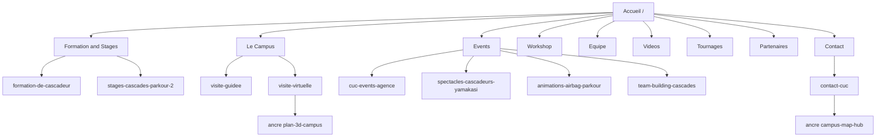

# Audit Complet & Modernisation 2026 — Campus Univers Cascades (CUC)

> Périmètre : vérification exhaustive de l'application Next.js 16 / React 19 (routes, liens, doublons, contenus superflus, navigation) + mise en place de technologies de pointe attendues pour un site vitrine premium en septembre 2026.

---

## 1. Synthèse de l'état actuel

### Stack technique détectée

| Élément | Version | Commentaire |
| --- | --- | --- |
| Next.js | `16.3.5` | App Router, React Server Components |
| React | `19.2.8` | Server Actions, `use()` hook disponibles |
| Tailwind CSS | `^4` | Config via `@tailwindcss/postcss` |
| Framer Motion | `^13.3.0` | Animations |
| Three.js | `^0.186.0` | Plan 3D campus |
| lucide-react | `^1.46.0` | Icônes |
| TypeScript | `^5` | — |

### Routes réellement présentes (15 pages)

`/` · `/animations-airbag-parkour` · `/contact-cuc` · `/cuc-events-agence` · `/cuc-team-cascadeur` · `/equipe-cascadeurs-pro` · `/formation-de-cascadeur` · `/partenaires` · `/spectacles-cascadeurs-yamakasi` · `/stages-cascades-parkour-2` · `/stunt-workshop-cuc` · `/team-building-cascades` · `/videos-cascadeur` · `/visite-guidee` · `/visite-virtuelle`

---

## 2. Problèmes identifiés (classés par criticité)

### 🔴 CRITIQUE — Liens & navigation

| # | Problème | Fichier(s) | Détail |
| --- | --- | --- | --- |
| C1 | **Incohérence de slug** : le menu pointe vers `/cuc-team-cascadeur` mais `next.config.ts` redirige `/filmographie` → `/cuc-team-cascadeur`. Le libellé du menu est « Tournages » alors que la page s'appelle « team-cascadeur ». | [`Navbar.tsx`](src/components/layout/Navbar.tsx:163), [`next.config.ts`](next.config.ts:41) | Vérifier la cohérence sémantique URL ↔ libellé. |
| C2 | **Redirections vers routes inexistantes** : `next.config.ts` redirige `/formations` → `/formation-de-cascadeur` (OK) mais aussi `/campus` → `/visite-guidee` et `/contact` → `/contact-cuc`. Ces redirections sont correctes MAIS `/filmographie` → `/cuc-team-cascadeur` crée une **double source de vérité** avec le menu. | [`next.config.ts`](next.config.ts:24) | Documenter / consolider. |
| C3 | **Ancres non vérifiées** : liens vers `/visite-virtuelle#plan-3d-campus` et `/contact-cuc#campus-map-hub`. L'ancre `#plan-3d-campus` existe dans [`visite-virtuelle/page.tsx`](src/app/visite-virtuelle/page.tsx:128) ✅. L'ancre `#campus-map-hub` doit être vérifiée dans [`contact-cuc/page.tsx`](src/app/contact-cuc/page.tsx). | Navbar, Footer, CommandPalette | Audit des ancres requis. |
| C4 | **Lien YouTube incohérent** : le Footer pointe vers une **recherche YouTube** (`results?search_query=...`) alors que la Navbar pointe vers la **chaîne officielle** (`@campusuniverscascades`). | [`FooterDirectContacts.tsx`](src/components/layout/footer-sections/FooterDirectContacts.tsx:89) vs [`NavActionsBar.tsx`](src/components/layout/navbar/NavActionsBar.tsx:38) | Unifier vers la chaîne officielle. |
| C5 | **TikTok incohérent** : Footer = `@campus.univers.cascades`, Navbar = `@campusuniverscascades`. | [`FooterDirectContacts.tsx`](src/components/layout/footer-sections/FooterDirectContacts.tsx:108) vs [`NavActionsBar.tsx`](src/components/layout/navbar/NavActionsBar.tsx:50) | Unifier le handle. |

### 🟠 MAJEUR — Code orphelin & doublons

| # | Problème | Fichier(s) | Détail |
| --- | --- | --- | --- |
| M1 | **Composants orphelins (jamais importés)** — code mort à supprimer ou réintégrer : | | |
| | `CareerSimulatorModal.tsx` | [`src/components/ui/CareerSimulatorModal.tsx`](src/components/ui/CareerSimulatorModal.tsx) | Aucun import détecté. |
| | `TowerPhysicsWidget.tsx` | [`src/components/3d/TowerPhysicsWidget.tsx`](src/components/3d/TowerPhysicsWidget.tsx) | Aucun import détecté. |
| | `TelemetryHUD.tsx` | [`src/components/ui/TelemetryHUD.tsx`](src/components/ui/TelemetryHUD.tsx) | Aucun import détecté. |
| | `TimecodeHUD.tsx` | [`src/components/ui/TimecodeHUD.tsx`](src/components/ui/TimecodeHUD.tsx) | Aucun import détecté. |
| | `ProgramSelector.tsx` | [`src/components/sections/ProgramSelector.tsx`](src/components/sections/ProgramSelector.tsx) | Aucun import détecté. |
| | `DisciplineGrid.tsx` | [`src/components/sections/DisciplineGrid.tsx`](src/components/sections/DisciplineGrid.tsx) | Aucun import détecté. |
| | `StuntTeam.tsx` | [`src/components/sections/StuntTeam.tsx`](src/components/sections/StuntTeam.tsx) | Aucun import détecté. |
| | `VideoShowcase.tsx` | [`src/components/sections/VideoShowcase.tsx`](src/components/sections/VideoShowcase.tsx) | Aucun import détecté. |
| | `SchoolOrigins.tsx` | [`src/components/sections/SchoolOrigins.tsx`](src/components/sections/SchoolOrigins.tsx) | Aucun import détecté. |
| | `ContactSection.tsx` | [`src/components/sections/ContactSection.tsx`](src/components/sections/ContactSection.tsx) | Aucun import détecté. |
| | `CampusMap.tsx` | [`src/components/sections/CampusMap.tsx`](src/components/sections/CampusMap.tsx) | Aucun import détecté. |
| | `HeroSection.tsx` | [`src/components/sections/HeroSection.tsx`](src/components/sections/HeroSection.tsx) | Remplacé par `ParallaxHero`. |
| | `HomeCampus3DSection.tsx` | [`src/components/sections/home/HomeCampus3DSection.tsx`](src/components/sections/home/HomeCampus3DSection.tsx) | Exporté mais **non utilisé** dans [`page.tsx`](src/app/page.tsx:7). |
| M2 | **Fichiers de types manquants** : `@/types` est importé (`Discipline`, `FilmCredit`, `DoubledCelebrity`) mais aucun `src/types` n'apparaît dans l'arborescence. | `HallOfFame.tsx`, `DisciplineGrid.tsx` | Vérifier l'existence de `src/types/index.ts`. |
| M3 | **Scripts d'audit redondants** : `audit_hrefs.mjs`, `audit_links.js`, `deep_site_audit.mjs`, `audit_architecture.js`, `audit_live_site.mjs` font des vérifications qui se chevauchent. | `scripts/` | Consolider en un seul script d'audit. |
| M4 | **Assets lourds non optimisés** : `public/images/ortho_tiles/` (20 tuiles) et `ortho_z19/` (42 tuiles) = 62 fichiers JPG probablement utilisés pour la génération d'orthophoto mais peut-être plus nécessaires en prod. | `public/images/` | Vérifier l'usage runtime. |

### 🟡 MINEUR — Contenus & UX

| # | Problème | Fichier(s) | Détail |
| --- | --- | --- | --- |
| m1 | **Doublon de liens Footer** : `/contact-cuc` apparaît 3× dans la même barre de crédits (« Règlement & Inscriptions », « Secrétariat Pédagogique ») + le CTA principal. | [`FooterCreditsBar.tsx`](src/components/layout/footer-sections/FooterCreditsBar.tsx:37) | Fusionner ou différencier les ancres. |
| m2 | **Doublon de liens FooterNavMatrix** : `/formation-de-cascadeur` apparaît 2× (Formation Pro 2 ans + Formule Découverte) — acceptable si ancres différentes, sinon redondant. | [`FooterNavMatrix.tsx`](src/components/layout/footer-sections/FooterNavMatrix.tsx:17) | Ajouter ancres distinctes. |
| m3 | **Doublon `/visite-guidee`** : 3 entrées dans FooterNavMatrix (Zoé Bell Hall, CUC Tower, Dojos) pointent toutes vers la même page sans ancre. | [`FooterNavMatrix.tsx`](src/components/layout/footer-sections/FooterNavMatrix.tsx:81) | Ajouter ancres `#zoe-bell-hall`, `#cuc-tower`, etc. |
| m4 | **`README.md` générique** : contenu par défaut `create-next-app`, aucune info projet. | [`README.md`](README.md:1) | Réécrire. |
| m5 | **`CLAUDE.md` = `@AGENTS.md`** : simple référence, OK mais à documenter. | [`CLAUDE.md`](CLAUDE.md:1) | — |
| m6 | **`next.config.ts` redirections** : 8 redirections dont certaines vers des routes qui n'existent plus (`/stages-cascades-parkour-2-2`). | [`next.config.ts`](next.config.ts:57) | Nettoyer les redirections obsolètes. |
| m7 | **`MobileStickyCTA` + `FooterCreditsBar` floating button** : deux éléments flottants en bas à droite sur mobile → risque de chevauchement. | [`MobileStickyCTA.tsx`](src/components/layout/MobileStickyCTA.tsx:28), [`FooterCreditsBar.tsx`](src/components/layout/footer-sections/FooterCreditsBar.tsx:66) | Vérifier le z-index et le positionnement. |
| m8 | **`pt-16 sm:pt-20` vs `pt-28`** : incohérence de padding-top entre la home et les pages internes. | [`page.tsx`](src/app/page.tsx:20) vs [`visite-guidee/page.tsx`](src/app/visite-guidee/page.tsx:26) | Uniformiser via une classe partagée. |

---

## 3. Plan de modernisation « Septembre 2026 »

### 3.1 Performance & Core Web Vitals

- [ ] **React Compiler** (stable en 2026) : activer `reactCompiler: true` dans `next.config.ts` pour éliminer les `useMemo`/`useCallback` manuels.
- [ ] **Partial Prerendering (PPR)** : activer `experimental.ppr` pour un shell statique + streaming dynamique.
- [ ] **`next/image` avec `sizes` explicites** sur tous les `<Image fill>` (hero, galeries) pour éviter le sur-téléchargement.
- [ ] **AVIF/WebP** : ajouter `formats: ['image/avif', 'image/webp']` dans `next.config.ts`.
- [ ] **Font optimization** : `next/font` déjà utilisé ✅ — vérifier le `preload` des 4 polices (Bebas, Inter, Space Grotesk, JetBrains Mono) → réduire à 2-3 familles.
- [ ] **Bundle analysis** : `@next/bundle-analyzer` pour traquer Three.js (lourd) et le lazy-loader uniquement sur `/visite-virtuelle` et `/visite-guidee`.
- [ ] **`dynamic(() => import(...), { ssr: false })`** pour `CampusPlan3D` (Three.js) → ne pas charger sur la home.

### 3.2 SEO & Métadonnées

- [ ] **`generateMetadata` par route** : actuellement seul le layout racine a des metadata. Ajouter des metadata spécifiques (title, description, OG image) sur les 15 pages.
- [ ] **`sitemap.ts`** et **`robots.ts`** natifs Next.js (App Router).
- [ ] **JSON-LD structuré** : `EducationalOrganization`, `LocalBusiness`, `Course` pour les formations, `VideoObject` pour les vidéos.
- [ ] **`opengraph-image.tsx`** dynamique par route (ImageResponse).
- [ ] **Canonical URLs** + `alternates.languages` (fr/en si international).

### 3.3 Accessibilité (WCAG 2.2 AA)

- [ ] **Skip-to-content link** en tête de chaque page.
- [ ] **Focus visible** : vérifier `focus-visible:` sur tous les boutons custom (TacticalButton, dropdowns).
- [ ] **`aria-label`** sur les liens icônes (réseaux sociaux Navbar/Footer).
- [ ] **Contraste** : vérifier `text-zinc-500` sur fond `#060608` (ratio < 4.5:1 probable).
- [ ] **Navigation clavier** : les dropdowns Navbar s'ouvrent au `onMouseEnter` uniquement → ajouter `onFocus`/`onKeyDown`.
- [ ] **`prefers-reduced-motion`** : désactiver les animations Framer Motion et le parallax.

### 3.4 UX & Interactions modernes

- [ ] **View Transitions API** : transitions de page fluides (support natif 2026).
- [ ] **Scroll-driven animations** CSS natifs (`animation-timeline: scroll()`) en remplacement partiel de Framer Motion.
- [ ] **`<dialog>` natif** pour les modales (Lightbox, ApplicationModal, CommandPalette) → meilleure gestion du focus et de l'inertie.
- [ ] **Popover API** pour les dropdowns Navbar.
- [ ] **Container queries** (`@container`) pour les composants responsives.
- [ ] **`text-wrap: balance`** sur les titres.
- [ ] **Speculation Rules API** pour le prefetch intelligent des routes.

### 3.5 Qualité de code

- [ ] **Consolider les scripts d'audit** en un seul `scripts/audit.mjs` avec rapport JSON.
- [ ] **Supprimer le code mort** (M1) après confirmation.
- [ ] **Créer `src/types/index.ts`** si manquant (M2).
- [ ] **ESLint strict** : activer `@typescript-eslint/no-unused-vars` en erreur.
- [ ] **Tests** : ajouter Vitest + Testing Library pour les composants critiques (Navbar, CommandPalette, Footer).
- [ ] **CI** : GitHub Actions avec `lint`, `typecheck`, `build`, `audit`.

### 3.6 Sécurité & Robustesse

- [ ] **`rel="noopener noreferrer"`** sur tous les `target="_blank"` (actuellement `rel="noreferrer"` seul).
- [ ] **Content Security Policy** dans `next.config.ts` headers.
- [ ] **`Strict-Transport-Security`**, `X-Content-Type-Options`, `Referrer-Policy`.
- [ ] **Validation des formulaires** côté serveur (Server Actions) pour `ContactForm`.

---

## 4. Diagramme de navigation cible

---

## 5. Ordre d'exécution recommandé

1. **Phase 1 — Nettoyage & cohérence** (critique)
   - Corriger les incohérences de liens sociaux (C4, C5)
   - Vérifier et corriger toutes les ancres (C3)
   - Supprimer le code orphelin (M1) après validation
   - Nettoyer les redirections obsolètes (m6)
   - Unifier les paddings (m8)

2. **Phase 2 — SEO & Métadonnées**
   - `generateMetadata` par route
   - `sitemap.ts` + `robots.ts`
   - JSON-LD structuré
   - OG images dynamiques

3. **Phase 3 — Performance**
   - React Compiler + PPR
   - Lazy-loading Three.js
   - Optimisation images (AVIF/WebP)

4. **Phase 4 — Accessibilité**
   - Skip links, focus, aria-labels
   - Navigation clavier dropdowns
   - `prefers-reduced-motion`

5. **Phase 5 — UX moderne**
   - View Transitions, `<dialog>`, Popover API
   - Container queries, `text-wrap: balance`

6. **Phase 6 — Qualité & CI**
   - Consolidation scripts d'audit
   - Tests Vitest
   - CI GitHub Actions
   - Headers de sécurité

---

## 6. Points à valider avec l'utilisateur

1. **Code orphelin (M1)** : supprimer définitivement ou réintégrer certaines sections (ex. `HomeCampus3DSection` pourrait enrichir la home) ?
2. **Internationalisation** : le site doit-il être bilingue FR/EN (impact SEO et routing) ?
3. **Assets ortho_tiles/ortho_z19** : encore utilisés en runtime ou supprimables ?
4. **Boutique externe** : `ma-boutique-club.com` — conserver le lien externe ou intégrer un mini-catalogue ?
5. **Priorité** : commencer par le nettoyage critique (Phase 1) ou par la modernisation visible (Phase 5) ?
