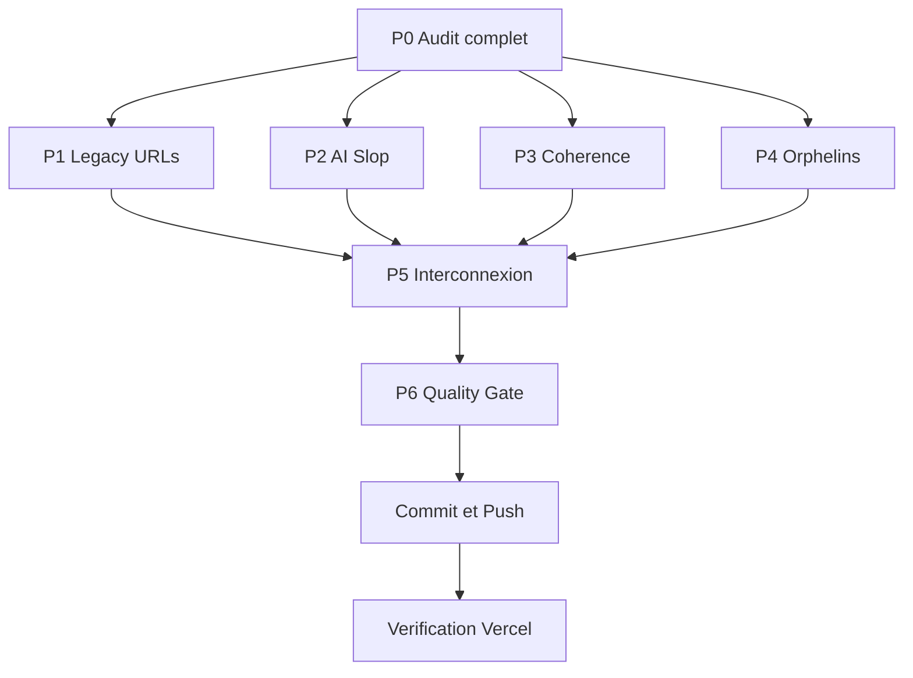

# Plan — Audit complet de l'application CUC & corrections

**Date :** 2026-09-20
**Mode de planification :** Architect
**Mode d'exécution requis :** Code

---

## 1. Objectif

Vérifier de bout en bout que l'application CUC (vitrine + Cockpit) fonctionne comme prévu, puis corriger :

1. **Intégrité fonctionnelle** — liens morts, doublons, incohérences, oublis, bugs.
2. **Contenu IA / badges creux** — conformément à la doctrine `AGENTS.md` (« Zéro AI Slop »).
3. **URLs legacy** — toutes les photos et PDF déjà rapatriés vers Supabase Storage doivent être référencés depuis Supabase, plus depuis l'ancien site WordPress.
4. **Coordination transverse** — vitrine, Cockpit et toute autre page doivent partager les mêmes sources de vérité.

---

## 2. État des lieux factuel (reconnaissance terminée)

### 2.1 Migration média — largement aboutie

| Indicateur | Valeur |
| --- | --- |
| Assets migrés | **221 / 221** (0 échec) |
| Volume | 150,13 Mo |
| Bucket | `cuc-vitrine-assets` |
| Préfixe | `media/` |
| Inventaire source | 226 médias (217 images, 6 documents, 3 vidéos), 414,07 Mo |
| Fichiers source réécrits | 37 fichiers, 310 remplacements |
| Lignes DB réécrites | 15 lignes, 161 remplacements |

### 2.2 URLs legacy résiduelles — périmètre confirmé

| Emplacement | Contenu | Statut |
| --- | --- | --- |
| [`src/lib/seo.ts`](src/lib/seo.ts:21) | `DEFAULT_OG_IMAGE` → `wp-content/uploads/2023/02/slider-8-scaled.jpg` | **À corriger** |
| [`src/app/videos-cascadeur/page.tsx`](src/app/videos-cascadeur/page.tsx:155) | `<source>` TF1 JT 20h (MP4) | **À migrer** (décision validée) |
| [`src/app/videos-cascadeur/page.tsx`](src/app/videos-cascadeur/page.tsx:169) | `<source>` France2 « L'École des Cascadeurs » (MP4) | **À migrer** (décision validée) |
| `scripts/setup_complete_vitrine.sql` | ~92 URLs `wp-content` | **Seeds obsolètes** |
| `scripts/seed_site_vitrine.sql` | idem | **Seeds obsolètes** |
| `scripts/seed_pages_content.sql` | idem | **Seeds obsolètes** |

> **Décision utilisateur (2026-09-20) :** les 2 vidéos de reportage sont **uploadées vers Supabase Storage** et les sources redirigées. Le coût de stockage/egress est assumé. Elles sortent donc de `INTENTIONALLY_EXTERNAL`.

### 2.3 Violations doctrine « Zéro AI Slop » — confirmées

| Fichier | Ligne | Contenu fautif |
| --- | --- | --- |
| [`src/data/filmography.ts`](src/data/filmography.ts:373) | 373 | tag `HOLLYWOOD` |
| [`src/data/filmography.ts`](src/data/filmography.ts:747) | 747, 820 | tag `BOX-OFFICE` |
| [`src/data/filmography.ts`](src/data/filmography.ts:677) | 677 | tag `NETFLIX EXTRÊME` |
| [`src/data/filmography.ts`](src/data/filmography.ts:461) | 461 | tag `SUCCÈS MONDIAL NETFLIX` |
| [`src/components/ui/campus-map/CampusRadarView.tsx`](src/components/ui/campus-map/CampusRadarView.tsx:75) | 75 | `RADAR TACTIQUE DOMAINE 6 HA` |
| [`src/app/stunt-workshop-cuc/page.tsx`](src/app/stunt-workshop-cuc/page.tsx:148) | 148 | `TRAIN LIKE A HOLLYWOOD STUNT PERFORMER` |
| `scripts/setup_complete_vitrine.sql` | 684-687, 1265 | Malik Diouf : `Art du Déplacement (ADD)` |
| `scripts/seed_site_vitrine.sql` | 436-439, 1017 | Malik Diouf : `Art du Déplacement (ADD)` |

> **Note :** `src/` est **exempt** des superlatifs bannis (`légendaire`, `référence suprême`, `gun-fu cinématique`, `chutes massives`, `dossier pro complet`, `élite`) — 0 occurrence. Le slop résiduel est dans les **tags de films**, les **badges UI** et les **seeds SQL**.

### 2.4 Incohérences de cohérence — confirmées

**Handles sociaux contradictoires :**

| Plateforme | Valeur A | Valeur B | Verdict |
| --- | --- | --- | --- |
| TikTok | `@campus.univers.cascades` ([`seo.ts`](src/lib/seo.ts:45), [`HomeSocialSection.tsx`](src/components/sections/home/HomeSocialSection.tsx:179), [`videos-cascadeur/page.tsx`](src/app/videos-cascadeur/page.tsx:329)) | `@campusuniverscascades` ([`navigation.ts`](src/data/navigation.ts:549)) | **Contradiction** |
| YouTube | `@campusuniverscascades` (partout) | — | Cohérent |
| Instagram | `campus.univers.cascades` (partout) | — | Cohérent |
| Facebook | `campus.univers.cascades` (partout) | — | Cohérent |

**Redirections :** 18 entrées dans [`next.config.ts`](next.config.ts:136) — à auditer (obsolescence, chaînes, destinations valides).

**Doublons Footer (relevés dans l'audit antérieur) :** `contact-cuc` ×3, `formation-de-cascadeur` ×2, `visite-guidee` ×3.

### 2.5 Composants orphelins — confirmés jamais importés

Recherche d'imports : **0 résultat** pour les 13 composants suivants :

`CareerSimulatorModal`, `TelemetryHUD`, `TimecodeHUD`, `TowerPhysicsWidget`, `ProgramSelector`, `DisciplineGrid`, `StuntTeam`, `VideoShowcase`, `SchoolOrigins`, `ContactSection`, `CampusMap`, `HeroSection`, `HomeCampus3DSection`

> Les sections `*HeroSection` réellement utilisées (`VisiteHeroSection`, `TeamHeroSection`, `FormationHeroSection`, `StagesHeroSection`, `EventsHeroSection`, `PartenairesHeroSection`, `ContactHeroSection`) sont **légitimes** et ne doivent pas être touchées.

### 2.6 Points vérifiés — aucune action requise

- [`src/types/index.ts`](src/types/index.ts) **existe** (avec `testing.d.ts`).
- `src/` est exempt des superlatifs bannis.
- `src/data/videos.ts` — les 6 visuels `PROGRAMMES_TV` sont déjà sur Supabase.
- Les 14 références `.pdf` dans `src/` pointent déjà vers Supabase Storage (hors placeholder `SettingsView`).
- `src/` est exempt de `Art du Déplacement` / `ADD`.

---

## 3. Stratégie d'exécution

### Diagramme de flux

### Principe directeur

**P0 d'abord, corrections ensuite.** L'audit produit un état des lieux factuel et reproductible (`plans/audit-complet-app-2026.md`) qui sert de référence pour mesurer la progression. Aucune correction n'est appliquée avant que l'audit n'ait figé le périmètre réel — cela évite de corriger des problèmes imaginaires ou d'en oublier.

---

## 4. Détail des phases

### P0 — Audit complet

**Livrable :** `scripts/audit_full_app.mjs` + `plans/audit-complet-app-2026.md`

Le script doit scanner :

1. **Routes** — énumérer toutes les routes de `src/app` (pages, layouts, routes dynamiques).
2. **Liens internes** — extraire tous les `href=` et `<Link href=` et vérifier que chaque destination correspond à une route existante.
3. **Ancres** — extraire tous les `#ancre` et vérifier qu'un `id=` correspondant existe dans le DOM cible.
4. **Doublons** — détecter les liens répétés dans une même structure (Footer, Navbar).
5. **Orphelins** — détecter les composants `.tsx` jamais importés.
6. **URLs legacy** — détecter toute occurrence de `campus-universcascades.com/wp-content`.
7. **Badges IA** — détecter les motifs de la doctrine « Zéro AI Slop ».
8. **Handles sociaux** — détecter les contradictions de handles entre fichiers.

**Sortie :** rapport JSON (`scripts/audit_full_app_report.json`) + rapport markdown lisible (`plans/audit-complet-app-2026.md`).

**Critère de sortie :** le rapport liste chaque anomalie avec fichier + ligne + sévérité, sans aucune correction appliquée.

---

### P1 — URLs legacy

1. **Vidéos reportage** — télécharger les 2 MP4, les uploader dans `cuc-vitrine-assets/media/reportages/`, rediriger les `<source>` de [`videos-cascadeur/page.tsx`](src/app/videos-cascadeur/page.tsx:155).
2. **Cohérence du garde-fou** — retirer les 2 vidéos de `INTENTIONALLY_EXTERNAL` dans [`verify_media_url_coverage.mjs`](scripts/verify_media_url_coverage.mjs), les ajouter à `media_url_mapping.json`.
3. **OG image** — remplacer l'URL `wp-content` de [`seo.ts`](src/lib/seo.ts:21) par un asset Supabase.
4. **Seeds SQL** — purger les 92 URLs `wp-content` des 3 seeds, ou les marquer d'un en-tête `-- OBSOLÈTE` si la traçabilité prime.
5. **Vérification base** — confirmer qu'aucune URL `wp-content` ne subsiste dans `site_pages`, `site_settings`, `site_team`, `site_films`, `site_partners`, `site_events`, `site_disciplines`, `site_campus_pois`.
6. **Extension du garde-fou** — étendre `verify_media_url_coverage.mjs` au dossier `scripts/` et aux seeds SQL.

**Critère de sortie :** `node scripts/verify_media_url_coverage.mjs` sort en code 0, et `grep wp-content` sur `src/` ne retourne rien.

---

### P2 — Contenu IA & badges creux

1. **Extension du scanner** — enrichir [`hunt_llm_cliches.mjs`](scripts/hunt_llm_cliches.mjs) avec les motifs badges (`HOLLYWOOD`, `PRO STAFF`, `WORLDWIDE`, `BOX-OFFICE`, `TACTIQUE`) et la règle `ADD` / `Art du Déplacement`.
2. **Violation doctrine Malik Diouf** — remplacer `Art du Déplacement (ADD)` par `Parkour` dans les 2 seeds SQL.
3. **Badges UI confirmés** — corriger [`CampusRadarView.tsx`](src/components/ui/campus-map/CampusRadarView.tsx:75) et [`stunt-workshop-cuc/page.tsx`](src/app/stunt-workshop-cuc/page.tsx:148).
4. **Tags de films** — normaliser les tags de [`filmography.ts`](src/data/filmography.ts) vers une taxonomie factuelle (ex. `NETFLIX`, `CINÉMA FRANÇAIS`, `BLOCKBUSTER`), puis synchroniser `site_films` en base.

**Critère de sortie :** `node scripts/hunt_llm_cliches.mjs` retourne 0 occurrence sur `src/` et sur les seeds.

---

### P3 — Cohérence transverse

1. **Handles sociaux** — unifier le TikTok sur `@campus.univers.cascades` (majorité des occurrences + cohérence avec Instagram/Facebook).
2. **Ancres internes** — vérifier et corriger `campus-map-hub`, `plan-3d-campus`, `zoe-bell-hall`, `cuc-tower`.
3. **Doublons Footer** — dédupliquer `contact-cuc`, `formation-de-cascadeur`, `visite-guidee`.
4. **Redirections** — auditer les 18 entrées de [`next.config.ts`](next.config.ts:136) : supprimer les obsolètes, vérifier qu'aucune ne chaîne vers une autre redirection, valider les destinations.
5. **Paddings** — unifier le `pt-28` de la home avec les pages internes.

**Critère de sortie :** l'audit P0 relancé ne signale plus aucune incohérence de cohérence.

---

### P4 — Nettoyage orphelins

1. **Composants** — supprimer les 13 composants jamais importés (après re-vérification d'absence d'import dynamique), et vérifier [`soundFx.ts`](src/lib/soundFx.ts) (probablement lié aux composants supprimés).
2. **Types** — vérifier que [`src/types/index.ts`](src/types/index.ts) est aligné sur les usages réels.
3. **Scripts d'audit** — consolider les scripts redondants (`audit.mjs`, `audit_live_site.mjs`, `audit_and_sync_supabase_clean.mjs`, `audit_storage_usage.mjs`, …) en un point d'entrée unique.

**Critère de sortie :** `tsc --noEmit` passe, aucun import cassé.

---

### P5 — Interconnexion CUC ↔ CUC Sign

1. **Clés étrangères** — vérifier l'existence et le peuplement de :
   - `site_team.profile_id` ↔ `profiles.id`
   - `site_sessions.cuc_sign_formation_id` ↔ `formations.id`
   - `site_campus_pois.location_id` ↔ `locations.id`
   - `site_disciplines` ↔ `evaluation_disciplines`
2. **Sources partagées** — vérifier que le Cockpit et la vitrine lisent les mêmes tables (zéro valeur orpheline en `localStorage`).

**Critère de sortie :** rapport d'interconnexion documenté, aucune valeur critique orpheline.

---

### P6 — Quality gate & déploiement

1. `tsc --noEmit` — 0 erreur.
2. `eslint` — 0 erreur.
3. `vitest` — tous les tests passent.
4. `npm run build` — 63/63 pages.
5. Probe local — 16/16 routes.
6. Probe production + vérification du bundle + image optimizer.
7. Commit, push, vérification du déploiement Vercel.

---

## 5. Risques identifiés

| Risque | Mitigation |
| --- | --- |
| Suppression d'un composant utilisé par import dynamique | Re-vérifier par recherche `import(` et `React.lazy` avant suppression |
| Upload des 2 MP4 volumineux → échec/timeout | Upload par script dédié avec streaming, vérification de la taille finale |
| Purge des seeds SQL → perte de traçabilité | Préférer l'en-tête `-- OBSOLÈTE` à la suppression si le seed documente l'historique |
| Normalisation des tags → rupture d'affichage Cockpit | Vérifier que `FilmsView` filtre sur une liste de catégories connues |
| Redirection supprimée → 404 sur lien indexé | Ne supprimer une redirection qu'après vérification qu'aucun lien interne ne la cible |

---

## 6. Ordre d'exécution recommandé

1. **P0** — Audit (obligatoire en premier, fige le périmètre).
2. **P1** — Legacy URLs (impact SEO/visuel immédiat).
3. **P2** — AI Slop (impact éditorial, doctrine).
4. **P3** — Cohérence (impact navigation).
5. **P4** — Orphelins (nettoyage, faible risque).
6. **P5** — Interconnexion (vérification, doctrine données).
7. **P6** — Quality gate + déploiement.
