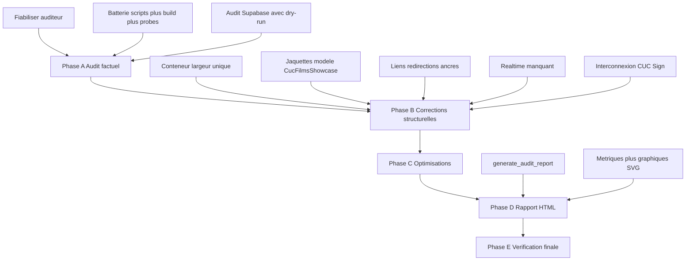

# Plan — Audit général, corrections, optimisations & rapport client HTML

**Date :** 2026-09-21
**Mode de planification :** Architect
**Mode d'exécution requis :** Code

---

## 1. Objectif

Auditer l'intégralité de l'application CUC (vitrine FR/EN + Cockpit + base Supabase), corriger tout ce qui est
factuellement défaillant, puis produire un **rapport HTML autonome et ré-exécutable** destiné au client
(`reports/audit-2026.html`), avec métriques chiffrées et visualisations graphiques.

## 2. Décisions validées avec le client

| Sujet | Décision |
| --- | --- |
| Rapport HTML | Généré par `npm run report:audit` vers `reports/audit-2026.html` — fichier autonome, privé, régénérable |
| Autorité Supabase prod | Écriture autorisée **après dry-run documenté** (rapport avant/après dans `plans/`) |
| Mise en page | Toutes les pages vitrine alignées sur la largeur de la page équipe (`max-w-[1600px]`) |
| Jaquettes de films | Présentation [`CucFilmsShowcase`](src/components/sections/films/CucFilmsShowcase.tsx:38) imposée sur **toutes** les surfaces publiques |

## 3. Constats de reconnaissance (déjà établis)

1. **Auditeur existant non fiable** — [`audit_full_app.mjs`](scripts/audit_full_app.mjs:1) détecte ses propres
   regex, l'acronyme SQL `ADD COLUMN` et la taxonomie légitime (`Tactique`, `Extrême`) comme violations.
   Le rapport actuel compte 183 « occurrences AI Slop » dont la majorité sont des faux positifs.
2. **Largeur incohérente** — page équipe en `max-w-[1600px]` ([`equipe-cascadeurs-pro/page.tsx`](src/app/(site)/[locale]/equipe-cascadeurs-pro/page.tsx:160)),
   toutes les autres pages en `max-w-7xl` (1280 px).
3. **4 présentations différentes des jaquettes** — `CucFilmsShowcase` (référence), section home
   ([`HomeTournagesSection`](src/components/sections/home/HomeTournagesSection.tsx:197)), fiche coach
   ([`CoachDetailClient`](src/app/(site)/[locale]/equipe-cascadeurs-pro/[slug]/CoachDetailClient.tsx:496)),
   [`FilmGridCard`](src/components/sections/hall-of-fame/FilmGridCard.tsx:15) (probablement orphelin).
4. **Realtime partiellement déployé** — présent dans Navbar/Footer/Annonces/Showcase menus/`usePageDynamicContent`/Cockpit,
   absent sur : fiche coach, partenaires, événements, disciplines, POI campus, vidéos.
5. **Résidus WordPress** — 35 URLs `wp-content` restantes, toutes dans `scripts/` (historiques + mappings).
6. Le serveur dev tourne (terminal actif) : les probes de routes FR/EN peuvent être exécutés en local.

## 4. Phases et mapping todo

### Phase A — Audit factuel (zéro correction)

- Fiabiliser l'auditeur (faux positifs + nouvelles règles : largeur, realtime, parité i18n, liens sociaux).
- Exécuter la batterie complète : `audit:app`, audits i18n (surface, entités, parité, UI),
  [`deep_audit_interconnection.mjs`](scripts/deep_audit_interconnection.mjs:1), `check_live_supabase.mjs`,
  `npm run build`, probe des routes FR/EN.
- Auditer Supabase : tables `site_*`, publication `supabase_realtime`, RLS, FK d'interconnexion CUC Sign,
  miroirs `site_settings`, contenu `site_pages` vs vitrine.
- Figer l'état dans `plans/audit-general-2026.md` (classé par sévérité) + annexe UI/UX par page.

### Phase B — Corrections structurelles

- Conteneur de page partagé, largeur unique vitrine.
- Unification des jaquettes sur le modèle `CucFilmsShowcase` (grille 2/3, badge année, tri, `FilmDetailsModal`).
- Liens, redirections, ancres, doublons footer, handles sociaux, CTA flottants mobile.
- Abonnements Realtime manquants (toujours via [`createSafeChannel`](src/lib/supabase/realtime.ts:46)).
- Interconnexion CUC ↔ CUC Sign (FK peuplées ou statut documenté ; jamais de FK fausse — doctrine AGENTS.md).
- Résidus : marquage `OBSOLÈTE` des scripts historiques, allowlist garde-fou, code mort.

### Phase C — Optimisations mesurées

- i18n (parité, fuites FR sur /en, metadata par route), performance images/Three.js/JSON-LD, accessibilité.

### Phase D — Rapport HTML

- `scripts/generate_audit_report.mjs` : collecte les métriques (lignes de code par zone, fichiers par type,
  routes, entités en base, couverture i18n, couverture realtime, anomalies par sévérité, avant/après),
  rend un HTML autonome (CSS inline, graphiques SVG, zéro dépendance CDN) au design identité CUC
  (jaune #FFE500 sur fond sombre), lisible par un client non technique.

### Phase E — Vérification finale

- `typecheck`, `lint`, `test`, `build`, re-run audits (0 anomalie ou résidu documenté),
  régénération du rapport avec les chiffres post-corrections, commit + push, contrôle Vercel.

## 5. Flux d'exécution

## 6. Garde-fous (doctrines permanentes)

1. **Zéro invention** : le rapport et les corrections ne contiennent que des faits vérifiés.
2. **Terminologie Parkour** : jamais `ADD` ni `Art du Déplacement`.
3. **Un lien FAUX est pire qu'aucun lien** : toute FK d'interconnexion doit être prouvée, sinon documentée NULL.
4. **Zéro valeur orpheline** : tout contenu modifiable du Cockpit persiste dans Supabase.
5. **Realtime = confort, jamais dépendance dure** : fallback statique toujours affiché.
6. Toute écriture prod précédée d'un dry-run documenté dans `plans/`.

## 7. Critères d'acceptation

- [ ] `npm run typecheck`, `npm run lint`, `npm run test`, `npm run build` passent.
- [ ] Auditeur principal : 0 faux positif, anomalies restantes = résidus documentés et justifiés.
- [ ] Une seule largeur de conteneur sur toute la vitrine ; jaquettes identiques sur toutes les surfaces publiques.
- [ ] Aucune fuite de français résiduelle sur `/en` (audits i18n verts).
- [ ] `reports/audit-2026.html` généré, autonome, complet, daté, avec chiffres post-corrections.
