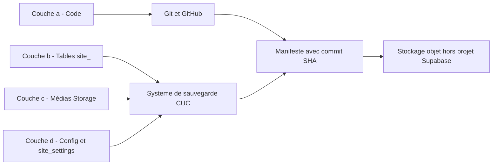
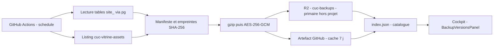
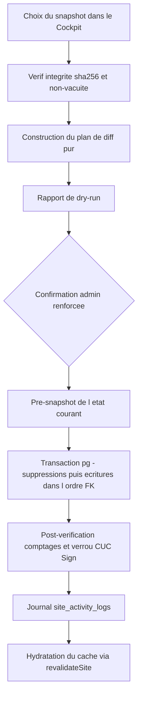
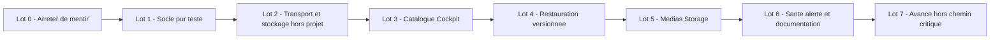

# Plan — Sauvegardes automatiques & restauration versionnée (2026)

> **Statut** : conception, aucun code de production. Document de décision destiné aux agents
> d'implémentation. Chaque affirmation technique cite un chemin réel et un numéro de ligne.
> Ce qui n'est pas vérifiable dans le dépôt est marqué **NON VÉRIFIABLE dans le repo**.

---

## 0. Contrôle de cohérence de l'audit préalable

Relecture de première main effectuée. L'audit est **majoritairement exact** ; trois points sont
corrigés ou précisés ci-dessous.

### 0.1 Failles confirmées, avec lignes réelles

| # | Faille | Preuve dans le repo |
| :-- | :--- | :--- |
| a1 | Les `error` PostgREST ne sont **jamais** lus : chaque table absente renvoie `data: null`, converti en `[]` | [`backup.ts:34-47`](src/app/(admin)/admin/actions/backup.ts:34) puis `|| []` en [`backup.ts:55-68`](src/app/(admin)/admin/actions/backup.ts:55) |
| a2 | Conséquence : un instantané **vide** est déclaré réussi | `return { success: true, backup: backupPayload }` en [`backup.ts:72`](src/app/(admin)/admin/actions/backup.ts:72) |
| b1 | Aucun `createBucket` nulle part ; l'échec d'upload est avalé | `try` en [`route.ts:41`](src/app/api/cron/backup/route.ts:41), `catch {}` vide en [`route.ts:64`](src/app/api/cron/backup/route.ts:64) |
| b2 | Le run répond `success: true` même si le stockage a échoué | [`route.ts:68-75`](src/app/api/cron/backup/route.ts:68) |
| b3 | Rétention « 8 derniers » purement indicative, appliquée seulement si l'upload a réussi | [`route.ts:59-62`](src/app/api/cron/backup/route.ts:59) |
| c1 | La « restauration » est un `upsert` sans `DELETE` — ce n'est **pas** un retour arrière | [`backup.ts:104-157`](src/app/(admin)/admin/actions/backup.ts:104) |
| c2 | Les `catch {}` internes écrivent des **miroirs `site_settings`** : une table manquante fabrique une donnée de secours fictive | [`backup.ts:129-148`](src/app/(admin)/admin/actions/backup.ts:129) |
| d1 | 7 tables `site_*` hors export : `site_social_links`, `site_announcements`, `site_campus_facilities`, `site_page_revisions`, `site_audit_logs`, `site_activity_logs`, `site_vitals`, `site_media`, `site_videos` | export limité à 14 tables en [`backup.ts:34-47`](src/app/(admin)/admin/actions/backup.ts:34) ; inventaire réel de [`scripts/audit_supabase_state.mjs:59-81`](scripts/audit_supabase_state.mjs:59) |
| e1 | Aucune sauvegarde des médias Storage | buckets mesurés en [`plans/revue-quotas-supabase.md:11-15`](plans/revue-quotas-supabase.md:11) ; originaux vidéo locaux non versionnés en [`.gitignore:58`](.gitignore:58) |
| f1 | Garde `CRON_SECRET` **contournable** : si la variable est absente, le `if` entier est sauté → **aucune** authentification | [`route.ts:19-24`](src/app/api/cron/backup/route.ts:19) |
| g1 | Aucun journal, aucune alerte, aucun test, aucune vérification d'intégrité | aucune écriture vers `site_activity_logs` dans [`route.ts`](src/app/api/cron/backup/route.ts:1) ni [`backup.ts`](src/app/(admin)/admin/actions/backup.ts:1) |
| h1 | `pg` et `DATABASE_URL` existent, donc un accès Postgres direct est possible — et déjà pratiqué | [`package.json:183`](package.json:183), [`audit_quotas.mjs:79`](scripts/audit_quotas.mjs:79) |

### 0.2 Corrections à l'audit préalable

1. **Le `catch {}` vide ne concerne pas l'export mais l'upload Storage.** L'export, lui, renvoie
   honnêtement `success: false` en cas d'exception ([`backup.ts:73-76`](src/app/(admin)/admin/actions/backup.ts:73)),
   et la route répond alors `500` ([`route.ts:28-33`](src/app/api/cron/backup/route.ts:28)). Le mensonge
   ne vient pas du `try/catch` global mais du **silence par table** décrit en a1.
2. **Il existe trois buckets, pas deux.** `cuc-vitrine-assets` (182 objets / 31,27 Mo),
   `reports` (6 objets / 0,40 Mo) et `avatars` (1 objet / 0,01 Mo) —
   [`plans/revue-quotas-supabase.md:13-15`](plans/revue-quotas-supabase.md:13). Le périmètre média doit
   donc traiter `reports` explicitement (exclusion assumée) et pas seulement l'ignorer.
3. **`pg` est une `devDependency`, pas une `dependency`** ([`package.json:183`](package.json:183)).
   Donc `pg` est **absent du runtime Vercel de production** : toute restauration exécutée depuis le
   Cockpit échouera tant que `pg` n'aura pas été promu en `dependencies`. C'est un prérequis
   bloquant, pas un détail (voir §5.7).

### 0.3 Librairies disponibles — aucune dépendance nouvelle n'est nécessaire

Relevé de [`package.json:151-188`](package.json:151):

- **Chiffrement** : `node:crypto` (AES-256-GCM, `createCipheriv`) — natif Node, aucun paquet.
- **Compression** : `node:zlib` (`gzipSync` / `gunzipSync`) — natif, aucun paquet.
- **Postgres** : `pg ^8.23.0` — déjà présent, à promouvoir en `dependencies` (§5.7).
- **Env local** : `dotenv ^18.0.3` — même convention que [`audit_quotas.mjs:39`](scripts/audit_quotas.mjs:39).
- **Exécution TypeScript de scripts** : `tsx ^4.23.13` — même convention que les scripts `cms:purge:*`.
- **Manipulation d'images** (médias) : `sharp ^0.35.4` — inutile ici, on ne recompresse pas.
- **Absent** : `archiver`, `tar`, `@aws-sdk/client-s3`, `age-encryption`, `openssl` wrapper.

**Décision** : ne pas introduire de bibliothèque d'archivage. Le format retenu est une **collection
de fichiers `.ndjson.gz` chiffrés**, chaque table étant une partie autonome (§3.5, §4). Ainsi on
n'ajoute **aucune dépendance runtime** ; côté CI, l'upload S3 se fait par l'**AWS CLI préinstallée sur
les runners `ubuntu-latest`**, pas par un SDK Node.

---

## 1. Source de vérité et périmètre « état du site »

« L'état du site » se décompose en **quatre couches étanches**. Chacune a un propriétaire de
sauvegarde distinct ; confondre les quatre est la cause racine des failles a1/c1.

| Couche | Contenu réel | Qui la sauvegarde aujourd'hui | Ce qu'il faut ajouter |
| :--- | :--- | :--- | :--- |
| **(a) Code** | Arbre Git, remote `https://github.com/Nody-G/cuc.git` | Git + GitHub (hors périmètre, déjà en place) | Rien. Le commit SHA devient une **métadonnée du manifeste** (§4.1). |
| **(b) Données éditoriales** | Tables `site_*` en Postgres (21 candidates, [`audit_supabase_state.mjs:59-81`](scripts/audit_supabase_state.mjs:59)) | Partiellement : 14 tables exportées, silencieusement et sans intégrité ([`backup.ts:34-47`](src/app/(admin)/admin/actions/backup.ts:34)) | **Sauvegarde complète et vérifiée des 21 tables de la liste blanche** (§2, §4). |
| **(c) Médias Storage** | `cuc-vitrine-assets` (182 obj / 31,27 Mo), `avatars` (1 obj), `reports` (6 obj) | **Rien** | Miroir versionné de `cuc-vitrine-assets` ; `avatars` en **lecture seule, jamais purgé** ; `reports` explicitement **hors périmètre**. |
| **(d) Configuration & paramètres** | `site_settings` en base ; variables d'environnement | `site_settings` est dans l'export ([`backup.ts:41`](src/app/(admin)/admin/actions/backup.ts:41)) mais sans miroirs associés | Sauvegarde de `site_settings` **et** d'un `env-manifest` **sans valeurs** (noms de clés + empreinte SHA-256, jamais le secret). `.env*` est gitignoré ([`.gitignore:37`](.gitignore:37)). |

### 1.1 Ce qui reste explicitement HORS périmètre, et pourquoi

1. **Schéma `auth`** — les comptes Supabase Auth ne sont **jamais** exportés. Raison : le restaurer
   depuis une sauvegarde écraserait les sessions vivantes et les jetons des deux produits ; une
   restauration d'identités ne se fait pas au niveau d'une vitrine. La gouvernance des comptes vit
   dans le Cockpit ([`actions.ts:13-20`](src/app/(admin)/admin/actions.ts:13)) et dans les sauvegardes
   natives Supabase, pas ici. **Aucune liste blanche ne contiendra jamais un nom de table du schéma `auth`.**
2. **Tables CUC Sign** — `formations`, `profiles`, `students`, `locations`, `groups`,
   `group_memberships`, `slots`, `signatures`, `evaluation_disciplines`, `evaluation_sessions` :
   **jamais lues, jamais écrites, jamais supprimées** par ce système (§2).
3. **Bucket `reports`** — six artefacts de reporting régénérables par
   `npm run report:*` ([`package.json:52-54`](package.json:52)). Les sauvegarder serait de la
   sur-fragmentation contraire à `AGENTS.md` §2.
4. **`.staging/`** — zone de travail locale non versionnée ([`.gitignore:58`](.gitignore:58)).
   Les originaux vidéo lourds restent un **actif d'exploitation**, pas un actif de sauvegarde
   applicative ; leur préservation relève d'une copie disque hors dépôt (documentée, non automatisée ici).

### 1.2 Matrice de paternité (une seule source par sujet — `AGENTS.md` §4)



---

## 2. Stratégie anti-casse CUC Sign (exigence n° 1)

Principe directeur : **on ne protège pas CUC Sign en ajoutant des précautions, on le protège en
rendant l'écriture hors périmètre structurellement impossible.** Aucune décision d'exécution
(paramètre CLI, mauvaise sauvegarde, bug) ne doit pouvoir dépasser le périmètre.

### 2.1 Liste blanche unique et normative

Une **seule** constante fait autorité : `SITE_TABLE_WHITELIST`, dérivée de
[`TABLE_CANDIDATES`](scripts/audit_supabase_state.mjs:59) et **étendue aux tables manquantes de
l'export actuel**. Les 21 entrées, sans exception :

```
site_pages, site_page_revisions, site_team, site_films, site_partners, site_events,
site_disciplines, site_sessions, site_programs, site_inquiries, site_audit_logs,
site_announcements, site_settings, site_navigation, site_footer, site_social_links,
site_translations, site_campus_pois, site_campus_facilities, site_media, site_videos
```

### 2.2 Garde-fous fail-fast (logique pure, testée)

| Garde | Règle | Comportement |
| :--- | :--- | :--- |
| G1 — Prédicat de préfixe | Tout nom de table doit satisfaire `^site_[a-z_]+$` | `throw` avant toute I/O. Le préfixe `site_` est la règle canonique ([`cuc_sign_interconnection.md:31`](.agents/rules/cuc_sign_interconnection.md:31)). |
| G2 — Refus de dérive | Si la liste blanche contient un seul nom qui n'est pas `site_*`, **toute** la sauvegarde **et** toute restauration s'arrêtent | `throw` au chargement du module. Aucun mode « continuer quand même ». |
| G3 — Interdiction CUC Sign | `formations`, `profiles`, `students`, `locations`, `groups`, `group_memberships`, `slots`, `signatures`, `evaluation_disciplines`, `evaluation_sessions` sont **dans une liste noire explicite**, distincte de la liste blanche | Test unitaire : l'intersection liste blanche ∩ liste noire doit être **vide**. |
| G4 — Interdiction du schéma `auth` | Toute requête SQL générée est vérifiée : le schéma cible doit être `public` | `throw` si `relnamespace` n'est pas `public`. |
| G5 — Aucune FK vers CUC Sign | Interdiction absolue de créer une FK vers `evaluation_disciplines` (et toute autre table CUC Sign) | Contrôle CI qui inspecte `pg_constraint` : seules **3** FK site → CUC Sign sont autorisées (§2.3). |
| G6 — `DELETE` borné | Le `DELETE` d'une restauration ne s'exécute que sur une table de la liste blanche, jamais ailleurs | Le SQL est **construit** à partir de la liste blanche, jamais concaténé depuis une entrée utilisateur. |
| G7 — Bucket `avatars` | `avatars` est **lecture seule** : aucun upload, aucun `DELETE`, jamais purgé | Le module de stockage refuse toute opération d'écriture sur un bucket hors `cuc-backups`. |

### 2.3 Protection des trois colonnes de pont (non-dégradation)

Les seules liaisons site → CUC Sign sont documentées en
[`cuc_sign_interconnection.md:21-27`](.agents/rules/cuc_sign_interconnection.md:21) :

| Table vitrine | Colonne de pont | Cible CUC Sign | Convention FK |
| :--- | :--- | :--- | :--- |
| `site_sessions` | `cuc_sign_formation_id` | `formations.id` | `ON DELETE SET NULL` |
| `site_team` | `profile_id` | `profiles.id` | `ON DELETE SET NULL` |
| `site_campus_pois` | `location_id` | `locations.id` | `ON DELETE SET NULL` |

**Règle de non-dégradation, explicite et non négociable** :

1. Lors d'un `UPDATE` de restauration, ces trois colonnes sont **retirées du `SET`** : la valeur
   **vivante** est conservée, même si la sauvegarde en contient une autre. Un instantané périmé ne
   peut donc jamais défaire un appariement récent fait dans le Cockpit.
2. Lors d'un `INSERT` (ligne absente en base), la valeur de pont issue du snapshot est écrite
   **uniquement après validation** que l'identifiant cible existe réellement dans `formations` /
   `profiles` / `locations` — lecture seule sur CUC Sign. Sinon la colonne est écrite `NULL`.
   Justification : « un lien faux est pire qu'aucun lien »
   ([`cuc_sign_interconnection.md:33`](.agents/rules/cuc_sign_interconnection.md:33)).
3. La suppression d'une ligne `site_*` ne peut pas atteindre CUC Sign : les FK sont toutes en
   `ON DELETE SET NULL` ([`cuc_sign_interconnection.md:32`](.agents/rules/cuc_sign_interconnection.md:32)).
4. **Interdiction de créer une FK vers `evaluation_disciplines`** : c'est une table d'**instance**
   (`session_id NOT NULL`, 4 étiquettes) alors que `site_disciplines` est un référentiel éditorial de
   10 entrées — aucun appariement possible
   ([`cuc_sign_interconnection.md:27`](.agents/rules/cuc_sign_interconnection.md:27)).

### 2.4 Verrou de non-agression, contrôlé après chaque restauration

Le « verrou CUC Sign » est un contrôle **actif**, pas une intention :

- comptage de `formations`, `profiles`, `locations` **avant** et **après** → doit être **identique** ;
- comptage des 3 colonnes de pont non nulles (`IS NOT NULL`) → ne doit **jamais régresser** ;
- exécution de `npm run audit:supabase` ([`package.json:39`](package.json:39)) → doit rester vert.

Si l'un des trois échoue : la restauration est déclarée en échec, journalisée `critical`, et la
procédure de retour (restauration du pré-snapshot, §5.6) est proposée automatiquement.

---

## 3. Transport, automatisation, stockage et rétention

### 3.1 Comparatif et arbitrage du transport

| Critère | Vercel Cron (existant) | GitHub Actions planifié | Décision |
| :--- | :--- | :--- | :--- |
| Binaire `pg_dump` | **Absent** des fonctions serverless (NON VÉRIFIABLE dans le repo, mais jamais fourni par le runtime) | **Préinstallé** sur `ubuntu-latest` | Actions |
| Durée maximale | Contrainte (timeout de fonction) | 6 h par job | Actions |
| Secrets | Vercel env | GitHub Secrets (chiffrés), repo **public ou privé** | Égalité |
| Artefacts & rétention | Aucun artefact natif | Artifacts + `actions/cache`, rétention configurable | Actions |
| Coût | Inclus (offre gratuite, sous réserve d'usage non commercial — [`durability_health.md:63-66`](.agents/rules/durability_health.md:63)) | Minutes gratuites généreuses sur dépôt public | Égalité |
| Reproductibilité locale | Non | Oui (`act` / `node scripts/...`) | Actions |
| Fréquence | **1 exécution / jour** côté plan gratuit (`0 3 * * 0` n'est pas une limite du plan mais un choix ; la limite réelle du plan gratuit est journalière — **NON VÉRIFIABLE dans le repo**) | Cron réel, jusqu'à plusieurs fois par jour | Actions |

**DÉCISION : transport principal = GitHub Actions planifié.**

- `.github/workflows/backup.yml` : `schedule` quotidien (`30 2 * * *`) = la **quotidienne** ;
  `schedule` hebdomadaire (`0 3 * * 0`) = la **mise en avant hebdomadaire** (tier de rétention) ;
  `workflow_dispatch` pour la sauvegarde manuelle à la demande.
- **Le Vercel Cron existant est conservé mais dégradé en *balise de santé*** : il vérifie la
  fraîcheur du dernier snapshot et journalise ; il **ne produit plus** de sauvegarde. Alternative
  écartée : le supprimer purement et simplement — on perdrait la seule sonde qui tourne **côté
  plateforme d'hébergement**, donc indépendante de GitHub.
- Alternative écartée : **Vercel seul**. Rejeté car a1/b1 (échecs silencieux) s'ajoutent à l'absence
  garantie de `pg_dump`, qui condamne tout dump Postgres et pousse vers des exports table par table
  nécessairement tronqués.
- Alternative écartée : **Actions + Vercel en double écriture**. Rejeté : deux écrivains sur le même
  index de catalogue = dérive garantie, contraire à `AGENTS.md` §4 (une seule source par sujet).

### 3.2 Stockage hors du projet Supabase — arbitrage

> Un instantané qui vit dans le projet qu'il protège n'est pas une sauvegarde : un incident de quota
> (l'incident réel du 2026-09-23, [`durability_health.md:21-31`](.agents/rules/durability_health.md:21)) ou une
> suppression de projet emporte les deux.

**DÉCISION : stockage primaire = bucket objet S3-compatible (Cloudflare R2 recommandé), hors projet
Supabase.**

| Option | Verdict | Justification |
| :--- | :--- | :--- |
| Bucket Supabase `cuc-backups` (statu quo [`route.ts:43`](src/app/api/cron/backup/route.ts:43)) | **Rejeté comme cible primaire** | Même projet que les données ; le bucket n'existe même pas aujourd'hui. Conservé uniquement comme **cache de transit court** (7 jours) si l'on veut éviter tout réseau externe, jamais comme archive. |
| Cloudflare R2 | **RETENU** | API S3, **egress gratuit** (critère décisif pour des médias de 31 Mo × versions), endpooint `https://<account>.r2.cloudflarestorage.com`. |
| AWS S3 (Glacier pour les mensuelles) | Alternative acceptable | Coût de requêtes et egress supérieurs ; même intégration AWS CLI. |
| Artefact GitHub chiffré seul | **Rejeté comme primaire** | Dépend du dépôt et de la politique de rétention GitHub ; un dépôt public rend les artifacts accessibles — acceptable **seulement une fois chiffrés**, et jamais comme unique copie. |
| `pg_dump` complet conservé hors ligne (disque dur, NAS) | **Complément, non primaire** | Ne couvre pas les médias, non automatisable côté hébergeur ; à documenter dans `durability_health.md`. |

Composition retenue :



### 3.3 Chiffrement des snapshots — obligatoire

`site_inquiries` contient des **données personnelles** (nom, email, téléphone) ; `site_activity_logs`
peut contenir des adresses. Le chiffrement n'est donc pas optionnel.

- **Algorithme** : AES-256-GCM via `node:crypto` (`createCipheriv`), clé de 32 octets en base64.
- **Portée** : chaque partie de données (`.ndjson.gz`) est chiffrée **individuellement**. Le
  `manifest.json` reste en clair et ne contient **aucune donnée personnelle** (noms de tables,
  comptages, empreintes, IV, authTag).
- **Clé** : `BACKUP_ENCRYPTION_KEY` — GitHub Secret **et** variable d'environnement Vercel (le
  Cockpit doit pouvoir déchiffrer pour le dry-run et la restauration). Rotation documentée : nouvelle
  clé ⇒ les anciens snapshots restent lisibles par `key_id` inscrit dans le manifeste.
- **Aucun secret n'entre dans un artefact** : l'`env-manifest` ne contient que des **noms** de clés et
  des empreintes SHA-256 (§1, couche d).
- Cas dépôt **public** (NON VÉRIFIABLE dans le repo) : le chiffrement est la seule barrière —
  il est donc obligatoire dans les deux cas, ce qui rend la question du caractère public/privé
  **non bloquante**. Cas dépôt **privé** : le chiffrement reste exigé pour la PII.

### 3.4 Rétention (GFS — grand-père / père / fils)

| Tier | Nombre conservé | Source |
| :--- | :--- | :--- |
| Quotidiennes | **7** | `schedule` quotidien |
| Hebdomadaires | **4** | snapshot du dimanche promu « hebdomadaire » |
| Mensuelles | **12** | snapshot du 1er du mois promu « mensuelle » |

- La promotion de tier est décidée par une **fonction pure** `selectExpiredSnapshots(snapshots, policy)`
  — testable sans réseau — qui renvoie la liste des identifiants à purger.
- La purge supprime les objets R2 **puis** réécrit l'index ; jamais l'inverse (un index en avance sur
  les objets créerait des versions fantômes).
- Volume estimé : 23 snapshots × (≈ 4 Mo de données chiffrées + index média) — très inférieur au
  budget de stockage, hors budget Supabase puisque stocké chez R2. Estimation à confirmer à la
  première exécution réelle.
- Les snapshots **promus** (hebdo/mensuel) sont immuables et ne sont jamais purgés par la rétention glissante.

### 3.5 Format des artefacts

```
cuc-backups/                                  (bucket R2)
├── index.json                                catalogue, réécrit en dernier
├── health.json                               dernier run : statut, âge, taille, verrou CUC Sign
├── site/
│   └── 2026/10/
│       └── snapshot-20261001T023000Z-a1b2c3d/
│           ├── manifest.json                 en clair, sans PII
│           └── data/
│               ├── site_pages.ndjson.gz.enc
│               ├── site_team.ndjson.gz.enc
│               └── ... (une partie par table de la liste blanche)
└── media/
    └── cuc-vitrine-assets/2026/10/…          miroir versionné des médias
```

- **NDJSON** (un objet JSON par ligne) plutôt qu'un tableau : diff par table, lecture en flux,
  reprise partielle sans tout charger.
- **Pas de `tar`** : chaque table est un fichier autonome → zéro dépendance d'archivage (§0.3).
- **`pg_dump`** : optionnel et **séparé** — un dump complet chiffré, étiqueté `disaster/`, qui ne sert
  **jamais** à la restauration automatique (car il contiendrait CUC Sign). Documenté, non branché.

---

## 4. Contrat de données, intégrité et catalogue

### 4.1 Structure exacte du manifeste

```jsonc
{
  "manifest_version": 1,
  "snapshot_id": "snapshot-20261001T023000Z-a1b2c3d",
  "created_at": "2026-10-01T02:30:00.000Z",
  "tier": "daily",                    // daily | weekly | monthly | manual | pre-restore
  "scope": {
    "tables": ["site_pages", "…"],    // sous-ensemble de la liste blanche, vérifié
    "whitelist_version": "1",         // versionne la liste blanche : un ajout de table est tracé
    "excluded": ["auth", "formations", "profiles", "students", "locations",
                 "groups", "group_memberships", "slots", "signatures",
                 "evaluation_disciplines", "evaluation_sessions"]
  },
  "code": {
    "git_commit": "a1b2c3d…",
    "git_branch": "main",
    "app_version": "0.1.0"            // package.json:3
  },
  "schema": {
    "database_schema_version": "…",   // empreinte des migrations appliquées
    "captured_at": "…"
  },
  "parts": [
    {
      "table": "site_pages",
      "path": "data/site_pages.ndjson.gz.enc",
      "rows": 24,
      "plaintext_bytes": 51200,
      "ciphertext_bytes": 51412,
      "plaintext_sha256": "…",        // intégrité du contenu, avant chiffrement
      "ciphertext_sha256": "…",       // intégrité du fichier stocké
      "compression": "gzip",
      "encryption": { "alg": "aes-256-gcm", "key_id": "2026-10", "iv": "…", "auth_tag": "…" }
    }
  ],
  "media": {
    "bucket": "cuc-vitrine-assets",
    "objects": 182,
    "bytes": 32789123,
    "manifest_path": "media/cuc-vitrine-assets/2026/10/manifest.json"
  },
  "env_fingerprint": {
    "keys": ["DATABASE_URL", "SUPABASE_URL", "CRON_SECRET", "…"],
    "sha256_of_names": "…"            // jamais les valeurs
  },
  "totals": { "tables": 21, "rows": 4102, "bytes": 4123456 },
  "bridge_columns": ["site_sessions.cuc_sign_formation_id",
                     "site_team.profile_id",
                     "site_campus_pois.location_id"],
  "previous_snapshot_id": "…"         // chaînage, utile pour un retour pas à pas
}
```

### 4.2 Lister les versions disponibles

- `listBackupVersions()` lit `index.json` puis, en cas d'absence, **reconstruit** la liste à partir des
  `manifest.json` présents (dégradation gracieuse).
- L'index est trié du plus récent au plus ancien et expose : `snapshot_id`, `created_at`, `tier`,
  `totals.rows`, `totals.bytes`, `git_commit`, `integrity_verified`.

### 4.3 Vérification d'intégrité avant toute restauration

Ordre strict, toute étape en échec **arrête** la restauration :

1. présence du `manifest.json` et `manifest_version` connue ;
2. `scope.tables` ⊆ liste blanche **et** ∩ liste noire = ∅ (G2, G3) ;
3. pour chaque partie : téléchargement, `ciphertext_sha256` recalculé ;
4. déchiffrement AES-GCM (le `auth_tag` détecte toute altération), `gunzip`, `plaintext_sha256` recalculé ;
5. comptage des lignes NDJSON == `parts[].rows` ;
6. contrôle de non-vacuité : au moins une table non vide **et** `totals.rows` > seuil (anti-backup vide,
   réponse directe à la faille a2) ;
7. `git_commit` résolu (avertissement, non bloquant, si le commit n'est plus dans l'historique).

### 4.4 Catalogue : fichiers sur le stockage **vs** table `site_backups`

**DÉCISION : le catalogue est un fichier `index.json` sur le stockage. Aucune table `site_backups`
n'est créée.** (Recherche confirmée : `site_backups` n'existe nulle part dans le dépôt.)

Justification au regard du SRP :

1. **Le catalogue doit survivre à la perte de la base.** Une table Postgres dans le projet Supabase
   disparaît exactement dans le scénario que la sauvegarde doit couvrir (suppression de projet,
   corruption, incident de quota du 2026-09-23). Un catalogue dans la base qu'il catalogue est un
   catalogue qui meurt avec son objet.
2. **Une seule source par sujet** (`AGENTS.md` §4). Le manifeste est déjà, par construction, la
   description complète d'un snapshot ; un second registre en base dupliquerait cette vérité et
   dériverait (tier, comptages, hash).
3. **Frontière de responsabilité nette** : la couche « Domaine » décrit un snapshot (manifeste) ;
   la couche « I-O » le stocke ; le catalogue n'est qu'un **index d'accès** dérivé, donc reconstructible.
4. Alternative écartée : table `site_backups` **miroir** pour accélérer l'affichage du Cockpit —
   rejetée car elle ajoute un écrivain supplémentaire et un état à resynchroniser, pour un gain de
   performance négligeable sur 23 entrées.

Conséquence assumée : le Cockpit lit le catalogue via une Server Action qui interroge le stockage
objet (le cache `unstable_cache` / `revalidateTag` peut amortir la lecture, conformément à
[`durability_health.md:43-44`](.agents/rules/durability_health.md:43)).

---

## 5. Restauration versionnée — le retour arrière réel

### 5.1 Principe

Ce qui existe aujourd'hui ([`backup.ts:104-157`](src/app/(admin)/admin/actions/backup.ts:104)) est un
**`upsert`**, donc une fusion : les lignes supprimées par erreur **reviennent** (faux), et les lignes
créées par erreur **restent** (faux). Une restauration doit être une **projection exacte** de
l'instantané, bornée à la liste blanche.

### 5.2 Algorithme



Étapes détaillées :

1. **Résolution** : `snapshot_id` → `manifest.json`.
2. **Vérification d'intégrité** (§4.3), y compris le contrôle de non-vacuité.
3. **Plan de restauration** — construit par de la **logique pure** (`diff.ts`, `fk-order.ts`) :
   - lecture de l'état courant des tables de la liste blanche (clés + comptages) ;
   - pour chaque table : `insert`, `update`, `delete` (clés absentes du snapshot) ;
   - **colonnes de pont retirées des `UPDATE`** (§2.3) ;
   - insertion : validation des identifiants de pont en lecture seule sur CUC Sign ;
   - ordre FK calculé par tri topologique des contraintes **restreint à la liste blanche** ;
     si le graphe est cyclique ou illisible, repli sur un ordre manuel déclaré et journalisé.
4. **Dry-run par défaut** — convention déjà en place dans le dépôt
   ([`durability_health.md:83-92`](.agents/rules/durability_health.md:83), scripts `--dry` /
   `:write`). Sortie : par table, `insert`/`update`/`delete`, ordre FK, colonnes de pont protégées,
   pré-contrôles CUC Sign. **Aucune écriture.**
5. **Application** (`--apply`) :
   a. **Pré-snapshot obligatoire** de l'état courant, tier `pre-restore` — c'est le filet de sécurité
      de la restauration elle-même ;
   b. `BEGIN` ;
   c. `DELETE` des lignes absentes du snapshot, **enfants avant parents** (ordre FK inversé) ;
   d. écritures parents avant enfants, `INSERT … ON CONFLICT DO UPDATE` avec `SET` **excluant** les
      colonnes de pont ;
   e. `COMMIT` ; toute erreur ⇒ `ROLLBACK` intégral.
6. **Vérification post-restauration** : recomptage par table == comptages du manifeste ; ré-empreinte ;
   **verrou CUC Sign** (§2.4) ; `npm run audit:supabase`.
7. **Journalisation** : entrée `site_activity_logs` (`backup.restore.applied`, `critical`) avec acteur,
   `snapshot_id`, comptages avant/après, durée. Puis `revalidateSite(...)` sur les routes publiées
   (`/`, `/formation-de-cascadeur`, `/stages-cascades-parkour-2`, `/contact-cuc`,
   `/team-building-cascades`) — même liste qu'aujourd'hui
   ([`backup.ts:159`](src/app/(admin)/admin/actions/backup.ts:159)).
8. **Rollback de la restauration** : procédure documentée en une commande —
   `restore_backup.mjs --apply --snapshot <pre-snapshot-id>`. Le pré-snapshot étant automatiquement
   produit à l'étape 5a, le retour est toujours possible. Si l'étape 5c/5d a échoué, la transaction a
   déjà tout annulé : le rollback n'est requis que si le `COMMIT` a réussi mais que la
   post-vérification échoue (cas « restauration réussie techniquement, résultat non désiré »).

### 5.3 Protection des données de pont pendant la suppression

Cas particulier : une ligne `site_sessions` supprimée localement **doit** être supprimée par une
restauration si elle est absente du snapshot. Mais une ligne dont la colonne de pont a été **remplie
après** la date du snapshot doit être **préservée** : sa suppression détruirait un appariement récent.
**Règle** : toute ligne dont une colonne de pont est non nulle et **absente** du snapshot est
**conservée** et signalée dans le rapport de dry-run comme « conservée — appariement postérieur à
l'instantané ».

### 5.4 Ordre FK

- Calculé depuis `pg_constraint` (`contype = 'f'`) pour les seules relations de `public` appartenant à
  la liste blanche (G4, G5).
- `DELETE` : ordre inverse. `INSERT`/`UPDATE` : ordre direct.
- Testé unitairement sur un graphe de fixtures (acyclique et cyclique) sans base de données.

### 5.5 Portée et limites assumées

- Seules les **données** sont restaurées. Le **schéma** ne l'est pas : les migrations restent le
  domaine de `npm run db:migrate:*` ([`durability_health.md:83-92`](.agents/rules/durability_health.md:83)).
- Une restauration **ne touche jamais** une colonne absente du snapshot sur une ligne existante : elle
  ignore, elle n'efface pas. (Un snapshot ancien ne doit pas vider une colonne ajoutée depuis.)

### 5.6 Niveau de confirmation exigé dans le Cockpit — arbitrage

État réel : un simple `confirm()` navigateur
([`BackupRestoreModal.tsx:101`](src/app/(admin)/admin/components/BackupRestoreModal.tsx:101)) — alors que
l'aide promet « une confirmation par mot de passe administrateur »
([`help-content.systeme.ts:64`](src/app/(admin)/admin/components/help-view/help-content.systeme.ts:64)).

**DÉCISION : on aligne le code sur la promesse de l'aide, on ne dégrade pas la promesse.**
Triple barrière, exigée côté serveur (jamais espérée côté client) :

1. **Rôle** : `directeur` ou `admin` uniquement — la règle d'or des rôles
   ([`cuc_sign_interconnection.md:67-74`](.agents/rules/cuc_sign_interconnection.md:67)) exclut
   `secretaire` des opérations destructives ;
2. **Ré-authentification par mot de passe** de l'utilisateur courant (pas un secret partagé) ;
3. **Phrase de confirmation saisie** (`RESTAURER`) affichée avec le `snapshot_id` et le nombre de
   lignes concernées.

Alternative écartée : corriger l'aide pour décrire un simple `confirm()`. Rejetée car l'enjeu a
augmenté — après la mise en service de CUC Sign, une restauration mal déclenchée coûte des
appariements et des candidatures.

### 5.7 Prérequis bloquant : `pg` doit passer en `dependencies`

`pg` est aujourd'hui une `devDependency` ([`package.json:183`](package.json:183)) et sera donc
**absent du runtime Vercel de production**. Or le dry-run et la restauration s'exécutent depuis des
Server Actions du Cockpit.

**DÉCISION** : promouvoir `pg` en `dependencies`, et exécuter ces Server Actions en
`runtime = 'nodejs'` (jamais Edge).

Alternative écartée : faire exécuter la restauration par un `workflow_dispatch` GitHub déclenché
depuis le Cockpit. Rejetée car elle exige un **PAT GitHub à longue durée** dans l'environnement
Vercel et un second plan de contrôle (deux systèmes à auditer) pour un gain nul en sécurité — la
garde passe de « rôle + mot de passe + phrase » à « jeton ».

---

## 6. Découpage modulaire cible (obligatoire, `AGENTS.md` §1-2)

Règle appliquée : **cible 150–200 lignes, plafond 300**. Chaque fichier a **une** responsabilité et
une seule couche. Interdiction des dépendances circulaires ; sens imposé
`Types → Domaine pur → I-O → Orchestration → Présentation`.

### 6.1 Types & Contrats

| Fichier | Rôle unique | Couche | Lignes (est.) | Dépend de |
| :--- | :--- | :--- | ---: | :--- |
| `src/lib/backup/contracts.ts` | `BackupManifest`, `SnapshotPart`, `RestorePlan`, `TableDiff`, `BackupStatus`, `RetentionPolicy`, `BackupTier` | Types & Contrats | 130–160 | aucun |

### 6.2 Domaine pur (aucune I/O, testable sans réseau ni base)

| Fichier | Rôle unique | Lignes (est.) | Dépend de |
| :--- | :--- | ---: | :--- |
| `src/lib/backup/whitelist.ts` | `SITE_TABLE_WHITELIST`, `CUC_SIGN_DENYLIST`, `BRIDGE_COLUMNS`, gardes G1–G7 | 100–130 | `contracts.ts` |
| `src/lib/backup/manifest.ts` | `buildManifest()`, `serializeManifest()`, `parseManifest()` — purs (données entrantes = déjà lues) | 140–170 | `contracts.ts`, `whitelist.ts` |
| `src/lib/backup/integrity.ts` | `sha256Hex()`, `verifyParts()`, `assertNonEmpty()`, `verifyGcmTag()` | 90–120 | `contracts.ts` |
| `src/lib/backup/fk-order.ts` | `computeRestoreOrder(fks)` — tri topologique, détection de cycle, repli manuel | 120–150 | `contracts.ts` |
| `src/lib/backup/diff.ts` | `buildRestorePlan(current, snapshot)` — insert/update/delete + protection des colonnes de pont + règle §5.3 | 170–200 | `contracts.ts`, `whitelist.ts` |
| `src/lib/backup/retention.ts` | `selectExpiredSnapshots()` — GFS 7/4/12, tiers promus immuables | 100–130 | `contracts.ts` |

### 6.3 Accès I/O

| Fichier | Rôle unique | Lignes (est.) | Dépend de |
| :--- | :--- | ---: | :--- |
| `src/lib/backup/io/crypto.ts` | AES-256-GCM : `encryptBuffer()`, `decryptBuffer()`, `keyFromEnv()` | 90–120 | `node:crypto` |
| `src/lib/backup/io/compress.ts` | `gzipBuffer()`, `gunzipBuffer()`, `toNdjson()`, `fromNdjson()` | 60–90 | `node:zlib` |
| `src/lib/backup/io/storage.ts` | Objets S3/R2 : `put`, `get`, `list`, `remove` + **refus d'écriture hors bucket `cuc-backups`** (G7) | 150–190 | `@aws-sdk/client-s3` (seule dépendance ajoutée, côté scripts) |
| `src/lib/backup/io/db-read.ts` | Lecture des tables de la liste blanche via `pg` → lignes brutes | 110–140 | `pg`, `whitelist.ts` |
| `src/lib/backup/io/db-restore.ts` | `BEGIN`/`COMMIT`/`ROLLBACK`, `DELETE` borné, `INSERT … ON CONFLICT` sans colonnes de pont | 170–200 | `pg`, `fk-order.ts`, `whitelist.ts` |
| `src/lib/backup/io/index-store.ts` | Lecture/écriture atomique de `index.json` et `health.json` | 90–120 | `storage.ts` |
| `src/lib/backup/io/media.ts` | Miroir de `cuc-vitrine-assets` ; `avatars` lecture seule ; `reports` hors périmètre | 140–180 | `storage.ts` |
| `src/lib/backup/io/env-fingerprint.ts` | Noms de clés + `sha256_of_names` — **jamais de valeur** | 50–70 | `node:crypto` |

### 6.4 Orchestration (scripts CLI)

| Fichier | Rôle unique | Lignes (est.) | Dépend de |
| :--- | :--- | ---: | :--- |
| `scripts/backup/run_backup.mjs` | Pipeline : lire → manifeste → chiffrer → stocker → index → purger | 180–230 | §6.2, §6.3 |
| `scripts/backup/restore_backup.mjs` | CLI `--dry` / `--apply --snapshot <id>` : pré-snapshot, transaction, post-vérif | 210–270 | §6.2, §6.3 |
| `scripts/backup/verify_backup.mjs` | Vérifie un snapshot (intégrité + non-vacuité) sans restaurer | 110–150 | §6.2, §6.3 |
| `scripts/backup/list_backups.mjs` | Affiche le catalogue (humain + `--json`) | 80–110 | §6.3 |
| `scripts/backup/check_backup_health.mjs` | Fraîcheur < 48 h, tailles > seuil, tables non vides — **échec explicite** | 110–150 | §6.2, §6.3 |
| `scripts/guard_cuc_sign_scope.mjs` | Contrôle CI : seules 3 FK site → CUC Sign, aucune vers `evaluation_disciplines` | 90–130 | `pg` |

### 6.5 Présentation (Cockpit)

| Fichier | Rôle unique | Lignes (est.) | Nature |
| :--- | :--- | ---: | :--- |
| `src/app/(admin)/admin/actions/backup-versions.ts` | Server Actions : `listBackupVersions()`, `getBackupStatus()`, `dryRunRestore()`, `applyRestore()` (+ garde rôle/ré-auth/phrase) | 170–210 | **Créé** |
| `src/app/(admin)/admin/components/backup-view/BackupVersionsPanel.tsx` | Vue pure : liste des versions, âge, taille, intégrité, verrou CUC Sign | 150–190 | **Créé** |
| `src/app/(admin)/admin/components/backup-view/backup-status.types.ts` | Contrats de vue (props in, render out) | 40–60 | **Créé** |
| `src/app/(admin)/admin/components/BackupRestoreModal.tsx` | **Modifié (diff chirurgical)** : branche le panneau versions + triple confirmation ; conserve le téléchargement JSON manuel | 259 → ~250 | Modifié |

### 6.6 Fichiers modifiés en diff chirurgical

| Fichier | Modification | Risque CUC Sign |
| :--- | :--- | :--- |
| `src/app/api/cron/backup/route.ts` | Devient une **balise de santé** : garde `CRON_SECRET` fail-fast (401 si `cronSecret` absent), lit l'âge du dernier snapshot, journalise, n'écrit plus de sauvegarde. Le `catch {}` de [`route.ts:64`](src/app/api/cron/backup/route.ts:64) est supprimé. | Nul (aucune écriture en base) |
| `src/app/(admin)/admin/actions/backup.ts` | Lit chaque `error` PostgREST ; `exportFullSiteBackup` devient un adaptateur vers `run_backup` ; `restoreFullSiteBackup` est **retiré de la façade** au profit de `applyRestore` (après un cycle de dépréciation). Corrige a1, a2, c1, c2. | Faible (borné par G1–G7) |
| `src/app/(admin)/admin/actions.ts` | Façade : `export { … } from './actions/backup-versions'` (même convention qu'en [`actions.ts:47`](src/app/(admin)/admin/actions.ts:47)) | Nul |
| `package.json` | `pg` → `dependencies` ; ajout de `@aws-sdk/client-s3` (scripts uniquement) ; scripts `backup:*`, `backup:verify`, `backup:health` | Nul |
| `vercel.json` | Cron conservé, commenté comme **sonde de santé** ; aucune production de sauvegarde | Nul |
| `.github/workflows/ci.yml` | Ajout du job `backup-health` (non bloquant sur PR, bloquant sur `schedule`) | Nul |

### 6.7 Fichiers créés hors code

| Fichier | Rôle |
| :--- | :--- |
| `.github/workflows/backup.yml` | Quotidien + hebdomadaire + `workflow_dispatch` |
| `.agents/rules/backup_restore.md` | **Règle canonique** du sujet (voir §8.4) |

### 6.8 Fichiers à ne PAS toucher

- **Tout ce qui touche CUC Sign** : aucun script `apply_*cuc_sign*`, aucune table `formations`,
  `profiles`, `students`, `locations`, `groups`, `group_memberships`, `slots`, `signatures`,
  `evaluation_*` ne doit être ouvert en écriture. `scripts/audit_supabase_state.mjs` reste **lecture seule**.
- `src/lib/logging/**` : la porte d'écriture existe déjà (`writeActivityLog`,
  [`write.ts:62`](src/lib/logging/write.ts:62)) ; on l'utilise, on ne la duplique pas.
- `src/lib/i18n/**`, `src/components/**` : aucun rapport avec la sauvegarde.
- Les migrations : aucune migration n'est créée par ce plan (aucune table `site_backups`, §4.4).

---

## 7. Plan de tests et de preuve

### 7.1 Tests unitaires (logique pure — obligatoires, sans réseau)

| Cible | Tests |
| :--- | :--- |
| `whitelist.ts` | G1 préfixe ; G2 fail-fast sur entrée non `site_` ; G3 intersection liste blanche ∩ denylist vide ; G4 schéma `public` ; G7 refus d'écriture hors `cuc-backups` |
| `manifest.ts` | `build → serialize → parse` est un aller-retour stable ; un manifeste sans `parts` est rejeté ; `excluded` contient toujours les 11 tables CUC Sign + `auth` |
| `integrity.ts` | SHA-256 déterministe ; altération d'un octet ⇒ échec ; `assertNonEmpty()` refuse `rows: 0` partout |
| `fk-order.ts` | Graphe acyclique ⇒ ordre correct ; cycle ⇒ repli manuel ; `DELETE` en ordre inverse |
| `diff.ts` | `delete` = clés absentes du snapshot ; **colonnes de pont jamais dans `update`** ; ligne à appariement postérieur conservée (§5.3) ; insertion à identifiant de pont inconnu ⇒ `NULL` |
| `retention.ts` | 7 quotidiennes + 4 hebdo + 12 mensuelles ; tiers promus jamais purgés ; 8ᵉ quotidienne ⇒ purgée |

Convention de test déjà en place : `vitest` ([`package.json:11`](package.json:11)), fichiers
`*.test.ts` co-localisés (ex. [`throttle.ts`](src/lib/logging/throttle.ts:1) ↔
[`throttle.test.ts`](src/lib/logging/throttle.test.ts:1), ou
[`redact.ts`](src/lib/logging/redact.ts:1) ↔ [`redact.test.ts`](src/lib/logging/redact.test.ts:1)).

### 7.2 Tests d'intégration en dry-run

- `restore_backup.mjs --dry` contre un snapshot de test : vérifie l'absence **totale** d'écriture
  (comptages identiques avant/après).
- Test « restauration complète » sur **snapshot synthétique** : crée une table témoin, restaure,
  vérifie la projection exacte, puis restaure le pré-snapshot et vérifie le retour à l'état initial.
- Convention « IGNORÉ » sans `DATABASE_URL` : reprise exacte de
  [`audit_quotas.mjs:72-77`](scripts/audit_quotas.mjs:72) — un contrôle manquant ne doit **jamais**
  ressembler à un contrôle vert.

### 7.3 Preuve que CUC Sign est intact

Après toute restauration de test, exécution automatique et **bloquante** de :

1. `SELECT count(*)` sur `formations`, `profiles`, `locations` → identiques à l'avant ;
2. comptage `IS NOT NULL` des 3 colonnes de pont → sans régression ;
3. `npm run audit:supabase` ([`package.json:39`](package.json:39)) → code de sortie 0 ;
4. `node scripts/guard_cuc_sign_scope.mjs` → seules 3 FK site → CUC Sign, aucune vers
   `evaluation_disciplines` ;
5. `npm run audit:quotas` ([`package.json:25`](package.json:25)) → budget stockage non franchi
   (rappel : 182 objets / 31,27 Mo pour `cuc-vitrine-assets`,
   [`plans/revue-quotas-supabase.md:13`](plans/revue-quotas-supabase.md:13)).

Le résultat de ces 5 vérifications constitue le « verrou CUC Sign » affiché dans le Cockpit.

### 7.4 Ce qu'il faut ajouter à `.github/workflows/ci.yml`

Le job unique actuel est `quality` ([`.github/workflows/ci.yml:14`](.github/workflows/ci.yml:14)).
Ajouts :

| Ajout | Contenu | Comportement |
| :--- | :--- | :--- |
| Job `backup-unit` | `npm run test` couvre déjà les tests purs ; ajouter explicitement le chemin `src/lib/backup/**` au rapport de couverture | Bloquant |
| Job `backup-scope-guard` | `node scripts/guard_cuc_sign_scope.mjs` | **Bloquant en toutes circonstances** — c'est la garde anti-casse |
| Job `backup-health` | `node scripts/backup/check_backup_health.mjs --max-age-hours 48 --min-rows 1 --min-bytes N` | **Bloquant sur `schedule`**, informatif sur `pull_request` (pas de secrets côté PR de fork) |
| Étape déclenchée par `schedule` dans `ci.yml` | `on: schedule: - cron: '0 6 * * *'` | Le job de fraîcheur tourne même sans push, ce qui est le seul moyen de détecter un backup qui s'est arrêté |

Critères du contrôle de fraîcheur : dernier snapshot < 48 h ; taille de chaque partie > seuil déclaré ;
aucune table de la liste blanche à 0 ligne alors qu'elle est non vide en base ; `integrity_verified`
vrai. Le script suit la convention de code de sortie de
[`audit_quotas.mjs:27-29`](scripts/audit_quotas.mjs:27) : `2` si un seuil est franchi, `0 IGNORÉ`
explicite si les secrets sont absents.

---

## 8. Observabilité et échec honnête

### 8.1 Remplacer les `catch {}` par un échec explicite

| Emplacement fautif | Remplacement |
| :--- | :--- |
| `catch {}` vide de [`route.ts:64`](src/app/api/cron/backup/route.ts:64) | Suppression. La sonde lit `error` et renvoie `500` avec un motif lisible. |
| `uploadError` ignoré en [`route.ts:46-53`](src/app/api/cron/backup/route.ts:46) | `if (uploadError) → journal critical + statut 500`. |
| `error` PostgREST non lus en [`backup.ts:34-48`](src/app/(admin)/admin/actions/backup.ts:34) | Lecture systématique de `error` ; toute table en erreur **invalide** l'instantané. |
| `catch` fabriquant des miroirs `site_settings` en [`backup.ts:129-148`](src/app/(admin)/admin/actions/backup.ts:129) | Suppression. Une donnée de secours inventée est un mensonge, pas une résilience. |
| `success: true` inconditionnel en [`route.ts:69`](src/app/api/cron/backup/route.ts:69) | `success` reflète le pipeline réel : stocké **et** vérifié **et** indexé. |

Règle appliquée, déjà canonique dans le dépôt : « `supabase-js` ne lève pas d'exception, il renvoie
`{ error }` » ([`durability_health.md:71-73`](.agents/rules/durability_health.md:71)).

### 8.2 Journal d'activité

Une entrée par étape significative, via la porte existante
`writeActivityLog` ([`write.ts:62`](src/lib/logging/write.ts:62), table
`site_activity_logs` en [`write.ts:26`](src/lib/logging/write.ts:26)) :

| Événement | `category` | `level` |
| :--- | :--- | :--- |
| Sauvegarde réussie | `backup.create` | `info` |
| Sauvegarde échouée | `backup.create.failed` | `critical` |
| Intégrité invalide | `backup.integrity.failed` | `critical` |
| Dry-run de restauration | `backup.restore.dryrun` | `info` |
| Restauration appliquée | `backup.restore.applied` | `critical` |
| Verrou CUC Sign rompu | `backup.cucsign.guard.failed` | `critical` |

Bénéfice collatéral : `redact.ts` masque déjà jetons et adresses
([`durability_health.md:99`](.agents/rules/durability_health.md:99)), et `throttle.ts` évite
l'inondation — on hérite de la conformité sans la réécrire. La rétention du journal est déjà
cadrée (`npm run cms:purge:logs`, 90/180/365 j — [`durability_health.md:107`](.agents/rules/durability_health.md:107)).

### 8.3 Alerte de l'exploitant

1. **GitHub Actions** : l'échec du job `backup` déclenche la notification native (e-mail aux
   watchers).
2. **Cockpit** : le bandeau
   [`DashboardBackupPanel`](src/app/(admin)/admin/components/dashboard-view/DashboardBackupPanel.tsx:11)
   affiche un état **réel** : date du dernier succès, âge en heures, taille totale, tier, intégrité,
   verrou CUC Sign. Un âge > 48 h passe en alerte visuelle.
3. **Sonde Vercel** : la route cron dégradée renvoie un `500` visible par les journaux d'exécution
   Vercel si le dernier snapshot est trop vieux.

### 8.4 Contradictions documentaires à corriger (dans le lot de documentation)

| Fichier | Affirmation fausse | Correction |
| :--- | :--- | :--- |
| [`.agents/rules/durability_health.md:60`](.agents/rules/durability_health.md:60) | « `vercel.json` absent, aucun `crons` » | **Faux** : [`vercel.json:2-7`](vercel.json:2) déclare un cron `0 3 * * 0`. Réécrire la phrase pour décrire le cron réel et son rôle de sonde. |
| [`help-content.systeme.ts:59`](src/app/(admin)/admin/components/help-view/help-content.systeme.ts:59) | « télécharger une archive complète JSON/SQL » | **Faux** : seul un JSON est téléchargé ([`BackupRestoreModal.tsx:56`](src/app/(admin)/admin/components/BackupRestoreModal.tsx:56)). Décrire l'archive réelle (JSON + parties chiffrées) ou se taire. |
| [`help-content.systeme.ts:60`](src/app/(admin)/admin/components/help-view/help-content.systeme.ts:60) | « sélectionnez une sauvegarde antérieure » | **Impossible aujourd'hui** : aucune liste de versions n'existe. Devient vraie avec `BackupVersionsPanel`. |
| [`help-content.systeme.ts:63`](src/app/(admin)/admin/components/help-view/help-content.systeme.ts:63) | « sauvegardes automatiques quotidiennes chiffrées » de Supabase | Vrai **uniquement** sur plan payant — **NON VÉRIFIABLE dans le repo**. Reformuler en fonction du plan réel, sans inventer. |
| [`help-content.systeme.ts:64`](src/app/(admin)/admin/components/help-view/help-content.systeme.ts:64) | « confirmation par mot de passe administrateur » | Devient **vraie** après §5.6 ; d'ici là, l'aide ment sur le code ([`BackupRestoreModal.tsx:101`](src/app/(admin)/admin/components/BackupRestoreModal.tsx:101)). |
| [`help-application-data.ts:185`](src/app/(admin)/admin/components/help-view/help-application-data.ts:185) | « répliquées sur plusieurs régions Cloud indépendantes » | Affirmation marketing non démontrée : à reformuler selon la réalité de R2 (redondance interne au fournisseur, à confirmer). |

Nouveau fichier `.agents/rules/backup_restore.md` : règle canonique du sujet (liste blanche, colonnes
de pont, GFS, dry-run par défaut), référencé depuis l'index de [`AGENTS.md`](AGENTS.md:1) — conformément
à « une seule source par sujet » ([`durability_health.md:36-40`](.agents/rules/durability_health.md:36)).

---

## 9. Lots d'implémentation séquencés

Chaque lot est autonome, sans régression, et ordonné par urgence décroissante.

### Lot 0 — Correctif urgent : arrêter de mentir

- **Objectif** : plus aucun « succès » mensonger ; CUC Sign toujours hors d'atteinte.
- **Fichiers** : [`src/app/api/cron/backup/route.ts`](src/app/api/cron/backup/route.ts:1) (diff
  chirurgical : garde `CRON_SECRET` fail-fast, suppressions du `catch {}` et du `success: true`
  inconditionnel), [`src/app/(admin)/admin/actions/backup.ts`](src/app/(admin)/admin/actions/backup.ts:1)
  (lecture des `error` PostgREST, suppression des miroirs `site_settings`,
  `src/lib/backup/contracts.ts` + `src/lib/backup/whitelist.ts` (créés).
- **Critère de réussite** : un instantané avec une table en erreur renvoie `success: false` ; l'absence
  de `CRON_SECRET` renvoie `401` ; un test unitaire prouve G1–G3.
- **Risque CUC Sign** : **nul** — aucune table CUC Sign n'est nommée, aucune écriture nouvelle.

### Lot 1 — Socle pur et testable

- **Objectif** : toute la logique décidable existe, testée sans réseau.
- **Fichiers** : `manifest.ts`, `integrity.ts`, `fk-order.ts`, `diff.ts`, `retention.ts` + leurs
  `*.test.ts`.
- **Critère de réussite** : `npm run test` vert ; couverture de `src/lib/backup/**` > 90 % sur la
  logique pure ; aucun import d'I/O dans ces modules (vérifiable par `eslint`/revue).
- **Risque CUC Sign** : **nul** — code pur, sans accès base.

### Lot 2 — Transport : la sauvegarde existe vraiment, hors projet

- **Objectif** : un snapshot quotidien chiffré, stocké hors Supabase, indexé, purgé.
- **Fichiers** : `io/crypto.ts`, `io/compress.ts`, `io/storage.ts`, `io/db-read.ts`,
  `io/index-store.ts`, `io/env-fingerprint.ts`, `scripts/backup/run_backup.mjs`,
  `.github/workflows/backup.yml`, [`package.json`](package.json:1) (`pg` → `dependencies`,
  `@aws-sdk/client-s3`, scripts `backup:*`).
- **Critère de réussite** : deux exécutions produisent deux snapshots dans R2, `index.json` les liste,
  la 8ᵉ quotidienne purge la plus ancienne ; un snapshot dont une partie est altérée est détecté par
  `verify_backup.mjs`.
- **Risque CUC Sign** : **faible** — lectures bornées par G1–G4 ; l'écriture ne concerne que le
  stockage objet.

### Lot 3 — Catalogue et visibilité Cockpit

- **Objectif** : l'opérateur voit l'état réel.
- **Fichiers** : `actions/backup-versions.ts`, `components/backup-view/BackupVersionsPanel.tsx`,
  `components/backup-view/backup-status.types.ts`, diff chirurgical sur
  [`DashboardBackupPanel.tsx`](src/app/(admin)/admin/components/dashboard-view/DashboardBackupPanel.tsx:11)
  et [`actions.ts`](src/app/(admin)/admin/actions.ts:47).
- **Critère de réussite** : le panneau affiche dernier succès, âge, taille, intégrité ; un snapshot
  périmé de 48 h s'affiche en alerte.
- **Risque CUC Sign** : **nul** — lecture seule.

### Lot 4 — Restauration versionnée réelle (dry-run puis apply)

- **Objectif** : un retour arrière exact, borné, réversible, prouvé.
- **Fichiers** : `io/db-restore.ts`, `scripts/backup/restore_backup.mjs`, `scripts/backup/verify_backup.mjs`,
  `scripts/guard_cuc_sign_scope.mjs`, diff chirurgical sur
  [`BackupRestoreModal.tsx`](src/app/(admin)/admin/components/BackupRestoreModal.tsx:101) (triple
  confirmation §5.6).
- **Critère de réussite** : sur snapshot de test — dry-run sans écriture, `--apply` restaure la
  projection exacte, le pré-snapshot ramène à l'état initial, et les 5 preuves CUC Sign (§7.3) passent.
- **Risque CUC Sign** : **moyen par nature, neutralisé par construction** — liste blanche (G2),
  `DELETE` borné (G6), colonnes de pont protégées (§2.3), verrou post-restauration (§2.4),
  transaction unique (§5.2). C'est le lot exigeant la revue la plus stricte.

### Lot 5 — Médias Storage

- **Objectif** : les 182 objets de `cuc-vitrine-assets` (31,27 Mo) deviennent restaurables.
- **Fichiers** : `io/media.ts`, extension de `run_backup.mjs` (phase média) et de
  `restore_backup.mjs` (option `--with-media`).
- **Critère de réussite** : un objet supprimé puis restauré est bit-à-bit identique (SHA-256) ;
  `avatars` est **refusé en écriture** par le module (G7) ; `reports` n'apparaît dans aucun manifeste.
- **Risque CUC Sign** : **nul** — Storage uniquement.

### Lot 6 — Santé, alerte et vérité documentaire

- **Objectif** : un backup qui s'arrête se voit ; la documentation ne ment plus.
- **Fichiers** : `scripts/backup/check_backup_health.mjs`, `scripts/backup/list_backups.mjs`,
  [`.github/workflows/ci.yml`](.github/workflows/ci.yml:14) (jobs `backup-scope-guard`,
  `backup-health`, `schedule`), `.agents/rules/backup_restore.md`, corrections de
  [`durability_health.md`](.agents/rules/durability_health.md:59),
  [`help-content.systeme.ts`](src/app/(admin)/admin/components/help-view/help-content.systeme.ts:59),
  [`help-application-data.ts:185`](src/app/(admin)/admin/components/help-view/help-application-data.ts:185),
  index de [`AGENTS.md`](AGENTS.md:1).
- **Critère de réussite** : CI rouge si le dernier snapshot a plus de 48 h ; CI rouge si une FK
  interdite vers CUC Sign apparaît ; l'aide du Cockpit décrit ce que le code fait réellement.
- **Risque CUC Sign** : **nul** — documentation et contrôles.

### Lot 7 — Fonctionnalités avancées (hors chemin critique)

- **Objectif** : durcissement et confort, jamais bloquant pour les lots 0–6.
- **Contenu** : PITR Supabase (fenêtre de restauration à la seconde, réservée au plan payant —
  **NON VÉRIFIABLE dans le repo**), réplication R2 → second fournisseur, dump `pg_dump` complet
  `disaster/` **jamais branché** à la restauration automatique, retour pas à pas via
  `previous_snapshot_id`, procédure de copie disque des originaux de `.staging/`.
- **Critère de réussite** : documenté dans `backup_restore.md` avec le niveau de garantie réel, sans
  promesse non vérifiée.
- **Risque CUC Sign** : **nul si et seulement si** le dump complet reste hors du chemin de
  restauration automatique — c'est la condition d'existence de ce lot.

### 9.1 Vue d'ensemble de la séquence



---

## 10. Décisions structurantes — résumé exécutoire

| Sujet | Décision |
| :--- | :--- |
| **Transport** | **GitHub Actions planifié** (quotidien + hebdomadaire + `workflow_dispatch`) ; le Vercel Cron existant est **dégradé en sonde de santé**. |
| **Stockage** | **Bucket objet S3-compatible hors projet Supabase** (Cloudflare R2 recommandé) comme archive ; artefact GitHub chiffré en cache 7 j ; le bucket Supabase `cuc-backups` n'est plus la cible primaire. |
| **Chiffrement** | **Obligatoire** — AES-256-GCM via `node:crypto`, une clé `BACKUP_ENCRYPTION_KEY`, partie par partie. |
| **Rétention** | **GFS 7 quotidiennes + 4 hebdomadaires + 12 mensuelles** ; tiers promus immuables. |
| **Format** | `manifest.json` en clair (sans PII) + une partie `.ndjson.gz.enc` par table de la liste blanche. |
| **Catalogue** | **`index.json` sur le stockage**, corroboré par les `manifest.json`. **Aucune table `site_backups`** (un catalogue ne doit pas mourir avec la base qu'il catalogue). |
| **Restauration** | **Dry-run par défaut** ; pré-snapshot obligatoire ; **transaction unique** `pg` ; `DELETE` borné à la liste blanche ; ordre FK topologique ; post-vérification comptages + hash. |
| **Confirmation UI** | **Alignée sur l'aide** : rôle `admin`/`directeur` + ré-authentification par mot de passe + phrase `RESTAURER`. |
| **Garde-fous CUC Sign** | Liste blanche unique, refus **fail-fast**, liste noire explicite, `public` uniquement, 3 colonnes de pont protégées (jamais dégradées), **aucune FK vers `evaluation_disciplines`**, bucket `avatars` en lecture seule jamais purgé, verrou de 5 contrôles après chaque restauration. |
| **Dépendance ajoutée** | **Une seule** : `@aws-sdk/client-s3` (scripts). `pg` est **promu** en `dependencies` (il y était en `devDependencies`, ce qui rendait toute restauration depuis le Cockpit impossible). |
| **Hors périmètre** | Schéma `auth`, tables CUC Sign, bucket `reports`, `.staging/`. |
| **Non vérifiable** | Caractère public/privé du dépôt (traité dans les deux cas), limites réelles du plan Vercel, fenêtre PITR Supabase, redondance multi-région de R2. |
