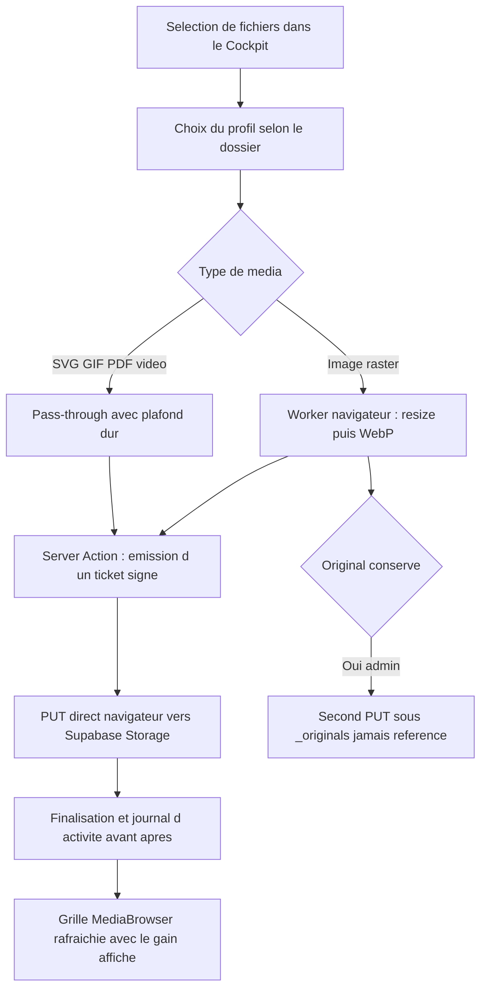

# Plan — Compression des médias téléversés depuis le Cockpit

**Périmètre :** Cockpit (`src/app/(admin)/admin`), Supabase Storage bucket `cuc-vitrine-assets`, doctrine média.
**Statut :** proposition à valider avant implémentation.
**Objectif utilisateur :** « ne pas perdre en qualité, mais que les photos soient dans un format léger », avec la possibilité d'épargner certains originaux.

---

## 1. Diagnostic — preuves relevées dans le dépôt

| Constat | Preuve |
| --- | --- |
| Aucune transformation à l'upload : buffer brut envoyé à Storage | [`uploadMediaFile()`](src/app/(admin)/admin/actions/media.ts:28) |
| Passerelle client minimale, seul le compteur de succès remonte | [`handleUpload()`](src/app/(admin)/admin/components/media/useMediaSelection.ts:110) |
| **Plafond Next.js de 1 Mo** sur le corps des Server Actions, jamais relevé dans la config | [`server-actions.md`](node_modules/next/dist/docs/01-app/02-guides/server-actions.md:83), [`action-handler.js`](node_modules/next/dist/server/app-render/action-handler.js:517), [`next.config.ts`](next.config.ts:7) |
| Vercel plafonne aussi le corps d'une requête serverless (4,5 Mo) : relever la limite ne suffit pas | contrainte plateforme |
| Incident de quota déjà survenu (402 `exceed_storage_size_quota`) | [`roadmap-site-2026.md`](plans/roadmap-site-2026.md:41) |
| Stockage mesuré : 90,95 Mo / 185 objets, dont 90,54 Mo pour 178 objets du bucket vitrine | [`revue-quotas-supabase.md`](plans/revue-quotas-supabase.md:6) |
| Doctrine média déjà écrite, mais appliquée seulement aux scripts, jamais au Cockpit | [`doctrine-medias-rapatriement.md`](plans/doctrine-medias-rapatriement.md:1) |
| `sharp` présent seulement en dépendance transitive de Next.js | [`package-lock.json`](package-lock.json:8903) |
| Précédents de compression hors Cockpit : images (`sharp`), vidéos (ffmpeg) | [`crop_real_cuc.mjs`](scripts/crop_real_cuc.mjs:1), [`transcode_reportages.mjs`](scripts/transcode_reportages.mjs:1) |

Conséquence directe : **toute photo de plus de 1 Mo échoue aujourd'hui** avant même d'atteindre `uploadMediaFile`, et le Cockpit l'annonce comme un simple `0/1 fichier(s) téléversé(s)`. Relever la limite ne règle rien au-delà de 4,5 Mo. La compression doit donc se faire **dans le navigateur, avant la requête**.

---

## 2. Réponses aux deux questions posées

### 2.1 « Ne pas perdre en qualité »

Le levier n'est pas la qualité d'encodage, c'est **la dimension**. Une photo de téléphone fait 4032 px de large : le site ne l'affiche jamais au-delà de 2560 px (`deviceSizes` de [`next.config.ts`](next.config.ts:20)). Réduire le bord long à 2560 px supprime environ 60 % des pixels sans qu'aucun écran du site ne puisse le voir, puis WebP qualité 0,85 retire 25 à 35 % de plus à équivalence visuelle. Résultat attendu : 5–12 Mo → 250–600 Ko, soit environ **-90 %**, sans différence perceptible en ligne.

Profils, du plus courant au plus exigeant :

| Profil | Dossiers concernés | Bord long max | Format | Qualité | Poids cible |
| --- | --- | --- | --- | --- | --- |
| `web` (défaut) | `media/cuc-visual`, `media/film-poster` | 2560 | WebP | 85 | 150–450 Ko |
| `portrait` | visuels d'équipe et portraits | 1600 | WebP | 88 | 80–250 Ko |
| `logo` | `media/partner-logo` | 512 | WebP 90, PNG conservé si transparence, SVG intact | 90 | 10–60 Ko |
| `hero` | visuels plein écran d'accueil | 3200 | WebP | 90 | 250–700 Ko |
| `pass-through` | SVG, GIF animé, PDF, vidéo | inchangé | inchangé | — | plafond dur seulement |

Règles d'encodage : jamais d'agrandissement, orientation EXIF appliquée puis **métadonnées supprimées** (elles pèsent parfois plusieurs centaines de Ko), aucune perte de transparence, et **repli sur l'original si la compression n'apporte pas de gain** (cas des petites images déjà optimisées).

### 2.2 « Garder certaines images en pleine qualité » — bonne ou mauvaise idée ?

C'est une bonne idée, **à une condition non négociable : l'original ne doit jamais vivre dans le catalogue servi.** Sinon un 8 Mo peut être sélectionné par erreur dans la médiathèque et partir sur le site public, ce qui annule tout le bénéfice et repollue l'egress.

Dispositif retenu — le modèle du négatif et du tirage :

- L'image **servie** reste systématiquement le dérivé WebP.
- L'original optionnel est rangé sous `_originals/…`, préfixe frère de la corbeille existante `_trash` ([`media-internals.ts`](src/app/(admin)/admin/actions/media-internals.ts:27)) : exclu du catalogue par défaut, jamais proposé au sélecteur d'image, invisible pour les éditeurs.
- Option **explicite** dans le panneau d'import, réservée au rôle administrateur, avec plafond dur par fichier et affichage du coût avant validation.
- Le poids ajouté est visible dans le tableau de bord de stockage (déjà alimenté par [`listMediaTree()`](src/app/(admin)/admin/actions/media.ts:138)).
- Purge dédiée : les négatifs non re-sollicités sont candidats à une suppression datée, comme les autres tables de croissance suivies par [`audit_quotas.mjs`](scripts/audit_quotas.mjs:1).

Recommandation d'usage : réserver les négatifs aux visuels de référence — visuels plein écran, portraits, logos — et **ne pas** conserver les sources des photos d'illustration. Un négatif de 6 Mo occupe environ douze fois l'espace de son dérivé, pour un service qui n'existe que le jour où l'on veut recadrer ou rééditer l'image. Au-delà d'une poignée de visuels, c'est du poids mort.

---

## 3. Architecture cible — quatre couches étanches

### Fichiers créés

| Fichier | Couche | Rôle | Garde-fou |
| --- | --- | --- | --- |
| `src/lib/media-library/media-policy.ts` | Types & contrats (pur) | Profils, plafonds par nature de média, choix du profil selon le dossier, noms des préfixes spéciaux | < 120 lignes |
| `src/lib/media-library/image-compression.plan.ts` | Domaine pur | Calcul des dimensions cibles, qualité par profil, décision de réencoder, formatage du gain, nature de média compressible | < 150 lignes, testable sans DOM |
| `src/lib/media-library/image-compression.client.ts` | Service navigateur | Décodage `createImageBitmap`, redimensionnement `OffscreenCanvas`, encodage WebP, repli canvas 2D, retour de l'original en cas d'échec | aucune logique métier, aucune règle de dossier |
| `src/lib/media-library/image-compression.worker.ts` | Service navigateur | Exécution du travail lourd hors du fil principal pour un lot de fichiers | message in / message out |
| `src/app/(admin)/admin/actions/media-upload-ticket.ts` | Domaine serveur | Authentification Cockpit, validation nature/MIME/taille, assainissement du chemin, émission de l'URL signée d'upload, refus explicite au-delà du plafond | < 150 lignes |
| `src/app/(admin)/admin/components/media/useMediaUpload.ts` | Hooks & orchestration | Compression séquentielle, progression par fichier, appel du ticket, PUT direct, finalisation, agrégats de gain | < 180 lignes |
| `src/app/(admin)/admin/components/media/MediaUploadPanel.tsx` | UI présentation | Liste des fichiers, poids avant/après, case « conserver l'original », erreurs par fichier | props in / render out |
| `src/lib/media-library/media-policy.test.ts`, `src/lib/media-library/image-compression.plan.test.ts` | Tests | Profils, dimensions, choix de format, gain, refus des cas limites | — |

### Fichiers modifiés

| Fichier | Modification |
| --- | --- |
| [`useMediaSelection.ts`](src/app/(admin)/admin/components/media/useMediaSelection.ts:110) | `handleUpload` délègue au nouveau hook (fichier actuellement à 242 lignes : l'upload sort, le reste demeure) |
| [`MediaBrowser.tsx`](src/app/(admin)/admin/components/media/MediaBrowser.tsx:1) | Rend `MediaUploadPanel` et affiche le gain cumulé ; reste purement présentationnel |
| [`media.ts`](src/app/(admin)/admin/actions/media.ts:28) | `uploadMediaFile` conservé en repli pour les fichiers sous 1 Mo, aligné sur la même politique et journalisé |
| [`media-internals.ts`](src/app/(admin)/admin/actions/media-internals.ts:27) | Constante `ORIGINALS_ROOT`, exclusion du préfixe dans le listage et l'arborescence |
| [`package.json`](package.json:144) | `sharp` promu en dépendance directe (normalisation serveur de secours) |
| `.agents/rules/media_compression.md` + index [`AGENTS.md`](AGENTS.md:1) | Règle canonique : un média servi est un dérivé léger ; l'original vit sous `_originals` |

### Décisions d'architecture verrouillées

- **Un seul master par image, jamais de famille de variantes.** `/media/.../photo.webp` en 2560 px suffit : `next/image` dérive déjà le `srcset` AVIF/WebP. Stocker cinq tailles multiplierait les objets par cinq et saturerait le bucket — l'inverse du but.
- **WebP comme master stocké, pas AVIF.** AVIF gagne quelques pourcents de poids mais coûte des secondes de calcul par image ; l'optimiseur Next.js produit de l'AVIF à la volée de toute façon.
- **Compression côté navigateur obligatoire** : c'est le seul chemin qui accepte une photo d'appareil brute, puisque le plafond de requête tombe à 1 Mo (Server Action) et 4,5 Mo (plateforme).
- **Le serveur reste autoritaire sur les limites** : même si le client est modifié, le ticket refuse ce qui dépasse, et le bucket porte ses propres plafonds.

---

## 4. Garde-fous serveur et configuration du bucket

- Ticket : plafonds par nature de média (image 8 Mo après compression, PDF 20 Mo, vidéo 45 Mo), liste blanche de types MIME, chemin horodaté assaini selon le contrat de nommage actuel.
- Migration SQL appliquée par script (motif des scripts existants) : `file_size_limit` et `allowed_mime_types` sur `cuc-vitrine-assets`, politique d'écriture réservée aux utilisateurs Cockpit authentifiés, `cacheControl: 31536000` conforme à la doctrine.
- Journalisation d'activité : `media.upload.compressed` avec poids avant, poids après, profil retenu et conservation d'original, en réutilisant le point unique [`reportMediaFailure()`](src/app/(admin)/admin/actions/media-failures.ts:20) pour les échecs, afin de ne pas créer un second vocabulaire.

---

## 5. Volet 2 — recompression de l'existant

- `scripts/recompress_bucket_media.mjs` : en lecture seule par défaut, parcourt le bucket, déduit le profil du dossier, mesure le gain et écrit `scripts/media_recompression_report.json` (poids avant/après, gain, correspondances d'URL).
- Écriture en deux temps : dépôt du nouveau `.webp` sous un chemin neuf, réécriture des références par le mécanisme existant ([`rewrite_media_urls.mjs`](scripts/rewrite_media_urls.mjs:1)), suppression de l'ancien objet **seulement** après vérification que la nouvelle URL répond.
- Garde-fous avant et après : `npm run media:verify:reachable`, `npm run content:verify:live`, puis `npm run media:audit` et `npm run audit:quotas` pour chiffrer le gain réel sur les 90,54 Mo actuels.

---

## 6. Volet vidéo — arbitrage assumé

Aucune compression vidéo serveur n'est possible ici (`sharp` ne traite pas la vidéo, ffmpeg est absent d'un runtime serverless). Décision : plafond dur de 45 Mo appliqué au ticket, message explicite au-delà, et renvoi vers le script local existant [`transcode_reportages.mjs`](scripts/transcode_reportages.mjs:1). Un CDN vidéo dédié reste une option ultérieure, à arbitrer séparément si le volume augmente.

---

## 7. Vérifications

- Tests unitaires purs sur les profils, le calcul de dimensions, le choix de format et le calcul de gain.
- Test du hook d'upload avec compression simulée (pas de vrai canvas sous jsdom) : progression, repli en cas d'échec, conservation d'original.
- Test de la Server Action : refus au-dessus du plafond, refus de MIME, assainissement du chemin, émission du ticket.
- Portes du projet : `npm run typecheck`, `npm test`, `npm run audit:strict`, `npm run studio:gate:full`.
- Mesure après livraison : `npm run media:audit`, `npm run audit:quotas`, et contrôle que les nouvelles images répondent bien en 200 via l'optimiseur.

---

## 8. Ordre d'implémentation (Contrats → Logique pure → Assemblage UI)

1. Contrats et profils (`media-policy.ts`) + tests.
2. Domaine pur (`image-compression.plan.ts`) + tests.
3. Service navigateur (`image-compression.client.ts`, `.worker.ts`).
4. Server Action de ticket + `sharp` en dépendance directe.
5. Hook d'orchestration `useMediaUpload.ts`, allègement de `useMediaSelection.ts`.
6. UI `MediaUploadPanel.tsx` et branchement dans `MediaBrowser.tsx`.
7. Plafonds bucket + règle canonique écrite.
8. Script de recompression de l'existant, exécution et mesure.

---

## 9. Ce que ce plan ne fait pas

- Pas de variantes responsives stockées : `next/image` les dérive, c'est une économie, pas un manque.
- Pas de changement de fournisseur de stockage.
- Pas de rapatriement des affiches distantes tolérées (IMDb, TMDB) : hors sujet ici.
- Pas de mise en place d'un CDN vidéo dans cette itération.
