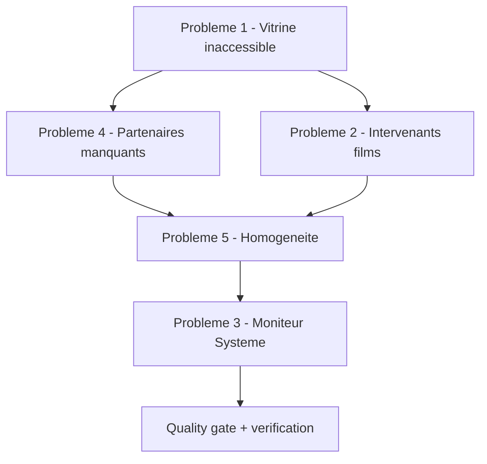

# Plan de correctifs — Vitrine inaccessible, Cockpit incomplet, Moniteur Système

> **Statut** : Plan à valider avant implémentation (mode Code).
> **Périmètre** : 5 problèmes signalés par l'utilisateur, dont 1 bloquant en production.

---

## 1. Synthèse des problèmes signalés

| # | Problème | Gravité | Cause probable identifiée |
| --- | ---------- | --------- | --------------------------- |
| 1 | Site vitrine inaccessible sur toutes les pages sauf `/admin`, quel que soit le cache ou la navigation privée | **BLOQUANT** | Client Supabase navigateur utilisé dans un contexte serveur |
| 2 | Intervenants manquants sur certains films dans la page Filmographie du Cockpit | Élevée | `cuc_team_involved` non renseigné en base pour une partie du catalogue |
| 3 | Moniteur Système CUC affiche des valeurs statiques, pas de vraies métriques | Moyenne | Composant purement décoratif, aucune mesure réelle |
| 4 | Partenaires manquants dans le Cockpit | Élevée | Écart entre `DEFAULT_PARTNERS` (code) et `site_partners` (base) |
| 5 | Manque d'homogénéité : certaines parties du site n'ont pas les mêmes capacités que les autres | Moyenne | Couverture éditoriale hétérogène entre les domaines |

---

## 2. Problème 1 — Vitrine inaccessible (BLOQUANT)

### 2.1 Diagnostic

Le point commun de toutes les pages publiques est [`src/lib/data/site-service.ts`](src/lib/data/site-service.ts:1). Ce module est importé par :

- [`src/app/page.tsx`](src/app/page.tsx:1) (via `usePageDynamicContent`)
- [`src/app/admin/CockpitApp.tsx`](src/app/admin/CockpitApp.tsx:37) (via `getPrograms`, `getTeam`, `getFilms`, `getPartners`, `getEvents`)

Or [`site-service.ts`](src/lib/data/site-service.ts:1) importe :

```ts
import { createClient } from '@/lib/supabase/client';
```

Et [`src/lib/supabase/client.ts`](src/lib/supabase/client.ts:10) appelle `createBrowserClient` :

```ts
export function createClient() {
  return createBrowserClient(SUPABASE_URL, SUPABASE_ANON_KEY);
}
```

**Le problème** : `createBrowserClient` de `@supabase/ssr` est conçu pour le navigateur. Lorsqu'il est exécuté côté serveur (Server Component, prerender, génération statique), il tente d'accéder à des API navigateur (`document`, `window`, `localStorage`) qui n'existent pas. Le rendu échoue alors **avant** l'envoi du HTML, ce qui produit exactement le symptôme décrit : « This page couldn't load » sur toutes les pages publiques.

**Pourquoi `/admin` fonctionne** : [`CockpitApp.tsx`](src/app/admin/CockpitApp.tsx:1) est un composant client (`'use client'`). Les appels à `getPrograms()`, `getTeam()`, etc. s'exécutent donc dans le navigateur, où `createBrowserClient` est légitime. C'est la signature exacte du bug : **seul le chemin client survit**.

**Pourquoi le cache et la navigation privée ne changent rien** : le défaut est dans le code serveur, pas dans le cache. Chaque requête régénère la même erreur.

### 2.2 Correctif

Séparer strictement les deux contextes d'exécution :

1. **Créer un client serveur** dans [`src/lib/data/site-service.ts`](src/lib/data/site-service.ts:1) en important `createClient` depuis [`src/lib/supabase/server.ts`](src/lib/supabase/server.ts:11) (qui utilise `createServerClient` + `cookies()`).
2. **Conserver un client navigateur** pour les composants client du Cockpit.
3. **Introduire une fabrique contextuelle** : un helper `getSupabaseClient()` qui retourne le client serveur si `typeof window === 'undefined'`, sinon le client navigateur. Cela évite de dupliquer chaque fonction de lecture.
4. **Vérifier tous les appelants** de `site-service.ts` pour s'assurer qu'aucun composant client n'importe une fonction qui exige `cookies()` (les fonctions serveur ne sont pas appelables depuis un composant client).

### 2.3 Point d'attention

`createServerClient` utilise `cookies()` de `next/headers`, qui est **asynchrone** en Next.js 16 et **interdit dans un composant client**. Il faut donc :

- Soit marquer les fonctions de lecture comme serveur uniquement et les appeler depuis des Server Components.
- Soit fournir deux implémentations distinctes : `site-service.server.ts` (avec `cookies()`) et `site-service.client.ts` (avec `createBrowserClient`), et laisser le Cockpit utiliser la version client.

La seconde option est la plus sûre compte tenu de l'architecture actuelle du Cockpit (entièrement client).

### 2.4 Vérification

- `npm run build` doit produire 63 pages sans erreur de prerender.
- Ouvrir chaque route publique en navigation privée : aucune page d'erreur.
- `/admin` doit continuer de fonctionner.

---

## 3. Problème 2 — Intervenants manquants sur les films

### 3.1 Diagnostic

[`FilmsView.tsx`](src/app/admin/components/FilmsView.tsx:108) écrit `cuc_team_involved` et `cuc_team_roles` :

```ts
cuc_team_involved: updated.cuc_team_involved || updated.instructor_ids || [],
cuc_team_roles: updated.cuc_team_roles || {},
```

L'affichage des intervenants repose sur `film.cuc_team_involved?.includes(t.id)` ([`FilmsView.tsx`](src/app/admin/components/FilmsView.tsx:259)). Si la colonne est vide en base pour une partie du catalogue, aucun intervenant ne s'affiche.

Le script [`scripts/seed_team_film_links.mjs`](scripts/seed_team_film_links.mjs:1) existe déjà pour amorcer ces liens, mais il n'a visiblement pas couvert l'intégralité des 570 lignes de `site_films`.

### 3.2 Correctif

1. **Auditer** : compter les films avec `cuc_team_involved` vide, et lister les références orphelines (membre absent de `site_team`).
2. **Rapprocher** les crédits IMDb déjà collectés (`scripts/michel_bouis_credits_imdb.json`, `scripts/coach_credits_curated_imdb.json`) des titres de `site_films` en utilisant **obligatoirement** [`creditTitleKey()`](src/lib/credit-title.ts:1) — jamais de `String.includes()` sur la chaîne brute (doctrine « Normalisation des titres »).
3. **Alimenter** `cuc_team_involved` + `cuc_team_roles` pour les films où l'appariement est certain.
4. **Produire un fichier de revue** dans `plans/` avant toute écriture en base (doctrine scraper IMDb).

### 3.3 Vérification

- `node scripts/verify_featured_matching.mjs` doit retourner un taux d'appariement non nul.
- Le Cockpit doit afficher les intervenants sur les films concernés.

---

## 4. Problème 3 — Moniteur Système CUC

### 4.1 Diagnostic

[`SystemHealthModal.tsx`](src/app/admin/components/SystemHealthModal.tsx:94) affiche des statuts **codés en dur** :

```tsx
<span className="... bg-emerald-500/20 text-emerald-400 ...">
  OPÉRATIONNEL
</span>
```

La valeur est littérale : elle ne reflète aucune mesure. Le composant reçoit bien `realtimeStatus`, `inquiriesCount`, `totalSessions`, `fullSessions` en props, mais les cartes « Base Données », « Flux Realtime », etc. ne sont pas alimentées par des mesures réelles.

### 4.2 Métriques réellement monitorables

| Métrique | Source | Intérêt |
| ---------- | -------- | --------- |
| Latence Supabase | `performance.now()` autour d'un `select` léger | Détecter une dégradation base |
| Nombre de lignes par table `site_*` | `count: 'exact'` | Vérifier la persistance |
| Dernière écriture | `max(updated_at)` par table | Détecter une base figée |
| État du canal Realtime | `subscribe((status) => ...)` | Déjà partiellement présent |
| Taux de remplissage des sessions | `booked_seats / max_seats` | Déjà calculé (`fullSessions`) |
| Candidatures en attente | `site_inquiries` par statut | Déjà partiellement présent |
| Fraîcheur du cache vitrine | `revalidateSite()` | Déjà présent |
| Médias Supabase accessibles | `verify_supabase_media_reachable.mjs` | Existant, à exposer |
| Couverture des URLs médias | `verify_media_url_coverage.mjs` | Existant, à exposer |
| Version du build / commit | `process.env.VERCEL_GIT_COMMIT_SHA` | Traçabilité déploiement |

### 4.3 Correctif

1. **Créer une Server Action** `getSystemHealth()` dans [`src/app/admin/actions.ts`](src/app/admin/actions.ts:1) qui mesure réellement :
   - latence Supabase (aller-retour sur une requête légère),
   - comptages par table,
   - horodatage de dernière modification,
   - état des vérifications médias.
2. **Alimenter** [`SystemHealthModal.tsx`](src/app/admin/components/SystemHealthModal.tsx:28) avec ces valeurs au lieu des littéraux.
3. **Afficher un état dégradé** (orange/rouge) quand une mesure échoue, au lieu d'un « OPÉRATIONNEL » systématique.
4. **Ajouter un rafraîchissement** manuel et un horodatage de dernière mesure.

### 4.4 Vérification

- Couper temporairement la clé Supabase : le moniteur doit passer en état dégradé, pas rester vert.
- Les comptages affichés doivent correspondre à un `select count` manuel.

---

## 5. Problème 4 — Partenaires manquants

### 5.1 Diagnostic

[`DEFAULT_PARTNERS`](src/lib/data/site-service.ts:1090) contient **12 partenaires** codés en dur (Qualiopi, Nike, RXR Protect, Gravity, C17, Kiloutou, TM Incendie, Action Cascade, AYA Catch, Cascade Demo Team, Xtrem Video, TaffCoeur).

[`getPartners()`](src/lib/data/site-service.ts:1366) retombe sur `DEFAULT_PARTNERS` si la base est vide ou en erreur. Deux causes possibles à l'écart :

1. **La table `site_partners` contient moins de 12 lignes** : les partenaires absents de la base n'apparaissent jamais dans le Cockpit (qui lit la base), alors qu'ils apparaissent sur la vitrine (qui retombe sur le code).
2. **Des partenaires sont `is_published = false`** : ils existent en base mais sont filtrés par `.eq('is_published', true)`.

### 5.2 Correctif

1. **Comparer** `DEFAULT_PARTNERS` et `site_partners` : identifier les manquants et les non publiés.
2. **Semer** les partenaires manquants dans `site_partners` (script idempotent, `upsert` sur `id`).
3. **Vérifier** que les logos pointent vers Supabase Storage et non vers un chemin local inexistant (`/images/partenaires/*.jpg` — à confirmer).
4. **Rendre le Cockpit capable de créer** un partenaire absent (déjà possible via [`PartnersView.tsx`](src/app/admin/components/PartnersView.tsx:35)).

### 5.3 Vérification

- Le nombre de partenaires affichés dans le Cockpit doit égaler le nombre de lignes `site_partners`.
- La vitrine et le Cockpit doivent afficher **le même** jeu de partenaires.

---

## 6. Problème 5 — Homogénéité entre les parties du site

### 6.1 Diagnostic

Les domaines éditoriaux n'ont pas tous le même niveau de couverture :

| Domaine | Table | Vue Cockpit | Édition | Média | Interconnexion CUC Sign |
| --------- | ------- | ------------- | --------- | ------- | ------------------------- |
| Programmes | `site_programs` | Oui | Oui | Partiel | Oui (`cuc_sign_formation_id`) |
| Sessions | `site_sessions` | Oui | Oui | — | Oui |
| Équipe | `site_team` | Oui | Oui | Oui | Oui (`profile_id`) |
| Films | `site_films` | Oui | Oui | Oui | Partiel |
| Partenaires | `site_partners` | Oui | Oui | Oui | Non |
| Événements | `site_events` | Oui | Oui | Partiel | Non |
| Disciplines | `site_disciplines` | Oui | Oui | Partiel | Oui (`evaluation_disciplines`) |
| Zones campus | `site_campus_pois` | Oui | Oui | Oui | Oui (`location_id`) |
| Navigation | `site_navigation` | Oui | Oui | — | Non |
| Footer | `site_footer` | Oui | Oui | — | Non |
| Réseaux sociaux | `site_social_links` | Oui | Oui | — | Non |
| Pages | `site_pages` | Oui | Oui | Oui | Non |
| Annonces | `site_announcements` | Oui | Oui | — | Non |
| Candidatures | `site_inquiries` | Oui | Oui | — | Oui (conversion élève) |

Les écarts portent sur : **sélecteur de média**, **ordre (drag & drop)**, **état publié/brouillon**, **aperçu live**, **historique de révisions**.

### 6.2 Correctif

1. **Définir un contrat d'édition commun** : chaque domaine doit offrir au minimum
   - création / édition / suppression,
   - réordonnancement,
   - bascule publié / brouillon,
   - sélecteur de média ([`MediaPickerModal`](src/app/admin/components/MediaPickerModal.tsx:1)),
   - toast de confirmation.
2. **Factoriser** les primitives déjà existantes dans [`src/app/admin/components/ui`](src/app/admin/components/ui) (`CockpitCard`, `CockpitBadge`, `CockpitEmptyState`, `CockpitLoadMore`, `useProgressiveList`).
3. **Combler les manques** identifiés domaine par domaine (le sélecteur de média est le plus fréquemment absent).
4. **Documenter** le contrat dans `plans/doctrine-cms-cockpit.md`.

### 6.3 Vérification

- Chaque vue Cockpit expose les mêmes actions de base.
- Aucun domaine ne dépend d'une saisie manuelle d'URL pour un média.

---

## 7. Ordre d'exécution recommandé



Le problème 1 est **bloquant** : il doit être corrigé et déployé en premier, car il empêche toute vérification visuelle des autres correctifs.

---

## 8. Quality gate obligatoire

Après chaque lot de correctifs :

```
npm run typecheck
npm run lint
npm run test
npm run build
npm run media:verify:coverage
npm run media:verify:reachable
```

Le `build` doit produire 63 pages sans erreur de prerender. Toute régression de prerender signale que le problème 1 n'est pas entièrement résolu.

---

## 9. Points à confirmer avec l'utilisateur

1. **Problème 1** : le message d'erreur exact affiché (page Next.js complète ou message navigateur) permettrait de confirmer la cause.
2. **Problème 2** : quels films précisément ont des intervenants manquants ?
3. **Problème 4** : quels partenaires précisément manquent dans le Cockpit ?
4. **Problème 5** : quelles parties du site sont concernées en priorité ?
