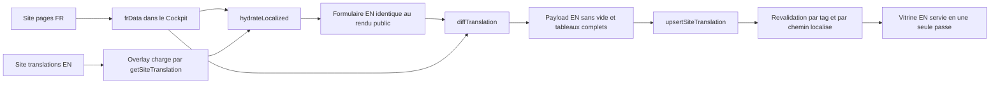

# Plan — Édition anglaise en place dans le Cockpit

Objectif : pouvoir rédiger l'article en français **puis enchaîner sa traduction anglaise
sans quitter l'éditeur de page**, avec une bascule `FR | EN` dans la barre du haut.

Modèle retenu : **A** — la bascule remplace les valeurs du formulaire. En `EN`, les mêmes
champs s'affichent, pré-remplis avec le contenu localisé (donc le français tant que la
traduction n'existe pas) ; l'enregistrement ne stocke **que ce qui diffère du français**.

---

## 1. État des lieux vérifié

| Élément | Fichier | Rôle actuel |
| --- | --- | --- |
| Éditeur de page | [`PagesEditorView.tsx`](src/app/(admin)/admin/components/PagesEditorView.tsx:55) | 4 onglets, 8 sous-éditeurs recevant `formData` + `setFormData` |
| Source FR | `site_pages` via [`getAllPages()`](src/app/(admin)/admin/actions.ts:227) | injectée dans `pagesList` par [`CockpitApp.tsx`](src/app/(admin)/admin/CockpitApp.tsx:192) |
| Traduction EN | `site_translations` (`entity = page`, `entity_id = slug`, `locale = en`) | éditée aujourd'hui en **JSON brut** par [`TranslationsView.tsx`](src/app/(admin)/admin/components/TranslationsView.tsx:28) |
| Fusion publique | [`mergeLocalized()`](src/lib/i18n/server.ts:34) + [`usePageDynamicContent()`](src/lib/hooks/usePageDynamicContent.ts:272) | overlay partiel appliqué par-dessus le FR, repli FR automatique |
| Aperçu live | [`buildPreviewUrl()`](src/lib/preview/preview-url.ts:54) | **accepte déjà une locale** (`/en/...`) : rien à créer |
| Couverture FR à EN | [`flatten()` / `isEditorial()`](scripts/audit_i18n_completeness.mjs:103) | mesure feuille par feuille, avec exclusions techniques |

### Invariants de fusion à ne jamais violer

1. **Tableau = remplacement en bloc** : [`mergeLocalized`](src/lib/i18n/server.ts:36) et
   [`deepMergeSectionsData`](src/lib/hooks/usePageDynamicContent.ts:35) remplacent un tableau
   non vide sans le fusionner item par item. Un tableau EN partiel casse donc les ancres,
   les `id` React et les images.
2. **Chaîne vide** : ignorée pour un scalaire côté serveur, mais **elle efface le FR** dans le
   chemin client `hero` ([`mergedContent`](src/lib/hooks/usePageDynamicContent.ts:279) fait un
   spread superficiel). Aucune valeur vide ne doit jamais être persistée.
3. **`layout_sections`** ne contient que des libellés d'administration (`name`) : jamais traduits.
4. **`og_image`, `slug`, images, ordres, `id` d'ancrage** : techniques, jamais traduits.

---

## 2. Défaut constaté à corriger au passage

`revalidateTag()` n'est appelé **nulle part** dans le code, alors que les lectures publiques
sont mises en cache par tag (`cacheLife('max')` + `cacheTag('site_translations')`, voir
[`server.ts`](src/lib/i18n/server.ts:87)). Les écritures ne revalident que des chemins FR
(`['/', '/{slug}']`, [`upsertSiteTranslation`](src/app/(admin)/admin/actions.ts:502)) : une
traduction EN est donc écrite sans invalidation ciblée de la page `/en/...`.

---

## 3. Conception

### 3.1 Une seule implémentation de la fusion — `src/lib/i18n/localized-merge.ts` (nouveau)

Module **client + serveur** (aucun import de `next/cache`), qui devient la source unique :

- `mergeLocalized(base, overlay)` : déplacé **à l'identique** depuis
  [`server.ts`](src/lib/i18n/server.ts:34), qui l'importera désormais.
- `flattenEditorial(node)` : même aplatissement et mêmes exclusions que
  [`flatten()`](scripts/audit_i18n_completeness.mjs:116) et `isEditorial()`, plus
  `layout_sections` et `og_image` ajoutés aux racines non traduisibles.
- `hydrateLocalized(base, overlay)` : contenu « tel que le public le voit », utilisé pour
  pré-remplir le formulaire EN **et** pour pousser le brouillon à l'aperçu.
- `diffTranslation(base, localized)` : produit l'overlay à écrire.
- `translationCoverage(base, overlay)` : `{ total, translated, percent, inheritedPaths }`.
- `findStaleArrayIndexes(base, overlay)` : détecte une divergence de structure (un item FR
  ajouté ou supprimé après la traduction) pour alimenter le bouton « Resynchroniser ».

### 3.2 Contrat d'écriture de l'overlay EN

- Aucune chaîne vide, aucun `null`, aucun tableau vide n'est persisté : un champ vidé
  **revient au français** au lieu de publier du vide.
- Si **une seule** feuille d'un tableau diffère, le **tableau entier** est écrit, chaque item
  recomposé complet depuis la base FR (`id`, `img`, `order`, liens recopiés tels quels).
- Les clés techniques et `layout_sections` sont retirées côté serveur en défense en
  profondeur, même si le client les envoie.

### 3.3 Cockpit

- **`useEntityTranslation`** (nouveau hook, `src/lib/hooks/`) : générique
  `{ entity, entityId, base }` → `{ locale, localized, coverage, loading, saving, dirty,
  save, revert, reload }`. Charge l'overlay par une server action, hydrate pour l'édition,
  écrit le diff.
- **`LocaleToggle`** (nouveau composant, `pages-editor/ui`) : bascule segmentée `FR | EN`,
  pastille `EN 68 %`, point de modification non enregistrée, état d'enregistrement.
- **`PagesEditorView`** : `frData` reste la source ; en `EN`, les mêmes 8 sous-éditeurs
  reçoivent le contenu localisé et un setter qui écrit dans le brouillon EN — **aucun
  sous-éditeur n'est réécrit**.
- **Enregistrer** indique la langue écrite (`Enregistrer FR` / `Enregistrer EN`).
- **Onglet Mise en page** : verrouillé en `EN` avec bandeau explicatif ; **Réinitialiser**
  propose en `EN` la suppression de l'overlay (retour au français), après confirmation.
- **Aperçu live** : `previewUrl` et `draft` suivent la locale active — l'aperçu montre donc
  `/en/...` avec exactement le contenu que le public recevra.
- **Historique** : `site_page_revisions` ne couvre que le FR ; en `EN`, le panneau affiche la
  date de dernière modification de l'overlay plutôt qu'un historique trompeur.

### 3.4 Server actions — [`actions.ts`](src/app/(admin)/admin/actions.ts:478)

- `getSiteTranslation(entity, entityId, locale)` : lecture admin ciblée.
- `deleteSiteTranslation(entity, entityId, locale)` : retour au français.
- `upsertSiteTranslation` durci : nettoyage défensif, `revalidateTag('site_translations')` et
  revalidation du **chemin localisé** (`buildPreviewPath(slug, locale)`).

---

## 4. Vérification

- Tests unitaires `src/lib/i18n/localized-merge.test.ts` : sémantique de fusion verrouillée
  (tableau remplacé en bloc, chaîne vide inoffensive), aller-retour
  `hydrate → diff`, aucun vide émis, tableaux complets, `layout_sections` exclu, couverture.
- `node scripts/audit_i18n_completeness.mjs` avant/après : aucune régression de couverture.
- Nouveau `scripts/verify_page_translation_invariants.mjs` : contrôle en base (pas de vide,
  tableaux de même longueur et mêmes `id` que le FR, aucune clé technique ni `layout_sections`)
  et rédaction de `plans/revue-edition-en-pages.md`.
- Contrôle de bout en bout : `node scripts/verify_i18n_no_flash.mjs` et
  `node scripts/verify_overlays_really_shown.mjs` après traduction d'une page réelle.
- Doctrine : ajouter la section « Doctrine édition bilingue Cockpit » à `AGENTS.md`.

## 5. Risques et non-objectifs

- **Divergence de structure** : un item FR ajouté après traduction laisse l'array EN plus court.
  Traité par `findStaleArrayIndexes` + bouton de resynchronisation, jamais en silence.
- **Traduction identique au français** : légitime (marques, noms propres). Comptée comme
  « héritée », pas comme un manque ; aucune écriture n'est forcée.
- **Non-objectif immédiat** : historique de versions des traductions (impliquerait une table
  `site_translation_revisions`) et remplacement de `TranslationsView` (conservé en diagnostic
  avancé).

## 6. Phasage

1. Socle partagé + tests + correctif de revalidation + durcissement de l'action.
2. Bascule `FR | EN` opérationnelle dans l'éditeur de page (traduction en place, aperçu EN).
3. Confort : grisé champ par champ et placeholder français via un composant de champ partagé.
4. Extension optionnelle aux autres fiches (films, coachs, événements, POIs, partenaires,
   disciplines, navigation, pied de page).
