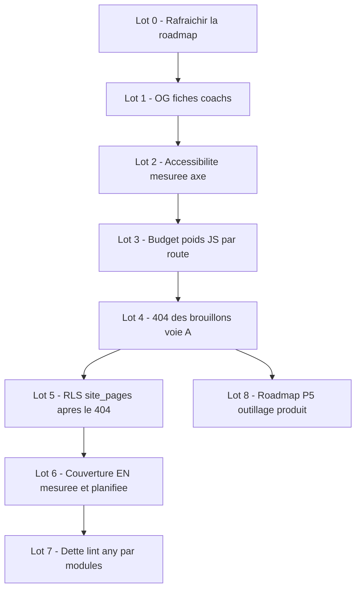

# Plan — Finalisation du site CUC (priorités + dette)

**But** : terminer tout ce qui reste, dans un ordre qui ne casse rien — chaque lot est
un **contrat vérifiable** (un sujet, une preuve, un commit), classé par impact réel ×
risque × dépendance. Sources : `plans/roadmap-site-2026.md` (feuille de route),
`plans/revue-diffusion-brouillons.md` (404), audits régénérés du 2026-09-22.

## Principe directeur

1. **Un lot, un sujet, une preuve** : à la fin de chaque lot, `studio:gate:full` +
   `build` verts, puis commit/push. Jamais deux sujets dans le même commit.
2. **Mesurer avant de corriger** : tout lot s'ouvre par la mesure qu'il fait bouger.
3. **Ne rien inventer** : pas de balisage, pas de policy, pas de refactor sans un
   besoin constaté (ex. FAQ : sans contenu réel, pas de `FAQPage`).
4. **Ordre imposé par les dépendances** : le 404 avant la RLS ; la perf vérifiée
   avant/après l'extraction des vues.

## Séquence recommandée



---

## Lot 0 — Rafraîchir la feuille de route (doc seulement)

**Constat** : le tableau « Déjà tenu » annonce « 560 libellés » ; la mesure du gate est
**306 annotés · 0 codé en dur** (439 textes classés), et le canal d'entité (annonces,
coachs, films) n'y figure pas.

**Actions** : corriger les chiffres, ajouter « entités éditables sous liste blanche »,
pointer `plan-preview-chrome-editable.md`.
**Preuve** : diff relu ; aucune ligne de code touchée.

## Lot 1 — OG des fiches coachs (impact partage, effort faible)

**Constat** : les 12 pages principales ont une OG générée (`renderOgImage`) ; les fiches
`/equipe-cascadeurs-pro/[slug]` — les plus partagées — **n'en ont pas**.

**Actions** :

- `src/app/(site)/[locale]/equipe-cascadeurs-pro/[slug]/opengraph-image.tsx` :
  OG dynamique par coach (nom, rôle, spécialités) via `renderOgImage`, **repli générique**
  si le slug est inconnu ;
- lecture du coach via `getTeam()` (mise en cache, comme les pages voisines) — aucune
  lecture réseau supplémentaire par rendu d'image ;
- test : repli sur slug inconnu + rendu non vide pour un coach du catalogue.

**Preuve** : `npm run build` déclare la route OG sous `[slug]` ; gate + tests verts.

## Lot 2 — Accessibilité mesurée (`axe-core`)

**Constat** : seul axe de qualité sans mesure ; `axe-core` absent des dépendances.

**Actions** :

- ajouter `jest-axe` (+ `axe-core`) en devDependencies ;
- 3 tests de composant : accueil (HeroFocalContent + sections clés), formation
  (hero + formules), contact (formulaire) — **0 violation `serious`/`critical`** ;
- règles explicitement listées (jsdom ne calcule pas les couleurs : `color-contrast`
  documenté hors périmètre local, vérifié plus tard en navigateur) ;
- brancher dans la suite existante (CI l'exécute déjà via `npm run test`).

**Preuve** : 3 tests verts, comptage des violations publié dans le test ; note dans
`plans/roadmap-site-2026.md` (Priorité 3.1 devient « tenu »).

## Lot 3 — Budget de poids JS par route

**Constat** : `audit:budget` couvre Realtime/aperçu/revalidation ; **aucun seuil de poids
JS par route** (vérifié : aucune notion bundle/Ko dans le script).

**Actions** :

- `scripts/audit_route_weight.mjs` : lit `.next/app-build-manifest.json`, somme les
  chunks gzip par route, compare à `plans/route-weight-baseline.json` ;
- seuils : **échec > +5 %**, avertissement > +2 % ; commande
  `npm run audit:route-weight[:baseline]` ;
- intégration : `studio_gate.mjs` (bloquant) + CI.

**Preuve** : baseline committée ; une modification factice (+10 %) fait échouer l'audit ;
gate vert.

## Lot 4 — 404 des brouillons (le gros lot, à faire seule)

**Constat vérifié** : aucun `notFound()` de publication ; l'aperçu utilise `?cuc-preview=1`
et la garde est déjà en place (sitemap, rendu, `robots: noindex`). Voie A retenue
(extraction des vues) : vrai 404 **et** aperçu isolé par session admin, sans secret partagé.

**Actions** :

1. **Pilote sur 2 routes** (accueil, formation) : extraire le JSX en `<XView/>` dans
   `views/`, la route publique reste mince ;
2. `/preview/[slug]` (serveur) : `checkIsAdmin()`, `noindex`, rend les vues avec
   `allowUnpublished` ; `buildPreviewUrl()` bascule dessus (FR + EN) ;
3. routes publiques : `notFound()` quand la page est **définitivement** non publiée ;
   conserver la garde existante pour le cas « lecture en panne » (copie certifiée) ;
4. **contrôle de performance obligatoire** : le build doit montrer les 13 pages
   toujours en statique/PPR (○/◐) — capture avant/après dans le rapport de lot ;
5. les 13 routes restantes, mécaniquement, une par commit si utile ;
6. tests : 4 tests de la garde adaptés + 1 test « aperçu admin rend une page non
   publiée » + 1 test « public = 404 ».

**Preuve** : navigation privée → 404 réel ; aperçu Cockpit intact ; sitemap inchangé ;
build ○/◐ conservé ; gate vert.

## Lot 5 — RLS `site_pages` (DB, après le 404 seulement)

**Actions** : migration SQL `policy FOR SELECT USING (is_published = true)` + script
d'application **dry-run d'abord** (`scripts/apply_site_pages_rls_migration.mjs`) ;
rapport avant/après ; note dans la règle durabilité.
**Ordre non négociable** : « absent » doit déjà être un 404 explicite (lot 4) sinon un
brouillon s'affiche avec le contenu certifié.
**Preuve** : dry-run relu ; après application : lecture anonyme d'un brouillon = 0 ligne,
page publiée intacte.

## Lot 6 — Couverture EN des pages (mesure puis décision)

**Actions** : exécuter `npm run i18n:audit:completeness`, publier le rapport, trier par
page ; les écarts se traitent **par lots éditoriaux** (contenu), pas par refactor.
**Preuve** : rapport daté dans `plans/` ; liste d'actions éditoriales chiffrée.

## Lot 7 — Dette lint `any` (65 avertissements, 0 erreur)

**Stratégie** : jamais un « grand soir » ; par module, dans l'ordre
`actions/**` → `components/team-view` → `hooks` → `types`.
**Actions par module** : remplacer `any` par `Record<string, unknown>` ou une interface
locale, sans changement de comportement ; `typecheck` + tests après chaque module ;
objectif : **0 nouveau** warning et réduction continue, suivie dans le rapport.
**Preuve** : `npm run lint` (comptage) avant/après par module.

## Lot 8 — Roadmap P5 (outillage produit, à trancher)

1. **Brouillons multiples** (3 versions) : utile si l'édition longue est réelle ;
2. **`publish_at`** : pertinent seulement s'il y a des campagnes datées — sinon attendre ;
3. **Défilement synchronisé multi-appareils** : confort, dernier.
→ Décision produit avant tout code ; recommandation : ne rien ouvrir sans besoin daté.

## Hors plan (frontières assumées, documentées)

- Noms de coachs hors canal d'entité (identité vérifiée IMDb → écran Équipe) ;
- contenus non textuels des entités (listes, booléens, médias) ;
- 4 « composants live sans Realtime » (2 faux positifs du store d'aperçu) ;
- FAQ : **sans objet** tant qu'aucune question/réponse n'existe dans les pages
  (aucun `FAQPage` inventé).

## Risques et garde-fous

| Risque | Garde |
| --- | --- |
| Lot 4 rend les routes dynamiques | capture ○/◐ avant/après ; lot pilote d'abord |
| axe en jsdom partiel | jeu de règles explicite + limite documentée |
| Baseline de poids qui vieillit | commande de régénération + revue à chaque montée de dépendances |
| RLS appliquée trop tôt | ordre lot 4 → lot 5, dry-run obligatoire |
| Dette lint infinie | plafond par module, jamais de mélange avec un lot fonctionnel |

## Suivi d'exécution

| Lot | État | Commit | Preuve |
| --- | --- | --- | --- |
| L0 — Feuille de route rafraîchie | ✅ 2026-09-23 | `02a7a50` | chiffres réels (306 annotés · 0 codé en dur), ligne « entités éditables » |
| L1 — OG des fiches coachs | ✅ 2026-09-23 | `b6668a2` | build : `ƒ /[locale]/equipe-cascadeurs-pro/[slug]/opengraph-image-1je4j1` ; 5 tests ; `openGraph.images` config retiré (il masquait l'image fichier — règle vérifiée dans le code de Next) |
| L2 — Accessibilité mesurée (axe) | ✅ 2026-09-23 | `794b729` | 4 tests sur 3 surfaces, 0 violation `serious`/`critical` ; détecteur validé par contrôle négatif (`image-alt` bloquant détecté) ; `color-contrast` documenté hors jsdom |
| L3 — Budget poids JS par route | ✅ 2026-09-23 | `3092543` | 54 routes mesurées (gzip, HTML prérendus — Turbopack n'émet plus `app-build-manifest.json`) ; baseline committée ; contrôle négatif : −10 % de baseline → échec `+11,1 %` ; gate local (si build) + CI après build |
| L4 — 404 des brouillons (voie A) | ✅ 2026-09-23 | `ca134dc` | `getPublicPageContent()` (404 réel ; mécanisme vérifié au runtime), aperçu `/[locale]/preview` (admin, 15 vrais écrans, `instant = false`), garde de statut au proxy, statuts ○/◐ conservés, +8 tests (379 au total) |
| L5 — RLS `site_pages` | 🟡 outillé, application en attente | `1405d07` | porte 404 RLS-proof (`getPagePublicationState`) + aperçu client admin (`getPreviewPageContent`) ; migration + applier dry-run (`db:migrate:site-pages-rls[:write]`) ; sonde anonyme impossible (API 402) ; base : 15 publiées / 0 brouillon |
| L6 — Couverture EN | ⛔ bloqué par l'incident | — | `i18n:audit:completeness` interrompu : `402 exceed_storage_size_quota` — à relancer dès rétablissement |
| L7 — Dette lint `any` | ✅ 2026-09-23 | `9bf4aad` | **65 → 6 avertissements** (0 erreur) : `actions/**` 37, team-view 8, hooks 10, data 4, TraductionsView 2 ; module par module, typecheck + gate verts après chaque étape ; bonus : toasts de l'écran « Traductions EN » réparés (l'API racine du Cockpit est mono-argument — les messages s'affichaient « error »/« success » au lieu du texte) |
| L8 — Roadmap P5 (décisions) | 📝 recommandation rendue | — | **Brouillons multiples : non** — le filet local + la garde de concurrence suffisent (aucune perte constatée). **`publish_at` : à rouvrir SI campagnes datées** — aucune aujourd'hui, ne pas ouvrir. **Défilement synchronisé multi-appareils : dernier** — confort, sans urgence. Aucun code ouvert sans besoin daté. |

**Reste assumé (L7)** — 6 avertissements, documentés et bornés : 3 × `no-location-assign-relative-destination` (connexion Cockpit : le rechargement pleine page après login est **volontaire** — le routeur client ne reconstruit pas la session serveur) et 3 × `any` de **contrats JSON partagés** (`SitePageContent.sections_data`, `SiteInquiry.metadata`, `Instructor.metadata`) : convertir ces sacs cascaderait sur des dizaines de consommateurs typés — passe dédiée à ouvrir avec un besoin réel, jamais en effet de bord.

### Incident plateforme (2026-09-23)

L'API Data Supabase répond **402 Payment Required** à **toutes** les clés (anon ET service) :

```
{"message":"Service for this project is restricted due to the following violations:
exceed_storage_size_quota. The project owner must upgrade their plan or remove spend caps
to restore service."}
```

- **Effet** : vérifications base suspendues (L5, L6) ; la vitrine publique sert ses replis
  certifiés (garde-fou prévu, jamais une page morte) ;
- **Actions propriétaire** : plan/spend caps Supabase, puis purge du stockage
  (`npm run media:audit`, [`revue-mediatheque-storage.md`](plans/revue-mediatheque-storage.md:1)) ;
- **Ensuite** : `npm run db:migrate:site-pages-rls:write` (vérifie « brouillon = 0 ligne »),
  puis relancer le lot 6.
