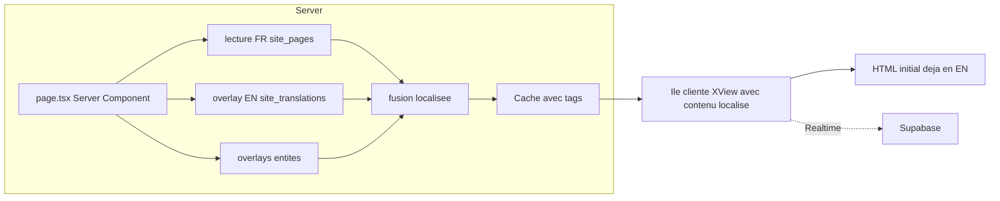

# Plan — i18n complet, zéro flash, architecture flexible

**Date :** 2026-09-21
**Demande client :** « Il manque encore énormément de traductions, même sur des boutons, dans
des descriptions… je veux une traduction complète. Et en mode anglais je vois apparaître le
français un bref instant. Je veux un site stable, avec une architecture maline et hyper
moderne pour palier à tout type de problème avec aisance et flexibilité. »

**Périmètre retenu par le client :** *complet visible* — interface 100 %, bios des coachs,
programmes, disciplines, événements, lieux du campus, descriptions de films affichées.
**Objectif :** plus un seul mot français visible en mode EN.

---

## 1. Diagnostic — deux causes racines, mesurées

### 1.1 Traduction incomplète : le catalogue UI est quasi vide

| Constat | Valeur |
| --- | --- |
| Clés de traduction existantes | **26** ([`messages/fr.json`](../messages/fr.json:1)) |
| Composants contenant de la copie française **en dur** | **73** (hors Cockpit) |
| Contenus de page en base (`site_pages`) | 100 % couverts (225 champs) |

Autrement dit : les contenus *éditoriaux* sont traduits, mais **toute la copie d'interface
écrite directement dans le JSX** — boutons, libellés, descriptions, placeholders, messages
d'erreur — n'a **aucun catalogue où exister**. Il est donc structurellement impossible de la
traduire aujourd'hui. C'est exactement ce que le client constate.

Fichiers les plus touchés (mesure [`audit_i18n_completeness.mjs`](../scripts/audit_i18n_completeness.mjs:1)) :
`FormationFormulesSection` (22), `CoachDetailClient` (20), `CampusEditorPanel` (19),
`spectacles-cascadeurs-yamakasi/page.tsx` (15), `ApplicationModal` (15),
`ContactCoordinatesSidebar` (15), `videos-cascadeur/page.tsx` (14), `ContactForm` (14),
`FooterBrandAndSites` (13), `animations-airbag-parkour/page.tsx` (12)…

### 1.2 Flash de français : cascade de requêtes côté navigateur

**16 des 17 pages publiques sont `'use client'`.** Le rendu suit donc cet ordre :

1. premier rendu avec les **valeurs FR par défaut** (constantes du code) ;
2. requête 1 → contenu FR de `site_pages` → re-rendu en français ;
3. requête 2 → **overlay EN** de `site_translations` → re-rendu en anglais.

Le français affiché « un bref instant » est l'état intermédiaire de l'étape 2
([`usePageDynamicContent.ts`](../src/lib/hooks/usePageDynamicContent.ts:136)). Le même
schéma existe pour la navigation et le pied de page, et le contenu n'est **pas** dans le HTML
initial (mauvais pour le SEO comme pour la stabilité perçue).

---

## 2. Architecture cible

### Principe 1 — La localisation se résout sur le serveur, jamais dans le navigateur

Le fichier de route redevient un **Server Component** qui assemble, en une passe, le contenu
FR *déjà fusionné* avec l'overlay EN, puis le transmet à l'îlot client qui garde toute
l'interactivité (parallaxe, modales, Realtime). Le premier pixel est donc **déjà dans la bonne
langue** : le flash disparaît par construction, pas par contournement.



### Principe 2 — Un seul registre d'entités traduisibles

Aujourd'hui l'overlay ne gère que `page`, `navigation`, `footer`. On généralise avec **un
registre déclaratif** : chaque entité traduisible décrit sa table, son identifiant, ses champs
traduisibles et sa stratégie de fusion (scalaire, tableau indexé, texte riche). Ajouter une
entité traduisible devient **une ligne**, pas un chantier.

```
entity         table              id           champs traduisibles
page           site_pages         slug         hero, sections_data, meta_*
team           site_team          id           role, title, bio, specialties
program        site_programs      id           title, description, modules
discipline     site_disciplines   id           name, description, objectives
event          site_events        id           title, description, location
campus_poi     site_campus_pois   id           name, description, category
film           site_films         id           description, stunt_roles
partner        site_partners      id           description
session        site_sessions      id           title, description
```

### Principe 3 — Aucune copie française dans le JSX

Toute chaîne visible rejoint `messages/fr.json` et `messages/en.json`, par espace de noms
(`home.about`, `contact.form`, `team.hero`…). Le Cockpit reste FR par conception.

### Principe 4 — La robustesse est vérifiée, pas espérée

| Risque | Parade |
| --- | --- |
| Une traduction manque en EN | Audit de couverture **bloquant** en CI (sort en code 2) |
| Un littéral FR revient dans le JSX | Scanner **bloquant** : aucun texte FR hors catalogue |
| Une section casse | Frontière d'erreur **par section** : la page reste utilisable |
| Une URL d'image casse | Contrôle d'accessibilité des visuels (déjà en place pour les affiches) |
| Un contenu change en base | Realtime conserve la fraîcheur ; le cache serveur est invalidé par tags |
| Le client veut corriger un texte | Éditeur générique dans le Cockpit, piloté par le registre |

---

## 3. Découpage en lots

Le détail exécutable est dans la liste de tâches. Résumé :

| Lot | Contenu | Effet visible |
| --- | --- | --- |
| **0** | Mesure + garde-fous bloquants | Rien, mais rend tout le reste vérifiable |
| **1** | Résolution serveur de la localisation | **Flash supprimé**, HTML initial localisé, SEO renforcé |
| **2** | Interface 100 % externalisée puis traduite | Boutons, libellés, descriptions EN |
| **3** | Entités : coachs, programmes, disciplines, événements, campus, films | Plus aucun contenu FR en EN |
| **4** | Cockpit : éditeur générique + santé i18n | Le client pilote lui-même |
| **5** | Vérification de bout en bout | Preuve : audit 100 %, tests, build |

---

## 4. Points d'attention identifiés

- **Ne pas casser l'interactif** : les vues restent clientes, seul le fichier de route devient
  serveur. Les composants de parallaxe et de Realtime ne changent pas de nature.
- **Cache et fraîcheur** : lecture serveur mise en cache avec tags (`site_pages`,
  `site_translations`) ; Realtime continue de rafraîchir côté navigateur.
- **Ordre de fusion** : FR (base) puis overlay EN, jamais l'inverse ; une clé absente de
  l'overlay laisse le FR — mais l'audit interdit cette situation en EN.
- **Cockpit** : hors périmètre EN, il reste en français (décision déjà actée).
- **Volumétrie** : les 570 films ne sont traduits que sur les champs **affichés** (descriptions
  de modale), conformément au périmètre « complet visible » retenu.
