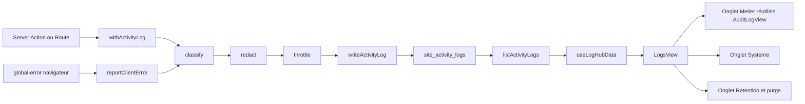

# Plan — Hub « Journal & Activité » du Cockpit

**Demande client (2026-09-29)** : « un endroit dans le cockpit où je puisse voir les logs
divers et variés pour avoir une vue d'ensemble de ce qui est modifié sur le site et bien
d'autres choses, histoire d'avoir une trace de tout ce qui se passe mais de manière bien
rangée ».

**Périmètre retenu (arbitrage client)** : hub unifié complet — journal métier (audit
existant) + erreurs techniques (Supabase, e-mails, Instagram, Realtime, frontière
d'erreur) + jobs et synchronisations, avec table dédiée, niveaux, filtres par source et
purge automatique.

---

## 1. Constat — ce qui existe déjà, et les trois trous

### 1.1 Ce qui existe et fonctionne

| Brique | Fichier | État |
| :--- | :--- | :--- |
| Écriture d'audit métier | [`logAuditEvent()`](src/app/(admin)/admin/actions/audit.ts:14) | Appelée par 12 modules d'actions |
| Lecture élargie | [`getAuditLogsExtended()`](src/lib/data/site/audit.ts:47) | Table puis miroir `site_settings`, puis échantillon local |
| Vue dédiée | [`AuditLogView.tsx`](src/app/(admin)/admin/components/AuditLogView.tsx:17) | Stats, filtres, groupes par jour, export CSV, liste progressive |
| Table | [`site_audit_logs`](scripts/migration_apply_campus_pois_audit_logs.sql:52) | `id, user_id, user_name, action, target, details, created_at` |
| Dernière écriture | [`getSystemHealth()`](src/app/(admin)/admin/actions/health.ts:119) | Métrique « dernière écriture réelle » |

### 1.2 Trou n°1 — l'onglet n'est pas dans le menu

[`buildNavSections()`](src/app/(admin)/admin/cockpit/cockpit-nav.ts:134) ne liste ni
`audit`, ni `health`, ni `analytics`, ni `translations`, ni `microcopy`. Ces vues sont
pourtant rendues par [`CockpitCmsTabs.tsx`](src/app/(admin)/admin/cockpit/CockpitCmsTabs.tsx:167)
et déclarées « Outils Système » dans
[`TAB_METADATA_MAP`](src/app/(admin)/admin/cockpit/cockpit-nav.ts:284). Elles ne sont donc
joignables que par URL directe ou palette de commandes — ce qui explique la demande.

### 1.3 Trou n°2 — le champ « Entité » est vide en permanence

La base stocke `target`, le type TypeScript expose `entity`
([`AuditLogEntry`](src/lib/data/site/types.ts:270)), et l'UI filtre sur `entity` :
[`useAuditLogFilters.ts`](src/app/(admin)/admin/components/audit-log-view/useAuditLogFilters.ts:43)
construit ses options sur `entities`, et
[`buildAuditCsv()`](src/app/(admin)/admin/components/audit-log-view/audit-format.ts:86)
exporte une colonne vide. Filtre et colonne ne peuvent jamais rien renvoyer.

### 1.4 Trou n°3 — aucune trace technique

Les échecs Supabase, SMTP, Instagram, Realtime ou Storage ne vivent que dans les logs
Vercel : [`global-error.tsx`](src/app/global-error.tsx:24) se contente d'un
`console.error` local, [`user-roles.ts`](src/app/(admin)/admin/actions/user-roles.ts:83)
renvoie `emailSent: false` sans trace persistée, les échecs de canal
([`useCockpitRealtimeSync.ts`](src/app/(admin)/admin/cockpit/useCockpitRealtimeSync.ts:1))
sont avalés. C'est l'inverse de la doctrine du §8 de
[`durability_health.md`](.agents/rules/durability_health.md:71) : *aucune écriture
avalée*.

---

## 2. Décision d'architecture — deux flux, deux tables

Ne pas fusionner dans `site_audit_logs` : le journal métier est peu volumineux, lu par la
vue existante et par la sonde de santé, alors qu'un flux technique peut produire des
centaines de lignes par incident et exige un budget de rétention distinct.

- **Flux métier** — `site_audit_logs`, inchangé. Reste la source du « Journal d'Audit »
  et de la métrique « dernière écriture ». Aucun risque de régression.
- **Flux technique** — nouvelle table `site_activity_logs` : incidents, jobs, synchros,
  dégradations, erreurs de frontière, refus RLS, expirations de token.

Les deux flux sont **rangés sous un seul écran** par leurs propriétés (`source`,
`level`, `acteur`) : l'utilisateur voit un hub, la base garde deux budgets.

---

## 3. Modèle de données — `site_activity_logs`

Colonnes : `id`, `occurred_at` (index DESC), `level` (`info | warning | error | critical`),
`source` (`cockpit | site | supabase | email | instagram | realtime | cron | media`),
`category` (identifiant fin, ex. `page.save`, `db.rls_denied`, `token.expired`),
`actor_id` / `actor_name`, `target`, `message` (phrase française lisible), `context`
(JSONB, secrets expurgés), `request_id` (corrélation d'un même geste), `duration_ms`,
`origin` (action ou route émettrice).

Index : `occurred_at DESC`, `(level, occurred_at DESC)`, `(source, occurred_at DESC)`,
`(category)`. Pas d'index GIN sur `context` (le besoin est la lecture chronologique, pas
la recherche JSON).

RLS : `ENABLE`, aucune policy `DELETE` (purge par service role uniquement), `INSERT`
authentifié + service, `SELECT` réservé aux rôles `admin` et `directeur`.

Aucun canal Realtime publié : le hub se rafraîchit par sondage et bouton « Actualiser »,
pour ne pas consommer le budget de connexions mesuré par `npm run audit:budget`.

---

## 4. Découpage SRP — fichiers créés

Ordre d'implémentation imposé par `AGENTS.md` §4.2 : **Types → Domaine → Hooks → UI**.

### 4.1 Types & contrats

| Fichier | Rôle | Budget |
| :--- | :--- | :--- |
| `src/lib/logging/types.ts` | `LogLevel`, `LogSource`, `ActivityLogInput`, `ActivityLogEntry`, `LogQuery`, `LogStats` | ~70 lignes |
| `src/app/(admin)/admin/components/log-hub/log-hub.types.ts` | Modèles de vue : onglets, options de filtre, groupes | ~50 lignes |

### 4.2 Domaine & services (purs, testables hors React)

| Fichier | Rôle |
| :--- | :--- |
| `src/lib/logging/classify.ts` | Erreur PostgREST / réseau / token → `{ level, source, category, message }`. Table de correspondance des codes connus (`42P01` table absente, `42501` RLS, `PGRST301` JWT expiré…). |
| `src/lib/logging/redact.ts` | Expurge clés, jetons, e-mails complets et chemins Storage avant persistance. |
| `src/lib/logging/throttle.ts` | Regroupe les entrées identiques sur une fenêtre glissante (`source|category|message`) et incrémente un compteur, pour qu'un incident ne produise pas 500 lignes. |
| `src/lib/logging/write.ts` | `writeActivityLog()` — serveur uniquement, lit le champ `error` (jamais un `try/catch` seul, doctrine §8), ne lève jamais, retombe sur `console.error` préfixé `[activity-log-unwritten]`. |
| `src/lib/logging/wrap.ts` | `withActivityLog(name, fn)` : enveloppe une Server Action, mesure `duration_ms`, journalise le succès en `info` et l'échec en `error` avant de relancer. |
| `src/lib/data/site/activity-logs.ts` | Lecture publique côté service, sur le modèle de [`audit.ts`](src/lib/data/site/audit.ts:13). |
| `src/lib/data/site/audit-mapper.ts` | Normalise une ligne `site_audit_logs` en `AuditLogEntry` : `target → entity`. **Corrige le trou 1.3 sans renommer de colonne** (migration non destructive exigée par [`durability_health.md`](.agents/rules/durability_health.md:83) §9). |

### 4.3 Orchestration

| Fichier | Rôle |
| :--- | :--- |
| `src/app/(admin)/admin/actions/logs.ts` | Server Actions : `listActivityLogs(query)`, `getActivityLogStats()`, `reportClientError(payload)`, `purgeActivityLogs(retentionDays)`. Accès gardé par `requireManager()`. |
| `src/app/(admin)/admin/components/log-hub/useLogHubData.ts` | Chargement paginé, rafraîchissement, sondage 30 s, état `now` figé hors rendu (modèle [`useAuditLogData.ts`](src/app/(admin)/admin/components/audit-log-view/useAuditLogData.ts:22)). |
| `src/app/(admin)/admin/components/log-hub/useLogHubFilters.ts` | Niveau, source, catégorie, plage, acteur, recherche plein texte. |
| `src/app/(admin)/admin/components/log-hub/useLogHubExport.ts` | Export CSV / JSON, réutilise [`toCsv`](src/lib/csv-export.ts:1). |
| `src/app/(admin)/admin/components/log-hub/log-hub-model.ts` | Pur : regroupement par jour puis par source, statistiques, tri, déduplication d'affichage. |
| `src/app/(admin)/admin/components/log-hub/log-hub-format.ts` | Pur : libellés français de niveau et de source, phrase récapitulative, durées. |

### 4.4 Présentation

| Fichier | Rôle | Budget |
| :--- | :--- | :--- |
| `src/app/(admin)/admin/components/LogsView.tsx` | Orchestrateur mince : en-tête, onglets de sources, stats, filtres, liste | ~130 lignes |
| `log-hub/LogHubSourceTabs.tsx` | Métier / Système / Rétention | ~60 |
| `log-hub/LogHubStatsCards.tsx` | Compteurs par niveau et source | ~70 |
| `log-hub/LogHubFiltersBar.tsx` | Barre de filtres | ~110 |
| `log-hub/LogHubList.tsx` | Liste progressive + groupes datés | ~90 |
| `log-hub/LogEntryRow.tsx` | Ligne d'un événement | ~80 |
| `log-hub/LogLevelBadge.tsx` | Pastille de niveau | ~30 |
| `log-hub/LogDetailDrawer.tsx` | Détail + `context` expurgé + `request_id` | ~90 |

Chaque fichier reste sous le plafond de 300 lignes (`AGENTS.md` §2) et l'onglet « Métier »
**réutilise** [`AuditLogView`](src/app/(admin)/admin/components/AuditLogView.tsx:17) au lieu
de le réécrire : un seul rendu pour le flux métier.

### 4.5 Mutualisation exigée par la doctrine « une seule source par sujet »

`RangeFilter`, `RANGE_MS` et les formateurs de date vivent aujourd'hui dans
[`audit-format.ts`](src/app/(admin)/admin/components/audit-log-view/audit-format.ts:4). Le
hub en a besoin : extraction vers `src/lib/time-range.ts` et
`src/lib/format/date.ts`, puis mise à jour des imports de la vue d'audit — sans
changement de comportement.

---

## 5. Points d'instrumentation

| Point d'écriture actuel | Ce qui manque | Événement ajouté |
| :--- | :--- | :--- |
| [`global-error.tsx`](src/app/global-error.tsx:24) | Rien n'est persisté | `level=critical`, `source=site`, `category=frontier.error`, via `reportClientError` |
| [`useCockpitRealtimeSync.ts`](src/app/(admin)/admin/cockpit/useCockpitRealtimeSync.ts:1) | Échecs de canal avalés | `source=realtime`, `category=channel.error` |
| [`actions/inquiries.ts`](src/app/(admin)/admin/actions/inquiries.ts:88) | Seul l'échec d'insertion est tracé | `source=email`, `category=inquiry.notify.failed` |
| [`user-roles.ts`](src/app/(admin)/admin/actions/user-roles.ts:83) · [`user-accounts.ts`](src/app/(admin)/admin/actions/user-accounts.ts:149) | `emailSent: false` sans trace | `level=warning`, `source=email`, `category=invite.degraded` |
| [`instagram-token-refresh.ts`](src/lib/instagram/instagram-token-refresh.ts:1) · [`actions/instagram-monitor.ts`](src/app/(admin)/admin/actions/instagram-monitor.ts:1) | Refresh et erreurs API invisibles | `source=instagram` : `token.refresh`, `token.expired`, `api.error` |
| [`actions/revalidate.ts`](src/app/(admin)/admin/actions/revalidate.ts:1) | Revalidation invisible | `source=site`, `category=revalidate` |
| [`sessions-sync.ts`](src/app/(admin)/admin/actions/sessions-sync.ts:69) | Résultat de synchro non conservé | `source=cron`, `category=sync.sessions`, compteurs en `context` |
| [`media-organize.ts`](src/app/(admin)/admin/actions/media-organize.ts:94) | Échec Storage non tracé | `source=media`, `category=upload.error` |
| Toutes les Server Actions mutantes | Échecs non journalisés | Enrobage `withActivityLog()` module par module |

**Anti-inondation** : `reportClientError` n'accepte que `level=critical` et
`source=frontier`, applique le regroupement de [`throttle.ts`](src/lib/logging/throttle.ts:1)
et n'enregistre aucune donnée personnelle (l'expurgation reste la dernière barrière).

---

## 6. Rétention, quotas et CI

Le §3 de [`durability_health.md`](.agents/rules/durability_health.md:21) impose que toute
table de croissance soit mesurée et plafonnée. `site_audit_logs` porte aujourd'hui la
mention « à cadrer » dans [`audit_quotas.mjs`](scripts/audit_quotas.mjs:183).

- `scripts/audit_activity_logs.mjs` — mesure par niveau et par source, plus ancienne
  entrée, `--write --keep-days=90` pour purger ; conserve `error` et `critical` 180 jours.
  Modèle : [`audit_page_revisions.mjs`](scripts/audit_page_revisions.mjs:26).
- Entrées ajoutées à `GROWTH_TABLES` et à la carte `retention` de
  [`audit_quotas.mjs`](scripts/audit_quotas.mjs:63).
- `package.json` : `audit:logs`, `cms:purge:logs`, `db:migrate:activity-logs`,
  `db:migrate:activity-logs:write`.
- `site_audit_logs` : cadrer aussi sa rétention (180 jours, événements `*.failed`
  préservés), ce qui referme la ligne « à cadrer ».
- Le contrôle de rétention rejoint le gate Studio, annoncé « IGNORÉ » sans chaîne de
  connexion, comme les autres.

---

## 7. Migration

`scripts/migration_apply_activity_logs.sql` : `CREATE TABLE IF NOT EXISTS`,
`CREATE INDEX IF NOT EXISTS`, `ALTER TABLE … ENABLE ROW LEVEL SECURITY`, policies
`DROP POLICY IF EXISTS` puis `CREATE POLICY`, `COMMENT` sur la table.
`scripts/apply_activity_logs_migration.mjs` : essai à blanc par défaut, `--write` explicite,
compte de lignes avant/après et échec si le compte change — protocole du §9 de
[`durability_health.md`](.agents/rules/durability_health.md:83).

Aucun `DROP`, aucun `ALTER COLUMN … TYPE`, aucun `UPDATE` de masse : la migration est
réputée non destructive et peut donc être appliquée par l'agent selon la consigne client
du 2026-09-29.

---

## 8. Navigation et accès

- Ajouter `'logs'` à [`TabType`](src/app/(admin)/admin/cockpit/cockpit-nav.ts:29), à
  [`TAB_ROUTES`](src/app/(admin)/admin/cockpit/cockpit-nav.ts:61) (`segment: 'journal'`),
  à [`TAB_METADATA_MAP`](src/app/(admin)/admin/cockpit/cockpit-nav.ts:284) et à une
  section **« Outils Système »** de [`buildNavSections()`](src/app/(admin)/admin/cockpit/cockpit-nav.ts:134)
  qui accueille `logs`, `audit`, `health`, `analytics`, `translations`, `microcopy` —
  donc fin du trou 1.2 pour tous ces onglets, pas seulement le journal.
- Section réservée à `admin` et `directeur` (mêmes règles que la policy `SELECT`).
- Entrée dans [`CommandPalette`](src/app/(admin)/admin/components/CommandPalette.tsx:1)
  et raccourci clavier via [`useCockpitShortcuts.ts`](src/app/(admin)/admin/cockpit/useCockpitShortcuts.ts:1).
- Le badge de la section affiche le nombre d'événements `error` sur 24 h.

---

## 9. Flux de bout en bout

---

## 10. Défauts corrigés au passage

1. Filtre et colonne « Entité » enfin alimentés (`target → entity` via
   `audit-mapper.ts`).
2. Onglets `audit`, `health`, `analytics`, `translations`, `microcopy` atteignables depuis
   le menu, plus seulement par URL.
3. `emailSent: false` d'`user-roles` / `user-accounts` cesse d'être silencieux : une
   invitation dégradée devient un `warning` consultable.
4. `site_audit_logs` quitte l'état « à cadrer » du rapport de quotas.

---

## 11. Hors périmètre

- Pas de canal Realtime pour le journal (sondage + bouton Actualiser), afin de ne pas
  peser sur le budget de connexions.
- Pas d'alerte e-mail ni de notification poussée sur événement `critical` : le hub est
  d'abord consultatif.
- Pas d'agrégation des journaux Vercel (plateforme) — seul ce que le dépôt écrit est
  visible.
- `cockpit-analytics` n'ingère pas encore les erreurs dans ses indicateurs ; extension
  possible une fois le flux stabilisé.

---

## 12. Ordre d'exécution

1. Types et contrats.
2. Domaine pur : `classify`, `redact`, `throttle`, modèle et formatage du hub, avec tests.
3. Migration SQL et applier, vérifiés à blanc puis appliqués.
4. Service d'écriture `writeActivityLog` et enrobage `withActivityLog`.
5. Instrumentation point par point, module par module.
6. Server Actions de lecture, de statistiques et de purge.
7. Hooks puis composants du hub, plus extraction des utilitaires de plage et de date.
8. Correction du mappeur d'audit et de la vue existante.
9. Navigation, palette, raccourci.
10. Scripts de rétention, quotas, `package.json`, gate Studio.
11. Règle de doctrine et tests de bout en bout.

---

## 13. État livré (2026-09-29)

Tout le plan est en œuvre. Écarts assumés par rapport à la lettre du plan, chacun
justifié en place :

- **L'enrobage `withActivityLog()` n'a pas été appliqué aux modules qui
  *retournent* leurs erreurs** (`{ success: false }`) : les enrober ne produirait
  aucune trace, puisque rien n'est levé. Ces modules journalisent au point de
  décision (`media-failures.ts`, `instagram-config-refresh.ts`, `sessions-sync.ts`,
  `user-roles.ts`, `user-accounts.ts`). L'enrobage reste disponible pour les
  actions qui lèvent réellement.
- **Aucun canal Realtime** ajouté pour le journal : sondage espacé (60 s, onglet
  visible) et bouton Actualiser, pour ne pas peser sur le budget de connexions.
- **La synthèse technique ne s'affiche que sur l'onglet « Système »** : l'onglet
  « Métier » porte déjà ses propres chiffres, et deux sources de comptage sur un
  même écran finissent toujours par se contredire.

Trois défauts réels trouvés en chemin et corrigés : le filtre « Entité » et sa
colonne CSV étaient vides à jamais (`target` en base, `entity` dans le domaine),
cinq onglets du Cockpit n'apparaissaient pas dans le menu, et les échecs
d'envoi d'e-mail étaient muets.

Dette pré-existante traitée : les quatre suites de tests qui échouaient au
chargement importaient explicitement `'vitest'` (deuxième instance du paquet,
configuration vide) — alignées sur la convention `globals: true` du dépôt ; et les
trois fichiers qui dépassaient le plafond de 300 lignes ont été scindés
(`types-revisions.ts`, `usePageEditorCommitHandlers.ts`,
`globals-cockpit-light-states.css` avec garde de thème mis à jour), ce qui rend
`npm run audit:strict` **vert**.

Deux extensions restent ouvertes, et elles sont documentées comme telles dans
§ 11 : l'ingestion des erreurs par `cockpit-analytics` (pour qu'elles apparaissent
dans les indicateurs du tableau de bord) et les alertes sortantes sur incident
critique.
