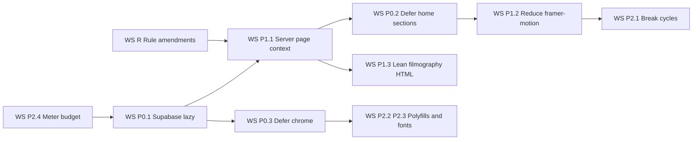

# Plan — Performance du premier chargement (vitrine publique CUC)

**Statut :** plan à approuver. **Aucune ligne de code n'est modifiée par ce document.**
**Source de vérité :** le diagnostic read-only déjà établi (poids gzip des chunks référencés par les HTML prérendus). Ce plan ne le refait pas : il en tire une exécution ordonnée.
**Périmètre :** JS de premier chargement des 14 routes publiques `/[locale]/…`, plus la lecture PostgREST par visiteur. Le Cockpit, la médiathèque et le rendu 3D ne sont pas re-découpés ici.
**Hors périmètre (constaté, non traité) :** Three.js est déjà correctement chargé en `next/dynamic` et absent du premier chargement — on ne le touche pas. Le CSS (~24 Ko gzip) est sain.

---

## 0. Rappel chiffré (diagnostic, non re-mesuré)

| Fait mesuré | Valeur | Ce que ce plan en fait |
| :--- | ---: | :--- |
| Premier chargement `/fr` | ≈ 555,7 Ko gzip | Cible du palier A |
| Premiers chargements `/fr/visite-virtuelle` → `/fr/contact-cuc` | 560,4 → 572,8 Ko | Cibles du palier B |
| Chunk Supabase `4127` | ≈ 181 Ko gzip | **WS‑P0.1** — hors du graphe initial |
| auth/realtime Supabase + lucide `6774` | ≈ 54 Ko gzip | **WS‑P0.1** + imports lucide ciblés |
| framer-motion + internes React `9826` + `5395` | ≈ 108 Ko gzip | **WS‑P0.2/P0.3/P1.2** |
| polyfills | ≈ 39 Ko gzip | **WS‑P2.2** |
| Fichiers `'use client'` | ≈ 431 | Motif structurel : routes clientes |
| `site_pages` lu par visiteur sur les routes non-accueil | 1 lecture (+1 overlay EN) | **WS‑P1.1** |
| HTML `/cuc-team-cascadeur` | ≈ 498 Ko | **WS‑P1.3** |
| Avertissement de dépendance circulaire (chunks 7852 ↔ 1656) | — | **WS‑P2.1** |

Rappel du mécanisme central, déjà prouvé : le layout fournit `navigation/footer/social/overlays` mais **pas** `page` ([`layout.tsx`](src/app/(site)/[locale]/layout.tsx:132)). Donc [`usePageDynamicContent()`](src/lib/hooks/usePageDynamicContent.ts:52) voit `hasServerPage === false` sur toute route non-accueil et déclenche [`fetchFreshContent()`](src/lib/hooks/usePageDynamicContent.ts:179).

---

## 1. Objectif & métriques de succès

### 1.1 Budget cible — JS **gzip** de premier chargement, par route publique

| Palier | Routes | Cible | Plafond dur (échec) |
| :--- | :--- | ---: | ---: |
| **A — contenu statique** | [`/fr`](src/app/(site)/[locale]/page.tsx:1), `contact-cuc`, `formation-de-cascadeur`, `spectacles-cascadeurs-yamakasi`, `stages-cascades-parkour-2`, `animations-airbag-parkour`, `team-building-cascades`, `stunt-workshop-cuc`, `partenaires`, `cuc-events-agence` | **≤ 250 Ko** | 300 Ko |
| **B — interactif / média** | `videos-cascadeur`, `visite-virtuelle`, `equipe-cascadeurs-pro`, `cuc-team-cascadeur` | **≤ 300 Ko** | 360 Ko |
| Plafond absolu, toute route publique | confondu | — | **380 Ko** |

Réduction attendue depuis 555–573 Ko : **−50 % à −58 %**. Justification du palier A à 250 Ko : la somme incompressible mesurée (react-dom ≈ 62 Ko + router/next-intl + les quelques îlots client réellement nécessaires) se situe autour de 150–190 Ko ; 250 Ko laisse la marge nécessaire aux polices de composants, sans autoriser le retour d'une librairie lourde.

### 1.2 Méthodologie de mesure (contractuelle)

1. **Mesure de référence (déjà en place, on ne la remplace pas) :** `npm run build` puis `npm run audit:route-weight` — [`audit_route_weight.mjs`](scripts/audit_route_weight.mjs:1) lit les **HTML prérendus** de `.next/server/app`, extrait les `/_next/static/**.js` réellement référencés, en gzip‑somme le poids et écrit [`plans/revue-poids-routes.md`](plans/revue-poids-routes.md:1). C'est exactement ce que reçoit le navigateur au premier chargement — donc la bonne métrique.
2. **Le budget remplace la baseline relative** quand le palier est atteint : aujourd'hui l'audit échoue à **+5 % de la baseline** ([`audit_route_weight.mjs`](scripts/audit_route_weight.mjs:36)), ce qui gèle un poids déjà trop élevé. **WS‑P2.4** ajoute un **plafond absolu par route** (`plans/route-weight-budget.json`), seul juge de la conformité au palier.
3. **Mesure terrain en production :** LCP/TTFB/INP via la télémétrie `site_vitals` déjà instrumentée ([`VitalsReporter.tsx`](src/components/analytics/VitalsReporter.tsx:1), `npm run audit:vitals`) et Lighthouse/PageSpeed sur l'URL **Vercel déployée** (le ressenti utilisateur est ce qui a déclenché le chantier).
4. **Contre-mesure de non-régression fonctionnelle :** `npm run audit:budget` (connexions Realtime Cockpit), `npm run probe:prod`, `npm run i18n:verify:no-flash`.

### 1.3 Métriques secondaires

- **Lectures PostgREST par page vue publique anonyme = 0** (hors formulaire de contact, qui n'écrit qu'à la soumission).
- **Aucune régression d'affichage bilingue** : le contrat « contenu de page fourni par le serveur » doit préserver la disparition du flash FR→EN (voir [`cockpit_bilingual_editing.md`](.agents/rules/cockpit_bilingual_editing.md:1)).
- **Aucune régression d'animation perçue** : réduction framer-motion sans perte visible (QA visuelle + tests a11y existants).

### 1.4 Definition of done du chantier

- Toutes les routes publiques sous leur plafond dur, et palier atteint pour ≥ 80 % des routes.
- `site_pages` : zéro lecture par visiteur sur les routes converties.
- Build sans nouvel avertissement bloquant ; aucun fichier au-delà de 300 lignes (plafond SRP).

---

## 2. Feuille de route

Légende des 4 couches (règle non négociable) : **[UI]** présentation pure · **[Hooks]** orchestration/état · **[Domain]** fonctions et services purs/testables · **[Types]** contrats isolés. Chaque workstream indique : fichiers → changement → conformité SRP → gain gzip estimé → vérification → rollback.

---

### PHASE P0 — gains rapides

#### WS‑P0.1 — Sortir `@supabase/supabase-js` du graphe de premier chargement

**Fichiers à créer**

| Fichier | Couche | Rôle |
| :--- | :--- | :--- |
| [`src/lib/supabase/lazy-client.ts`](src/lib/supabase/lazy-client.ts:1) | **[Domain]** | `loadSupabaseBrowserClient(): Promise<SupabaseClient>` — unique point d'accès paresseux : `const { createClient } = await import('./client'); return createClient();`. C'est un service, pas un hook. |

**Fichiers à modifier**

| Fichier | Couche | Changement précis |
| :--- | :--- | :--- |
| [`src/lib/hooks/navigation/useNavigation.ts`](src/lib/hooks/navigation/useNavigation.ts:47) | **[Hooks]** | Remplacer `import { createClient }` par l'appel paresseux ; ne charger le client **qu'après** la garde `if (!hasServerData && isCockpitRoute(...))` |
| [`src/lib/hooks/navigation/useFooter.ts`](src/lib/hooks/navigation/useFooter.ts:27) | **[Hooks]** | Idem (garde `hasServerFooter` + route Cockpit) |
| [`src/lib/hooks/navigation/useSocialLinks.ts`](src/lib/hooks/navigation/useSocialLinks.ts:25) | **[Hooks]** | Idem |
| [`src/lib/hooks/navigation/navigation-labels.ts`](src/lib/hooks/navigation/navigation-labels.ts:6) | **[Domain]** | Recevoir le client en paramètre (déjà le cas pour `fetchLabelOverlay`/`fetchFooterOverlay`) et retirer l'import statique ; sinon déplacer sa lecture dans le hook appelant |
| [`src/lib/hooks/useEntityOverlays.ts`](src/lib/hooks/useEntityOverlays.ts:5) | **[Hooks]** | Chargement paresseux, après garde « overlays serveur présents » |
| [`src/lib/hooks/useRealtimeRefresh.ts`](src/lib/hooks/useRealtimeRefresh.ts:4) | **[Hooks]** | Le client n'est chargé que si `isCockpitRoute()` (déjà testé dans ce module) |
| [`src/lib/data/translations.ts`](src/lib/data/translations.ts:1) | **[Domain]** | Chargement paresseux à l'appel |
| [`src/lib/data/site/inquiries.ts`](src/lib/data/site/inquiries.ts:6) | **[Domain]** | `import()` déclenché **dans la soumission** du formulaire (le contact reste sur le palier A sans charger Supabase au premier écran) |

**Changement (résumé).** Sur les routes publiques, `subscribeTable` sort déjà sans ouvrir de canal ([`realtime.ts`](src/lib/supabase/realtime.ts:159)). Il ne restait donc que **l'import statique** de `createClient` — et son instanciation GoTrue au premier effet — pour embarquer 181 Ko. Le chargement dynamique déplace `supabase-js` dans un chunk **non référencé par le HTML prérendu**, chargé uniquement là où il sert réellement : Cockpit, aperçu, soumission de formulaire.
Note importante : [`realtime.ts`](src/lib/supabase/realtime.ts:1) n'importe `@supabase/supabase-js` qu'en `import type` (effacé au build) — il ne faut **pas** l'alourdir en import de valeur.

**Conformité SRP.** Le nouveau service **[Domain]** centralise la seule décision « quand ouvrir une connexion Supabase » ; les hooks **[Hooks]** n'en connaissent plus l'implémentation. Zéro God Component, contrat typé, testable sans navigateur.

**Gain gzip estimé.** **−150 Ko à −181 Ko** par route publique (chunk `4127` retiré du HTML ; part de `6774` incluse). Effet TTI direct : une connexion GoTrue et son `localStorage` ne sont plus initialisés au premier écran.

**Vérification.** `npm run build && npm run audit:route-weight` → le chunk `4127` disparaît de la liste des chunks des routes `fr/*`/`en/*` ; le poids baisse d'au moins 150 Ko. Non-régression Cockpit : ouvrir `/admin`, vérifier que Realtime fonctionne toujours (canal partagé) via l'onglet concerné ; `npm run audit:budget`.

**Rollback.** Révoquer les `import()` en imports statiques dans les 8 fichiers (changement local, sans impact sur les données).

---

#### WS‑P0.2 — Différer les sections d'accueil sous la ligne de flottaison

**Fichiers à modifier**

| Fichier | Couche | Changement précis |
| :--- | :--- | :--- |
| [`src/app/(site)/[locale]/HomeView.tsx`](src/app/(site)/[locale]/HomeView.tsx:1) | **[UI]** | Garder **eager** uniquement `Navbar` + [`ParallaxHero`](src/components/ui/ParallaxHero.tsx:34) (LCP). Passer `HomeAboutSection`, `HomeTournagesSection`, `HomeVirtualTourSection`, `HomeQualiopiSection`, `HomeSocialSection` en `next/dynamic(() => import(...), { ssr: true })` avec un `loading` squelette de hauteur réservée (anti‑CLS) |
| [`src/components/sections/home/index.ts`](src/components/sections/home/index.ts:1) | **[UI]** | Le barrel reste la façade publique ; les imports dynamiques pointent vers les modules réels pour que Turbopack découpe bien par section |

**Changement (résumé).** Aucune logique déplacée : uniquement la **frontière de chargement**. `ssr: true` préserve le HTML prérendu (SEO + LCP), le JS des sections part dans des chunks asynchrones absents du HTML initial.

**Conformité SRP.** La composition reste dans la vue **[UI]** ; le choix de chargement est déclaratif, au plus près du rendu concerné.

**Gain gzip estimé.** **−40 Ko à −80 Ko** sur `/fr` (framer-motion et lucide ne sont plus requis par le HTML initial de l'accueil ; le hero conserve la part nécessaire).

**Vérification.** `npm run audit:route-weight` → `/fr` sous 250 Ko ; vérifier dans `plans/revue-poids-routes.md` que les chunks des sections ne sont plus listés. Contrôle visuel mobile : pas de saut de mise en page (CLS), sections présentes en HTML (`curl` du HTML prérendu).

**Rollback.** Revenir aux imports statiques dans [`HomeView.tsx`](src/app/(site)/[locale]/HomeView.tsx:1) (un seul fichier).

---

#### WS‑P0.3 — Différer la coquille animée optionnelle

**Fichiers à créer**

| Fichier | Couche | Rôle |
| :--- | :--- | :--- |
| [`src/components/layout/LazyMobileStickyCTA.tsx`](src/components/layout/LazyMobileStickyCTA.tsx:1) | **[Hooks]** (wrapping orchestration) | Composant client minimal qui charge [`MobileStickyCTA`](src/components/layout/MobileStickyCTA.tsx:1) via `dynamic(..., { ssr: false })` — l'appel à l'action n'apparaît qu'au scroll, son JS n'a pas à être au premier écran |

**Fichiers à modifier**

| Fichier | Couche | Changement précis |
| :--- | :--- | :--- |
| [`src/components/layout/RootShell.tsx`](src/components/layout/RootShell.tsx:112) | **[UI]** | Remplacer `MobileStickyCTA` par `LazyMobileStickyCTA` (frontière de chargement seulement) |
| [`src/components/layout/footer-sections/FooterCreditsBar.tsx`](src/components/layout/footer-sections/FooterCreditsBar.tsx:8) | **[UI]** | Remplacer les animations `motion`/`AnimatePresence` par des transitions CSS (élément toujours sous la ligne de flottaison) |

**Conformité SRP.** Un wrapper = une responsabilité : « différer un îlot sans changer sa logique ». Le composant d'origine n'est pas modifié.

**Gain gzip estimé.** **−15 Ko à −30 Ko** sur toutes les routes (framer-motion n'est plus requis par la coquille pour ce composant). ⚠️ `RootShell` est partagé avec le Cockpit : le wrapper doit rester neutre.

**Vérification.** `npm run audit:route-weight` sur une route du palier A ; sur `/admin`, vérifier que le CTA mobile et le pied de page s'animent toujours au scroll.

**Rollback.** Restaurer l'import direct dans [`RootShell.tsx`](src/components/layout/RootShell.tsx:112).

---

### PHASE P1 — architectural

> **Séquence imposée :** WS‑P1.1 (page fournie par le serveur) est **séquentiel avec le refactor d'accueil**. Aucun autre workstream ne touche [`HomeView.tsx`](src/app/(site)/[locale]/HomeView.tsx:1) ni [`layout.tsx`](src/app/(site)/[locale]/layout.tsx:1) pendant son exécution.

#### WS‑P1.1 — Contrat « contenu de page fourni par le serveur » sur les 14 routes

**Fichiers à créer**

| Fichier | Couche | Rôle |
| :--- | :--- | :--- |
| [`src/components/i18n/SitePageScope.tsx`](src/components/i18n/SitePageScope.tsx:1) | **[Hooks]** | Provider client **de fusion** : lit le contexte chrome via [`useSiteData()`](src/components/i18n/SiteDataProvider.tsx:75) et le re‑fournit enrichi de `page` — évite de dupliquer navigation/footer/social/overlays dans chaque route et garde une source unique pour la coquille |
| [`src/components/i18n/SiteDataValue.ts`](src/components/i18n/SiteDataValue.ts:1) | **[Types]** | Si nécessaire, extraction du contrat `SiteDataValue` hors du composant pour casser tout cycle d'import (déjà exporté par [`SiteDataProvider.tsx`](src/components/i18n/SiteDataProvider.tsx:31) — à isoler seulement si le build le réclame) |
| 14 × `…/<route>/<RouteView>.tsx` (p. ex. [`videos-cascadeur/VideosCascadeurView.tsx`](src/app/(site)/[locale]/videos-cascadeur/page.tsx:1)) | **[UI]** | Le contenu actuel des `page.tsx` clientes est déplacé **tel quel**, renommé en `*View`, sans changement de logique |

**Fichiers à modifier** — les 14 routes aujourd'hui clientes (relevées dans le diagnostic) deviennent des **Server Components minces** :

| Fichier | Couche | Changement précis |
| :--- | :--- | :--- |
| [`videos-cascadeur/page.tsx`](src/app/(site)/[locale]/videos-cascadeur/page.tsx:1) | **[UI]** | `async`, résout `getPublicPageContent('/videos-cascadeur', locale)`, enveloppe `*View` dans `SitePageScope` |
| [`visite-virtuelle/page.tsx`](src/app/(site)/[locale]/visite-virtuelle/page.tsx:1) | **[UI]** | Idem, slug `/visite-virtuelle` (conserve son `next/dynamic` 3D existant) |
| [`visite-guidee/page.tsx`](src/app/(site)/[locale]/visite-guidee/page.tsx:1) | **[UI]** | Idem |
| [`equipe-cascadeurs-pro/page.tsx`](src/app/(site)/[locale]/equipe-cascadeurs-pro/page.tsx:1) | **[UI]** | Idem |
| [`cuc-team-cascadeur/page.tsx`](src/app/(site)/[locale]/cuc-team-cascadeur/page.tsx:1) | **[UI]** | Idem (voir aussi WS‑P1.3) |
| [`contact-cuc/page.tsx`](src/app/(site)/[locale]/contact-cuc/page.tsx:1) | **[UI]** | Idem — le formulaire reste un îlot client distinct |
| [`formation-de-cascadeur/page.tsx`](src/app/(site)/[locale]/formation-de-cascadeur/page.tsx:1) | **[UI]** | Idem |
| [`spectacles-cascadeurs-yamakasi/page.tsx`](src/app/(site)/[locale]/spectacles-cascadeurs-yamakasi/page.tsx:1) | **[UI]** | Idem |
| [`stages-cascades-parkour-2/page.tsx`](src/app/(site)/[locale]/stages-cascades-parkour-2/page.tsx:1) | **[UI]** | Idem |
| [`animations-airbag-parkour/page.tsx`](src/app/(site)/[locale]/animations-airbag-parkour/page.tsx:1) | **[UI]** | Idem |
| [`team-building-cascades/page.tsx`](src/app/(site)/[locale]/team-building-cascades/page.tsx:1) | **[UI]** | Idem |
| [`stunt-workshop-cuc/page.tsx`](src/app/(site)/[locale]/stunt-workshop-cuc/page.tsx:1) | **[UI]** | Idem |
| [`cuc-events-agence/page.tsx`](src/app/(site)/[locale]/cuc-events-agence/page.tsx:1) | **[UI]** | Idem |
| [`partenaires/page.tsx`](src/app/(site)/[locale]/partenaires/page.tsx:1) | **[UI]** | Idem |
| [`src/app/(site)/[locale]/layout.tsx`](src/app/(site)/[locale]/layout.tsx:132) | **[Hooks]** | Devient la seule source de la coquille ; **ne porte toujours pas** `page` (le slug est propre à la route) |
| [`src/lib/hooks/usePageDynamicContent.ts`](src/lib/hooks/usePageDynamicContent.ts:112) | **[Hooks]** | Module le chargement paresseux Supabase (WS‑P0.1) et **ne rejoue plus aucune lecture quand `hasServerPage`** ; le Realtime reste actif uniquement dans le Cockpit/l'aperçu |

**Changement (résumé).** Le motif déjà appliqué à l'accueil ([`page.tsx`](src/app/(site)/[locale]/page.tsx:36) : `getPublicPageContent` + `SiteDataProvider`) devient le **contrat de toutes les routes**. `SitePageScope` évite que chaque route ait à recharger navigation/footer/social : elle n'apporte que `page`.

**Conformité SRP / règles satisfaites.** 4 couches étanches : la route serveur ne fait que résoudre la donnée (**orchestration serveur**), `SitePageScope` est le point unique de composition du contexte (**[Hooks]**), la vue est **[UI]**, le contrat `SiteDataValue` est **[Types]**. Respecte [`cuc_sign_interconnection.md`](.agents/rules/cuc_sign_interconnection.md:35) §3.5 (panne de lecture → copie certifiée) et la garde de diffusion [`UnpublishedPageGate`](src/components/i18n/SiteDataProvider.tsx:64). Chaque `*View` reste sous le plafond de 300 lignes ; toute vue qui dépasserait doit être découpée lors du déplacement.

**Gain gzip estimé.** Neutre à court terme, **décisif à moyen terme** : il supprime la **lecture PostgREST par visiteur** (coût base + egress + TTFB de la route), et il est la condition pour que WS‑P0.1 ne se contente pas de différer le problème (sur les routes non converties, le hook doit encore charger Supabase pour lire). Effet secondaire attendu : −5 à −15 Ko par route (les hooks cessent d'embarquer les chemins de repli de lecture).

**Vérification.** Après déploiement : `npm run probe:prod` + compter les requêtes `site_pages` (onglet réseau sur une route convertie → **zéro** appel `rest/v1/site_pages`) ; `npm run i18n:verify:no-flash` (pas de FR fugace en `/en/...`) ; `npm run audit:route-weight` (poids stable ou en baisse) ; `npm run audit:quotas` non dégradé.

**Rollback.** Route par route : restaurer `'use client'` et l'appel `usePageDynamicContent(slug)` d'origine (le hook reste compatible, `hasServerPage === false` rejoue la lecture). Aucune migration de données.

---

#### WS‑P1.2 — Réduire framer-motion dans la coquille et le hero

**Fichiers à modifier**

| Fichier | Couche | Changement précis |
| :--- | :--- | :--- |
| [`src/components/layout/navbar/NavDropdowns.tsx`](src/components/layout/navbar/NavDropdowns.tsx:6) | **[UI]** | Remplacer `motion`/`AnimatePresence` par transitions CSS (ouverture/fermeture), ou `LazyMotion` + `domAnimation` |
| [`src/components/layout/navbar/NavMobileDrawer.tsx`](src/components/layout/navbar/NavMobileDrawer.tsx:8) | **[UI]** | Idem — le tiroir est un état ouvert/fermé, suffisant en CSS |
| [`src/components/ui/parallax/StudioGlobalAtmosphere.tsx`](src/components/ui/parallax/StudioGlobalAtmosphere.tsx:4) | **[UI]** | Remplacer `useScroll/useSpring/useTransform` par une variable CSS pilotée au scroll (`IntersectionObserver` + `style.setProperty`) — et supprimer son import statique de l'accueil |
| [`src/components/ui/parallax-hero/useParallaxHero.ts`](src/components/ui/parallax-hero/useParallaxHero.ts:5) | **[Hooks]** | Conserver le ressort (c'est le hero, LCP) mais vérifier qu'aucun import `motion` inutile n'y entre |
| [`src/components/sections/home/HomeAboutSection.tsx`](src/components/sections/home/HomeAboutSection.tsx:8) | **[UI]** | Section sous la ligne de flottaison : apparition CSS ; ne pas embarquer `motion` |

**Changement (résumé).** framer-motion reste **uniquement** là où il produit une valeur perçue supérieure au coût (hero). Partout ailleurs, il est retiré ou remplacé par CSS, sans changer le rendu statique.

**Conformité SRP.** Chaque composant porte une seule animation ; aucune logique métier n'est déplacée.

**Gain gzip estimé.** **−30 Ko à −60 Ko** sur toutes les routes (réduction du chunk `9826`/`5395`).

**Vérification.** `npm run audit:route-weight` ; QA visuelle des menus desktop/mobile ; `npm run test` (tests a11y existants du menu).

**Rollback.** Fichier par fichier (les animations CSS et JS cohabitent sans état partagé).

---

#### WS‑P1.3 — Alléger le HTML de `/cuc-team-cascadeur`

**Fichiers à créer**

| Fichier | Couche | Rôle |
| :--- | :--- | :--- |
| [`src/app/(site)/[locale]/cuc-team-cascadeur/filmography.dataset.ts`](src/app/(site)/[locale]/cuc-team-cascadeur/filmography.dataset.ts:1) | **[Domain]** | Sérialisation compacte des crédits (champs strictement affichés), séparée du rendu |

**Fichiers à modifier**

| Fichier | Couche | Changement précis |
| :--- | :--- | :--- |
| [`cuc-team-cascadeur/page.tsx`](src/app/(site)/[locale]/cuc-team-cascadeur/page.tsx:1) | **[UI]** | Server Component (via WS‑P1.1) : rend en SSR les N premiers crédits (indexables) et délègue le reste à un chunk client chargé à la demande |
| Nouvelle vue crédits (`…/FilmographyList.tsx`) | **[UI]** | Rendu virtualisé/paginé, monté en `next/dynamic`, lit le dataset compact |

**Changement (résumé).** Le HTML de 498 Ko provient de la filmographie inlinée. On conserve ce qui doit être indexé (cartes coach + premiers crédits + JSON‑LD `Person`), et on déplace le reste hors du HTML initial.

**Conformité SRP.** Le dataset **[Domain]** est distinct du rendu **[UI]** ; la vue liste reste sous 300 lignes, découpée si besoin.

**Gain gzip estimé.** JS ≈ −10 Ko ; **HTML −200 Ko à −300 Ko** (gain TTFB/LCP fort, hors budget gzip JS mais directement lié au ressenti prod).

**Vérification.** `npm run audit:route-weight` (JS), mesure du poids HTML du fichier prérendu avant/après, contrôle d'indexation (`view-source` : présence des crédits prioritaires + JSON‑LD), `npm run i18n:audit:consumption`.

**Rollback.** Restaurer le rendu inliné depuis la vue d'origine (le dataset peut rester).

**Question ouverte :** arbitrage SEO/HTML à valider — combien de crédits doivent rester dans le HTML (voir §5).

---

### PHASE P2 — hygiène

#### WS‑P2.1 — Supprimer l'avertissement de dépendance circulaire (chunks 7852 ↔ 1656)

**Fichiers à modifier** — cibles probables (à confirmer par le cycle exact du build) : barrels [`src/components/sections/home/index.ts`](src/components/sections/home/index.ts:1), [`src/components/ui/parallax/index.ts`](src/components/ui/parallax/index.ts:1), et un contrat partagé à extraire sous **[Types]**.
**Changement.** Remonter le type/contrat partagé dans un fichier **[Types]** et casser le barrel réexportant-réimporté. Preuve : `npm run build` sans l'avertissement Turbopack/webpack.
**Gain.** Fiabilité du découpage (le cycle empêche Turbopack d'isoler un chunk) ; gain indirect sur le premier chargement.
**Rollback.** Local par import.
**Note :** `npm run build` utilise `next build --webpack` ([`package.json`](package.json:7)) ; capturer l'avertissement exact avant de le traiter (voir §5).

#### WS‑P2.2 — Polyfills : cibler les navigateurs réellement servis

**Fichiers à modifier :** [`package.json`](package.json:1) (champ `browserslist`) — **[Types]/config**.
**Changement.** Déclarer une cible moderne (dernières versions Chrome/Edge/Firefox/Safari) pour laisser SWC supprimer les polyfills inutiles.
**Gain gzip estimé.** **−20 Ko à −39 Ko** sur toutes les routes.
**Vérification.** `npm run audit:route-weight` ; `npm run audit:app` ; smoke test sur les navigateurs cibles.
**Rollback.** Retirer `browserslist`.

#### WS‑P2.3 — Polices : discipline de préchargement

**Fichiers à modifier :** [`RootShell.tsx`](src/components/layout/RootShell.tsx:18).
**Changement.** 4 familles déclarées ; ne précharger que celles du premier écran (Bebas Neue/Inter), vérifier l'usage réel de `Space Grotesk`/`JetBrains Mono` et en retirer une si non utilisée. Aucune requête Google au runtime (déjà auto-hébergé).
**Gain.** Réduction du poids bloquant du rendu (hors gzip JS) ; effet LCP.
**Rollback.** Rétablir la déclaration.

#### WS‑P2.4 — Automatiser le budget (et le rendre opposable)

**Fichiers à créer**

| Fichier | Couche | Rôle |
| :--- | :--- | :--- |
| [`plans/route-weight-budget.json`](plans/route-weight-budget.json:1) | **[Types]** (contrat) | Plafonds absolus par route (paliers A/B) et plafond global |
| [`.agents/rules/client_bundle_budget.md`](.agents/rules/client_bundle_budget.md:1) | règle | Source canonique du sujet (voir §4.2) |

**Fichiers à modifier**

| Fichier | Couche | Changement précis |
| :--- | :--- | :--- |
| [`scripts/audit_route_weight.mjs`](scripts/audit_route_weight.mjs:187) | **[Domain]** | Ajouter la comparaison au **plafond absolu** (échec code 2, avertissement à −10 % du plafond), en conservant la comparaison relative |
| [`package.json`](package.json:34) | config | Aucun nouveau script requis si le contrôle est intégré à `audit:route-weight` ; sinon `audit:route-weight:budget` |
| [`.github/workflows/ci.yml`](.github/workflows/ci.yml:1) | config | Brancher le contrôle sur le gate existant (définition de « terminé », [`durability_health.md`](.agents/rules/durability_health.md:10) §2) |
| [`plans/roadmap-site-2026.md`](plans/roadmap-site-2026.md:1) | doc | Cocher/adresser la ligne « budgets JS » |

**Gain.** Non chiffré : rend le palier **opposable** (une régression > plafond casse la CI au lieu de passer sous la baseline relative).
**Rollback.** Retirer la branche plafond du script.

---

## 3. Frontières de parallélisation (agents Code séparés)

Règle d'or : **un fichier n'a qu'un propriétaire à la fois.** Deux agents peuvent travailler en parallèle s'ils ne partagent aucun fichier ci‑dessous.

| Workstream | Possède (exclusivement) | Dépend de | Conflits potentiels |
| :--- | :--- | :--- | :--- |
| **WS‑P0.1** Supabase paresseux | `src/lib/supabase/lazy-client.ts`, `src/lib/hooks/navigation/**`, `src/lib/hooks/useEntityOverlays.ts`, `src/lib/hooks/useRealtimeRefresh.ts`, `src/lib/data/translations.ts`, `src/lib/data/site/inquiries.ts` | — | Ne touche **pas** `usePageDynamicContent.ts` (réservé à WS‑P1.1) |
| **WS‑P0.2** Sections d'accueil différées | `src/app/(site)/[locale]/HomeView.tsx`, `src/components/sections/home/index.ts` | — | **Séquentiel** avec WS‑P1.1 (même `HomeView.tsx`) et WS‑P1.2 (sections) |
| **WS‑P0.3** Coquille différée | `src/components/layout/LazyMobileStickyCTA.tsx`, `src/components/layout/footer-sections/FooterCreditsBar.tsx` | — | `RootShell.tsx` partagé avec WS‑P2.3 → séquencer |
| **WS‑P1.1** Page fournie par le serveur | `src/app/(site)/[locale]/**/page.tsx` (14), `src/components/i18n/SitePageScope.tsx`, `src/lib/hooks/usePageDynamicContent.ts` | Conception de WS‑P0.1 (motif de chargement) | `HomeView.tsx` (WS‑P0.2), `layout.tsx` |
| **WS‑P1.2** framer-motion | `src/components/layout/navbar/**`, `src/components/ui/parallax/**`, `src/components/ui/parallax-hero/**`, `src/components/sections/home/HomeAboutSection.tsx` | — | `HomeView.tsx` si les imports changent → après WS‑P0.2 |
| **WS‑P1.3** HTML filmographie | `src/app/(site)/[locale]/cuc-team-cascadeur/**` | WS‑P1.1 sur cette route | Séquence interne à la route |
| **WS‑P2.1** cycles | barrels + fichier Types extrait | — | `index.ts` des `home/` et `parallax/` → après WS‑P0.2/P1.2 |
| **WS‑P2.2/P2.3** config/polices | `package.json`, `RootShell.tsx` | WS‑P0.3 pour `RootShell.tsx` | Séquencer sur `RootShell.tsx` |
| **WS‑P2.4** budget automatisé | `scripts/audit_route_weight.mjs`, `plans/route-weight-budget.json`, CI | Indépendant (peut démarrer en premier, utile comme mètre‑étalon) | — |
| **WS‑R** règles/doc | `.agents/rules/**`, `AGENTS.md` | — | Aucun code |

Chaîne séquentielle critique : **WS‑P2.4 (mètre) → WS‑P0.1 → WS‑P1.1 (pilote accueil) → WS‑P0.2 → WS‑P1.2 → WS‑P2.1**.



**Parallélisable dès le premier jour (aucun fichier partagé) :** WS‑P0.1, WS‑P1.2, WS‑P1.3 (démarrer après P1.1 sur cette route), WS‑P2.4, WS‑R.
**Séquentiel obligatoire :** l'accueil — WS‑P0.2 puis WS‑P1.1 doivent s'exécuter dans cet ordre ou être fusionnés en **un seul** workstream « accueil » si un agent unique traite la route.

---

## 4. Ajustements de règles (texte exact proposé)

### 4.1 Correction de [`durability_health.md`](.agents/rules/durability_health.md:41) § 6

**Constat :** le texte affirme aujourd'hui que la vitrine « ne demande **aucune** lecture par visiteur ». C'est **faux pour toute route non-accueil** tant que la route est un composant client : [`usePageDynamicContent()`](src/lib/hooks/usePageDynamicContent.ts:179) lit `site_pages` par visiteur (et une seconde fois pour l'overlay EN). La phrase « n'ouvre aucun canal Realtime » reste vraie (garantie par [`realtime.ts`](src/lib/supabase/realtime.ts:159)).

**Texte actuel (extrait) :**

> 6. **Charge : ce qui croît avec le trafic, et rien d'autre** : le nombre de tables n'est pas
>    la question — la vitrine ne demande **aucune** lecture par visiteur (HTML prérendu,
>    lectures `use cache` + tags) et n'ouvre **aucun** canal Realtime (voir
>    `studio_mode_preview.md` § 4).

**Texte de remplacement proposé (verbatim) :**

> 6. **Charge : ce qui croît avec le trafic, et rien d'autre** : le nombre de tables n'est pas
>    la question. La vitrine n'ouvre **aucun** canal Realtime (voir `studio_mode_preview.md` § 4),
>    et **aucune page publique ne demande de lecture par visiteur — à une condition, désormais
>    mesurée** : la route fournit son contenu de page au `SiteDataProvider` depuis le serveur
>    (`getPublicPageContent` + lectures `use cache`/tags). Tant qu'une route cliente n'est pas
>    branchée sur ce contrat, elle lit `site_pages` **une fois par visiteur** — et une fois de plus
>    pour l'overlay EN : c'est une **dette connue et suivie**, jamais une situation admise. Sa
>    disparition est vérifiée par l'inspection réseau (`rest/v1/site_pages`) sur chaque route
>    convertie. Le poids JS de premier chargement par route publique est régi par
>    [`client_bundle_budget.md`](client_bundle_budget.md:1).

Cette formulation est **auto‑vérifiable** (elle nomme la condition et la preuve), cohérente avec l'esprit « ce qui n'est pas mesuré dérive » du même fichier, et ne supprime aucune contrainte.

### 4.2 Nouvelle règle canonique — [`.agents/rules/client_bundle_budget.md`](.agents/rules/client_bundle_budget.md:1)

**Justification.** `durability_health.md` § 1 cite déjà « budgets JS » dans la feuille de route, sans règle opposable. Le diagnostic montre qu'un plafond *relatif* à une baseline gonflée laisse passer 555–573 Ko. Le sujet mérite sa **source unique**.

**Plan proposé du fichier (contenu) :**

```
# RÈGLE PERMANENTE : BUDGET JS DE PREMIER CHARGEMENT & CHARGEMENT DIFFÉRÉ

**Un octet qui n'est pas utile au premier écran est un octet volé à l'utilisateur.**

> Source canonique du sujet — ne pas recopier ce contenu dans AGENTS.md.

1. Budget par route publique (gzip, premier chargement) :
   - palier A (contenu statique) : ≤ 250 Ko ; plafond dur 300 Ko ;
   - palier B (interactif/média) : ≤ 300 Ko ; plafond dur 360 Ko ;
   - plafond absolu : 380 Ko.
   Le contrat machine est `plans/route-weight-budget.json`.

2. Preuve : `npm run audit:route-weight` (HTML prérendus, chunks réellement référencés).
   Dépasser un plafond dur ÉCHOUE ; s'en approcher à moins de 10 % AVERTIT.
   La baseline relative ne remplace jamais le plafond absolu.

3. Bibliothèques lourdes — jamais dans le graphe d'une route publique :
   `three`, `framer-motion`, `@supabase/supabase-js`, bibliothèques de cartes/graphes.
   Seuls trois chemins sont licites : `next/dynamic`, `import()` déclenché par une action,
   ou usage strictement serveur. Un `import` statique atteignable depuis une route publique
   est un défaut, pas un choix.

4. Exception : documentée dans `plans/` (justification + plafond temporaire + date de revue),
   jamais silencieuse — même doctrine que la dette publiée de `durability_health.md` § 2.

5. Maintenance : après une amélioration, régénérer la baseline
   (`npm run audit:route-weight:baseline`) **après revue**, et resserrer les plafonds.
   Le contrôle est intégré au gate existant.
```

**Proposed row for the [`AGENTS.md`](AGENTS.md:1) index** (the table at the end of the file — internal-consistency check: it already lists one file per topic):

| Sujet | Fichier canonique |
| :--- | :--- |
| Budget JS de premier chargement, chargement différé des libs lourdes | [`client_bundle_budget.md`](.agents/rules/client_bundle_budget.md:1) |

Cette ligne unique respecte la limite `< 150 lignes` de `AGENTS.md` (aucun détail recopié).

**Règles non modifiées (à honorer pendant l'exécution) :** SRP et plafond 300 lignes ([`AGENTS.md`](AGENTS.md:1) §1–2), interdiction des God Components, séparation 4 couches, diffs chirurgicaux, publication/RLS ([`cuc_sign_interconnection.md`](.agents/rules/cuc_sign_interconnection.md:37)), bilingue sans flash ([`cockpit_bilingual_editing.md`](.agents/rules/cockpit_bilingual_editing.md:1)), presse/compression média non concernée ([`media_compression.md`](.agents/rules/media_compression.md:1)).

---

## 5. Risques, dépendances et questions ouvertes

### Risques

| Risque | Sévérité | Mitigation |
| :--- | :--- | :--- |
| `next/dynamic` avec `ssr: true` sous `cacheComponents` (PPR) : le chunk pourrait rester préchargé dans le HTML | Moyenne | Vérifier après chaque WS dans `plans/revue-poids-routes.md` ; si préchargé, tester `ssr: true` sans `preload`, ou un island client explicite |
| Retirer framer-motion de la navbar dégrade la perception (animations) | Moyenne | QA visuelle mobile + desktop ; ne retirer que là où CSS suffit ; conserver le hero |
| Le chargement paresseux Supabase casse la synchro Cockpit | Élevée | `npm run audit:budget` + test manuel du canal partagé ; repli = imports statiques |
| WS‑P1.1 touche 14 routes clientes (≈ 431 fichiers `'use client'` au total) | Élevée | Le découpage serveur/client route par route est isolé ; commencer par une route pilote, mesurer, généraliser |
| Réduction du HTML filmographie nuit au SEO | Moyenne | Garder les crédits prioritaires + JSON‑LD en SSR ; validation Search Console (voir question ouverte) |
| La baseline de l'audit est régénérée « pour faire passer » sans gain réel | Élevée | Plafond absolu (WS‑P2.4) **avant** toute régénération ; revue obligatoire |
| Régression bilingue (retour du flash FR) | Élevée | `npm run i18n:verify:no-flash`, `npm run i18n:audit:consumption` après chaque route |

### Dépendances

- Le diagnostic chiffré (chunks, routes, lecteur par visiteur) — considéré comme acquis.
- `next.config.ts` : `reactCompiler`, `cacheComponents` (PPR), images AVIF/WebP ([`next.config.ts`](next.config.ts:16)).
- Infrastructure de mesure existante : [`audit_route_weight.mjs`](scripts/audit_route_weight.mjs:1), `npm run audit:budget`, `npm run audit:vitals`, `site_vitals`.
- Chaîne CI (`.github/workflows/ci.yml`) — à lire avant branchement du plafond (fichier non ouvert par ce plan).
- Route publique par route publique : aucune migration de base n'est nécessaire.

### Questions ouvertes

1. **HTML filmographie :** quel volume de crédits doit rester dans le HTML pour préserver l'indexation Google (tous, les N premiers par coach, ou les seuls crédits notables) ? Décision propriétaire avant WS‑P1.3.
2. **`build --webpack` vs Turbopack :** l'avertissement de cycle 7852↔1656 vient-il de Webpack ? Faut-il aligner la commande de build sur Turbopack ? À trancher avant WS‑P2.1.
3. **Palier B :** `videos-cascadeur` et `visite-virtuelle` garderont des îlots riches (vidéo, 3D). Le plafond de 300 Ko est-il acceptable pour le propriétaire, ou exige-t-on 250 Ko partout ?
4. **Middleware i18n** ([`proxy.ts`](src/proxy.ts:37)) sur chaque vue : le ressenti prod vient-il aussi du TTFB de middleware ? À mesurer via `site_vitals` avant d'engager un chantier (hors périmètre de ce plan).
5. **Cockpit vs vitrine de `RootShell.tsx` :** accepter un wrapper client de plus dans la coquille partagée, ou créer un second point de montage réservé à la vitrine ?

---

## 6. Ordre d'exécution recommandé

1. **WS‑R** (règles) + **WS‑P2.4** (budget opposable) — les règles d'abord.
2. **WS‑P0.1** (Supabase paresseux) — gain immédiat le plus fort, risque contenu.
3. **WS‑P1.1** (route pilote : accueil, puis généralisation aux 13 autres) — supprime la lecture par visiteur.
4. **WS‑P0.2 → WS‑P0.3** (différer ce qui n'est pas utile au premier écran).
5. **WS‑P1.2** (framer-motion) → **WS‑P1.3** (HTML filmographie).
6. **WS‑P2.1 → WS‑P2.2 → WS‑P2.3** (hygiène).
7. Régénérer la baseline **après revue**, puis resserrer les plafonds de [`plans/route-weight-budget.json`](plans/route-weight-budget.json:1).
