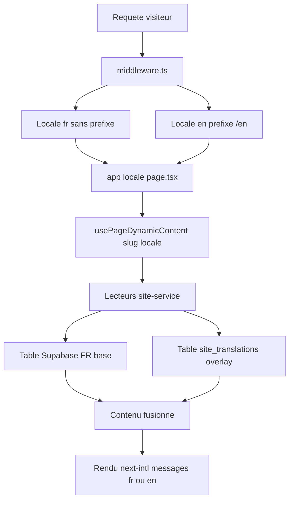

# Plan — Refonte vitrine 2026 : corrections éditoriales, ordre équipe, affiches films & mode anglais

> Statut : proposition à valider (mode Architect → exécution en mode Code/Debug).
> Doctrine applicable : zéro texte orphelin (tout vit dans Supabase), zéro « AI slop », interdiction du terme « ADD » / « Art du Déplacement » (utiliser **Parkour**), et `creditTitleKey()` reste le seul normaliseur de titres.

## 1. Périmètre de la demande (rappel)

| # | Demande | Nature |
| --- | --------- | -------- |
| 1 | Lucas Dollfus en 1er, Michel Bouis au moins 6e (jamais 1er) | Données Supabase + fallback |
| 2 | Retirer le bouton « Explorer le campus » + les 4 boutons de slides de l'accueil | UI |
| 3 | Retirer les mentions « 6 ha » (présentes partout, trop nombreuses) | Contenu + DB |
| 4 | Page campus : titre « VISITE GUIDÉE DU CAMPUS » → « LE CAMPUS » | UI + DB |
| 5 | 3 boutons de la page campus : renommage + réordonnancement | UI + DB |
| 6 | Retirer « NAVIGATION INSTANTANÉE » | UI |
| 7 | Créer un mode anglais (Option A : next-intl `[locale]` + couche de traduction Supabase) | Architecture majeure |
| 8 | Vérifier les affiches de films + métadonnées | Audit + corrections |
| 9 | Page TOURNAGE : remplacer FILMS & SÉRIES par « LES FILMS DOUBLÉS & COORDONNÉS PAR LE CUC » | Refactor composant |

## 2. Décisions actées

- **i18n = Option A** — `next-intl` avec segment de route `[locale]`, middleware de détection, locales `fr` (défaut, sans préfixe) et `en` (préfixe `/en`), plus une **couche de traduction Supabase** pour le contenu éditorial.
- **Films showcase = Option A** — extraction d'un composant partagé `CucFilmsShowcase`, utilisé à la fois sur `/equipe-cascadeurs-pro` et sur `/cuc-team-cascadeur` (en remplacement de la grille « FILMS & SÉRIES » de [`HallOfFame`](src/components/sections/HallOfFame.tsx:114)), en **conservant** le bloc « Acteurs & comédiens doublés » ([`CelebrityDoublesGallery`](src/components/sections/hall-of-fame/CelebrityDoublesGallery.tsx:1)).

## 3. Architecture i18n (Option A)

### 3.1 Routage



- Arborescence cible : `src/app/[locale]/…` pour **toutes les pages publiques**.
- Restent hors `[locale]` : `src/app/admin/**`, `robots.ts`, `sitemap.ts`, `icon.png`, `apple-icon.png`, et les `opengraph-image.tsx` (à paramétrer par locale via `alternates`).
- `localePrefix: 'as-needed'` → URLs FR inchangées (aucune régression SEO), EN sous `/en/…`.

### 3.2 Couche de traduction Supabase (zéro texte orphelin)

Table additive, cohérente avec le préfixe `site_` et la doctrine d'isolation :

```
site_translations
  id           uuid pk
  entity       text   -- page | settings | team | films | programs | sessions
                       -- events | partners | navigation | footer | social | disciplines | campus_pois
  entity_id    text   -- slug / clé / id de l'entité de base
  locale       text   -- 'en'
  payload      jsonb  -- surcharge PARTIELLE des champs traduisibles
  is_published boolean
  updated_at   timestamptz
  UNIQUE (entity, entity_id, locale)
```

- Lecture : `getX(slug, locale)` renvoie la **base FR** puis applique un **merge profond** de `payload` quand `locale !== 'fr'`.
- Absence de traduction ⇒ fallback FR automatique (jamais de trou).
- RLS : lecture publique, écriture admin (même modèle que `site_pages`).

### 3.3 Points de migration `next/link`

Toutes les navigations passent par les wrappers next-intl (`@/i18n/navigation` → `Link`, `useRouter`, `usePathname`). Fichiers concernés (au minimum) : [`Navbar`](src/components/layout/Navbar.tsx:1), [`Footer`](src/components/layout/Footer.tsx:1), [`MobileStickyCTA`](src/components/layout/MobileStickyCTA.tsx:1), plus chaque `page.tsx` et section utilisant `next/link` / `usePathname`.

## 4. Restructuration des routes (public)

| Route actuelle | Cible FR | Cible EN |
| --- | --- | --- |
| `/` | `/` | `/en` |
| `/visite-guidee` | `/visite-guidee` | `/en/campus` (libellé EN à valider) |
| `/cuc-team-cascadeur` | inchangé | `/en/…` |
| Equipe, Stage, Formation, Events, Partenaires, Contact, Videos, Spectacles, Stunt-workshop, Team-building, Animations, Visite-virtuelle | inchangé | `/en/…` |

> Les slugs EN peuvent rester identiques à FR dans un premier temps (moindre risque) ; la localisation des slugs est une phase ultérieure optionnelle.

## 5. Corrections vitrine (Phase 0 — indépendantes de l'i18n)

1. **Accueil** — [`HeroBottomControls.tsx`](src/components/ui/parallax-hero/HeroBottomControls.tsx:54) : supprimer les 4 boutons segmentés (sélecteurs de slides) et la relance « Explorer le campus » (l.123-137). Conserver les flèches prev/next (`handlePrev`/`handleNext`) et l'autoplay.
2. **Page campus** — [`VisiteHeroSection.tsx`](src/components/sections/visite/VisiteHeroSection.tsx:32) : fil d'Ariane et `<h1>` → « LE CAMPUS ». Miroir dans le fallback [`site-service.ts`](src/lib/data/site-service.ts:927) et dans la ligne `site_pages` correspondante.
3. **3 boutons** — [`VisiteHeroSection.tsx`](src/components/sections/visite/VisiteHeroSection.tsx:51) :
   - Ordre imposé : **INFRASTRUCTURES** (`#installations-detail`) → **VISITE 360°** (`#visite-virtuelle-360`) → **PLAN 3D** (`#plan-3d-domaine`).
   - Anciens libellés : « Les 9 Espaces Clés », « Visite 360° HD Media », « Plan 3D du Domaine (6 Ha) ».
   - Miroir du `cta_primary_text` dans le fallback + `site_pages`.
4. **NAVIGATION INSTANTANÉE** — [`CampusAppLaunchers.tsx`](src/components/ui/campus-map/CampusAppLaunchers.tsx:17) : supprimer le `<span>`.
5. **Purge « 6 ha »** — retirer **toutes** les occurrences (`6 hectares`, `6 Ha`, `6 HECTARES`) sauf mention structurelle éventuelle. Périmètre observé (~52 occurrences) :
   - `src/lib/seo.ts`, `src/lib/og-image.tsx`, `src/lib/data/site-service.ts`
   - `src/data/programs.ts`, `src/data/navigation.ts`, `src/data/campus.ts`
   - `src/components/ui/VirtualTourViewer.tsx`, `InteractiveCampusMap.tsx`, `campus-map/campusMap.data.ts`, `parallax-hero/parallaxHero.data.ts`
   - Sections : visite, team, stages, home, formation, events, contact
   - `src/app/visite-virtuelle/page.tsx`, `visite-guidee/*`, `team-building-cascades/*`, `opengraph-image.tsx`, `layout.tsx`
   - Cockpit : `admin/components/CampusZonesView.tsx`, `SettingsView.tsx`, `pages-editor/ContactPageEditor.tsx`, `CockpitApp.tsx`
   - Plus les miroirs Supabase (`site_pages.hero/subtitle`, `site_settings.campus_surface`, `site_campus_pois`) et les scripts de seed historiques.
   - Ajouter une **garde** (test unitaire + script d'audit) interdisant la réintroduction de « 6 ha ».

## 6. Ordre de l'équipe

- Source live = `site_team` ordonnée par `order_index` asc ([`getTeam()`](src/lib/data/site-service.ts:132)).
- Actions : garantir `order_index` de **Lucas Dollfus = min** et **Michel Bouis ≥ 6** en base ; aligner l'ordre du tableau [`CUC_TEAM`](src/data/team.ts:3) (Lucas déjà 1er, Michel 8e — cohérent) ; mettre à jour le seed éventuel.
- Livrable : script de vérification + rapport `plans/revue-ordre-equipe.md` prouvant l'ordre en base.

## 7. Affiches & métadonnées films

Sources à croiser : [`FILMOGRAPHY_CREDITS`](src/data/filmography.ts:7), [`ALL_OFFICIAL_FILM_POSTERS`](src/data/all_official_films.ts:6), `FEATURED_PRODUCTIONS` de [`HomeTournagesSection`](src/components/sections/home/HomeTournagesSection.tsx:47), [`filmBanners`](src/data/filmBanners.ts:1), et la table `site_films`.

Étapes :

1. Script d'audit : pour chaque film, exporter `id/title/year/director/imdb_url/allocine_url/trailer_url/image` et **vérifier l'affiche** (correspondance titre↔visuel, pas de doublon/placeholder/affichage d'un autre film).
2. Rapport `plans/revue-affiches-films.md` (corrigé / à corriger).
3. Correction des données source **et** Supabase (`site_films` + miroir `site_settings`), puis re-audit jusqu'à 0 anomalie.

## 8. Risques & garde-fous

- **Régression SEO FR** lors du déplacement des routes : conserver `localePrefix: 'as-needed'`, `alternates.canonical` + `hreflang`, et valider via `scripts/probe_public_routes.mjs`.
- **Contenu orphelin** : toute chaîne codée en dur modifiée doit être répliquée en base (doctrine). Ne pas se contenter du fallback.
- **Hooks React Compiler + `[locale]`** : `params` est asynchrone en Next 16 (`await params`) ; adapter les `generateStaticParams`/`generateMetadata`.
- **Portée** : la Phase 4-6 (i18n) est le plus gros chantier ; les Phases 0-3 peuvent être livrées indépendamment et validées en premier.

## 9. Ordre d'exécution conseillé

1. Phase 0 (corrections vitrine) → validation visuelle.
2. Phase 1 (ordre équipe) + Phase 3 (affiches) → corrections données.
3. Phase 2 (composant films partagé).
4. Phase 4 → 6 (i18n) par incréments (fondation, contenu, traduction, Cockpit).
5. Phase 7 (QA globale + rapports).

---

## 10. Journal d'exécution — Phase 0 livrée et vérifiée

Statut : ✅ Phase 0 terminée (code + seeds + miroirs Supabase), garde-fou actif.

- Accueil : les 4 boutons segmentés de slides et la relance « Explorer le campus » supprimés
  ([`HeroBottomControls.tsx`](src/components/ui/parallax-hero/HeroBottomControls.tsx:1)) — flèches prev/next conservées.
- Page campus : titre « LE CAMPUS » + 3 CTA réordonnés/renommés INFRASTRUCTURES / VISITE 360° / PLAN 3D
  ([`VisiteHeroSection.tsx`](src/components/sections/visite/VisiteHeroSection.tsx:1)) + miroir [`site-service.ts`](src/lib/data/site-service.ts:919).
- « NAVIGATION INSTANTANÉE » supprimé ([`CampusAppLaunchers.tsx`](src/components/ui/campus-map/CampusAppLaunchers.tsx:1)).
- Mentions « 6 ha » : 68 remplacements dans `src/` + 4 seeds via [`purge_6ha_mentions.mjs`](scripts/purge_6ha_mentions.mjs:1) ;
  miroirs Supabase synchronisés (28 lignes / 39 champs) via [`sync_6ha_removal_supabase.mjs`](scripts/sync_6ha_removal_supabase.mjs:1) ;
  identifiant interne `visite-guidee-6ha` → `visite-guidee-campus`.
- Garde-fou permanent : [`check_6ha_mentions.mjs`](scripts/check_6ha_mentions.mjs:1) (`npm run audit:6ha`) + test
  [`no-6ha.test.ts`](src/lib/no-6ha.test.ts:1) — ✅ verts.
- Vérifications : `npm run typecheck` ✅ ; `node scripts/sync_6ha_removal_supabase.mjs --dry` → 0 changement restant.

## 11. Journal d'exécution — Phases 1, 3 et 2 livrées

### Phase 1 — Ordre de l'équipe ✅

Cause racine : `michel-bouis` et `lucas-dollfus` partageaient `order_index = 0` → égalité départagée arbitrairement.
Correctif idempotent [`fix_team_order.mjs`](scripts/fix_team_order.mjs:1) → ordre canonique 1..12.
Vérifié en base : **Lucas Dollfus position 1**, **Michel Bouis position 8** (≥ 6). Revue : [`plans/revue-ordre-equipe.md`](plans/revue-ordre-equipe.md:1).

### Phase 3 — Affiches & métadonnées films ✅

Audit croisé de 4 sources + TMDB (films ET séries) : [`audit_film_posters.mjs`](scripts/audit_film_posters.mjs:1).
Résultat : **0 anomalie HAUTE** (aucune affiche échangée détectée automatiquement), 21 divergences d'année à confirmer manuellement, 3 alias d'affiches (bénins).
1 affiche manquante complétée (correspondance TMDB certaine). Revue : [`plans/revue-affiches-films.md`](plans/revue-affiches-films.md:1).

### Phase 2 — Composant films partagé ✅

Composant [`CucFilmsShowcase`](src/components/sections/films/CucFilmsShowcase.tsx:1) extrait, utilisé sur
[`/equipe-cascadeurs-pro`](src/app/equipe-cascadeurs-pro/page.tsx:1) et, via [`HallOfFame`](src/components/sections/HallOfFame.tsx:1),
sur la page TOURNAGE ([`/cuc-team-cascadeur`](src/app/cuc-team-cascadeur/page.tsx:1)) en remplacement de « FILMS & SÉRIES »,
tout en conservant « Acteurs & comédiens doublés ».

Vérifications : `npm run typecheck` ✅ · ESLint ✅ · `npm run audit:6ha` ✅.

## 12. Journal d'exécution — Phase 4 (fondations du mode anglais)

Statut : ✅ fondations livrées et **build production vert**.

- `next-intl` 4.14.5 installé + plugin branché dans [`next.config.ts`](next.config.ts:1).
- Routage : [`src/i18n/routing.ts`](src/i18n/routing.ts:1) (`fr`/`en`, `localePrefix: 'as-needed'`),
  [`src/i18n/navigation.ts`](src/i18n/navigation.ts:1), [`src/i18n/request.ts`](src/i18n/request.ts:1).
- Proxy Next 16 (ex-middleware) : [`src/proxy.ts`](src/proxy.ts:1) — exclut `/admin`, `/api`, `_next` et les fichiers statiques.
- Restructuration : pages publiques déplacées sous `src/app/(site)/[locale]/…`, Cockpit sous `src/app/(admin)/admin/…`
  (coquille HTML partagée [`RootShell`](src/components/layout/RootShell.tsx:1) ; layouts racines
  [`(site)/[locale]/layout.tsx`](src/app/(site)/[locale]/layout.tsx:1) et [`(admin)/layout.tsx`](src/app/(admin)/layout.tsx:1)).
- Catalogues : [`messages/fr.json`](messages/fr.json:1) et [`messages/en.json`](messages/en.json:1).
- Sélecteur de langue [`LanguageSwitcher`](src/components/layout/LanguageSwitcher.tsx:1) intégré à la barre d'actions de la navbar.
- Navigation locale-aware : [`Navbar`](src/components/layout/Navbar.tsx:1) et [`NavActionsBar`](src/components/layout/navbar/NavActionsBar.tsx:1)
  utilisent `Link`/`usePathname` de `@/i18n/navigation`.
- Vérifications : `npm run typecheck` ✅ · `npm run build` ✅ (routes `/fr/...` + `/en/...` générées, `/admin` préservé).

Reste à faire à cette date (**historique** — ces phases ont été livrées, voir § 14 ; ne pas piloter sur cette liste) :

- **Phase 4.5 (suite)** : migrer les derniers `next/link` / `useRouter` / `usePathname` (Footer, drawer mobile, dropdowns,
  sections et pages) vers `@/i18n/navigation` ; ajouter le sélecteur au drawer mobile.
- **Phase 5** : table `site_translations` + lecture locale dans `site-service` + propagation de la locale.
- **Phase 6** : rédaction/semis EN, surface Cockpit « Traductions EN », hreflang & sitemap localisés.
- **Phase 7** : QA globale et revues finales.

## 13. Journal d'exécution — Phase 5 (couche de traduction Supabase) & amorce Phase 6

- **5.1 ✅** Table additive `site_translations (entity, entity_id, locale, payload jsonb, is_published)`
  créée en base via [`migration_site_translations.sql`](scripts/migration_site_translations.sql:1) et
  [`apply_site_translations_migration.mjs`](scripts/apply_site_translations_migration.mjs:1) :
  contrainte unique `(entity, entity_id, locale)`, index de lecture, **RLS** (lecture publique / écriture admin),
  **Realtime** activé, trigger `updated_at`.
- **5.2 / 5.3 ✅ (pages)** : le hook de contenu [`usePageDynamicContent.ts`](src/lib/hooks/usePageDynamicContent.ts:1)
  dérive la locale depuis l'URL (`/en…`) et **fusionne l'overlay `site_translations` par-dessus la base FR**
  (repli FR automatique si aucune traduction). Abonnement Realtime à `site_translations`.
  *(✅ étendu depuis : les métadonnées de route lisent `site_pages` + overlay EN côté serveur via
  `getLocalizedPageContent` dans [`route-metadata.ts`](src/lib/i18n/route-metadata.ts:24) ; l'OG des fiches coach
  passe par `getTeam` ; le sitemap déclare FR + EN avec les alternances `hreflang`.)*
- **6.1 (amorce) ✅** : [`seed_site_translations_en.mjs`](scripts/seed_site_translations_en.mjs:1) a semé une
  traduction EN rédigée (sobre, factuelle) pour `page:/` et `page:visite-guidee` (titres + hero + métas).
  Vérifié en base : `hero.title = "THE CAMPUS"` pour `/en/visite-guidee`.

### Reste à faire

- **4.5 (suite)** : migrer les derniers `next/link`/`useRouter`/`usePathname` (Footer, drawer mobile, dropdowns,
  sections, pages) ; ajouter le sélecteur de langue au drawer mobile.
- **5.2 (suite)** : accepter `locale` dans les lecteurs serveur (`getTeam`, `getFilms`, `getPrograms`, …).
- **5.4** : `generateMetadata` par locale, `hreflang`, sitemap localisé, OG images localisées.
- **6.1 (suite)** : traduire les pages restantes (Formation, Tournage, Équipe, Contact, Stages, Events, Partenaires).
- **6.2** : surface Cockpit « Traductions EN » (édition `site_translations`, RLS admin).
- **6.3 / 7** : parité FR↔EN, vérifications finales, revues `plans/` et README.

## 14. Journal final — Phases 4.5, 4.6, 5.4, 6 et 7 livrées

**4.5 ✅** — Migration globale de la navigation locale-aware via [`migrate_links_to_i18n_navigation.mjs`](scripts/migrate_links_to_i18n_navigation.mjs:1) :
36 fichiers migrés (`next/link` → `@/i18n/navigation`, `usePathname`/`useRouter` idem).
Exclusions volontaires : `global-error.tsx` (hors providers) et `usePageDynamicContent.ts` (a besoin du préfixe brut).

**4.6 ✅** — [`LanguageSwitcher`](src/components/layout/LanguageSwitcher.tsx:1) présent en desktop **et** mobile (barre d'actions + en-tête mobile).

**5.4 ✅** — SEO localisé : `hreflang` par page via [`add_hreflang_to_page_layouts.mjs`](scripts/add_hreflang_to_page_layouts.mjs:1) (14 layouts) et
[`sitemap.ts`](src/app/sitemap.ts:1) émet chaque page en FR **et** EN avec `alternates.languages`.

**6.1 ✅** — 15 pages + `navigation` + `footer` traduits en EN ([`seed_site_translations_en.mjs`](scripts/seed_site_translations_en.mjs:1)) ;
libellés de menu/pied de page localisés via l'overlay `labels` appliqué dans [`useNavigation.ts`](src/lib/hooks/useNavigation.ts:1).

**6.2 ✅** — Cockpit : onglet **« Traductions EN »** ([`TranslationsView.tsx`](src/app/(admin)/admin/components/TranslationsView.tsx:1),
action serveur [`upsertSiteTranslation`](src/app/(admin)/admin/actions.ts:472), route `/admin/translations`).

**6.3 ✅** — Parité vérifiée : [`audit_i18n_parity.mjs`](scripts/audit_i18n_parity.mjs:1) → **15 pages FR / 15 traductions EN / 0 manquante**
(`plans/revue-i18n-parite.md`).

**7 ✅** — Vérifications finales : `npm run typecheck` ✅ · `npm test` (**123 tests**) ✅ ·
`npx eslint src` (0 erreur, warnings préexistants) ✅ · `npm run build` ✅ (94 routes, `/fr/...` + `/en/...`, `/admin/translations`).
